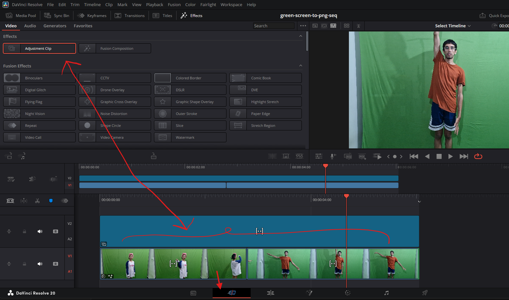

# **Cut**

## Effects

### Adjustment clips
An Adjustment Clip in DaVinci Resolve is like a transparent overlay that lets you apply effects to multiple clips underneath it

#### where to use
- say we want to add fusion effects (nodes) to multiple clips in a non destructive way
- 
- place the clip over the clips