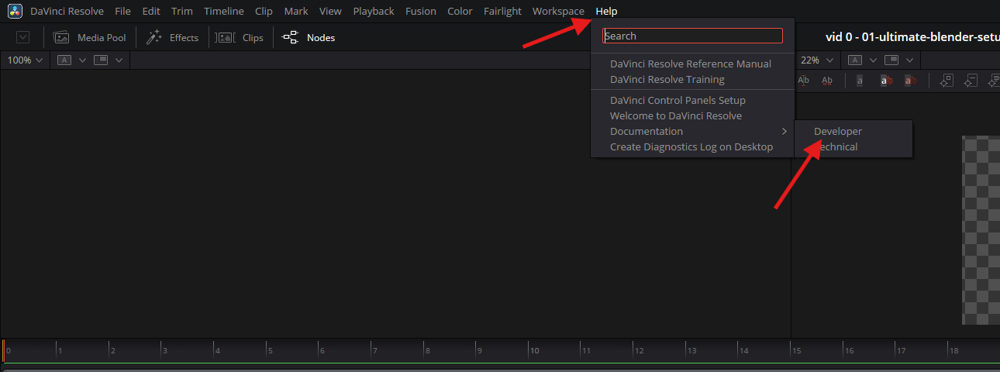

# **Davinci resolve**

## documention

- 
- Help -> Documentation -> Developer

## preview video

- press l to speed up
- k to pause
- j for reverse speed up

## TODO

- [] - learn how to blur or mask portion on video clip
  - can be done using either color page
  - or edit page with solid color effect
