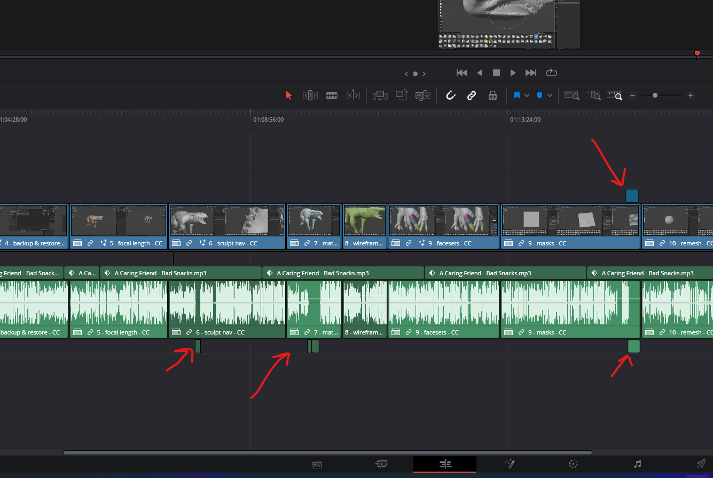

# **Davinci resolve**

## where to find documention

- 
- Help -> Documentation -> Developer

## preview video

- press l to speed up
- k to pause
- j for reverse speed up

## select custom clip length in timeline

- 

- press x
- press alt + x to select entire timeline

# Workflow

## Use Compound Clips

- combine the edited clips with many breaks under one compound clip
- also try to have the audio clip under one CC
  - so that when we move the master compound clip all its effects and sound clip move together
  - avoid this below timeline, instead have them inside the compound clips
  - 

## Edit clips without losing fusion effects

- to add image or text onto the clip
  - right click the compound clip -> open in timeline
  - right click individual clip -> open in fusion page
  - now add the effects over here, coz if we ever have to decompose the compound clip, we wont lose the fusion effects

# TODO

- [] - learn how to blur or mask portion on video clip
  - can be done using either color page
  - or edit page with solid color effect
