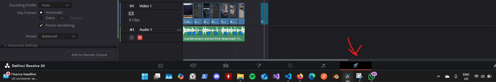
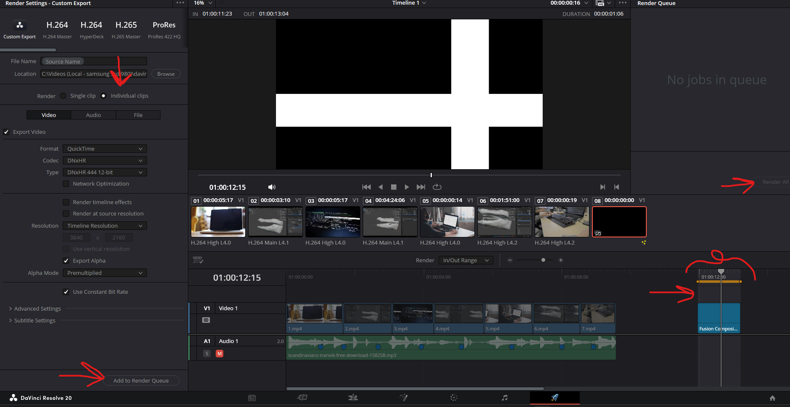

# **Deliver**

- 

## export as individual clip

lets you export independent clip, that can be used somewhere else

- 
- select "Individual Clips"
- this makes the grey line to orange line in the timeline
- drag the timeline points to start and the end the clip that you have
- the Render should automatically change to "in/Out Range"
- click on "Add to render queue"
- then click on "Render all"
