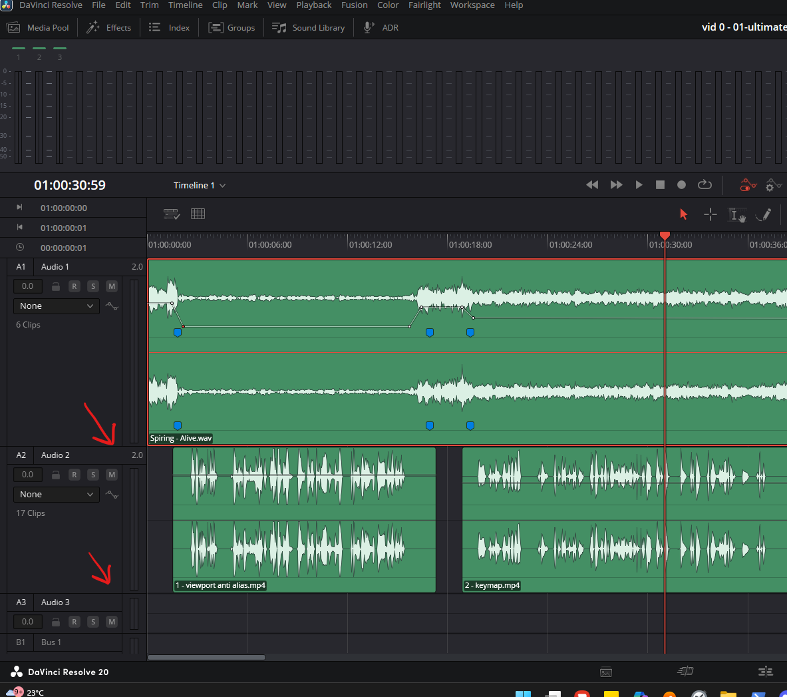
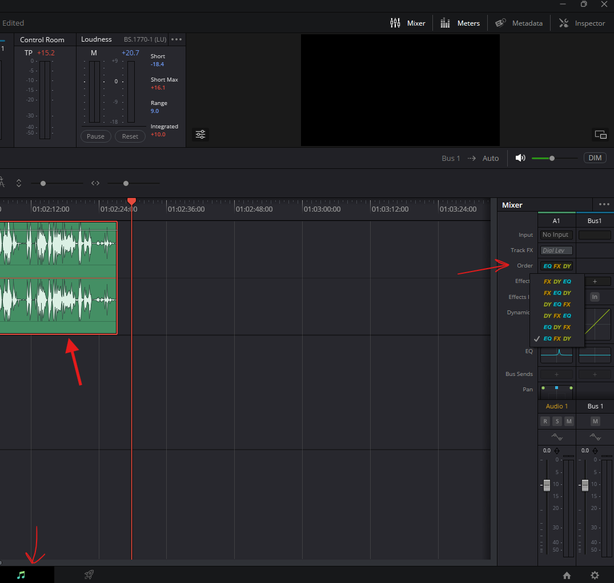
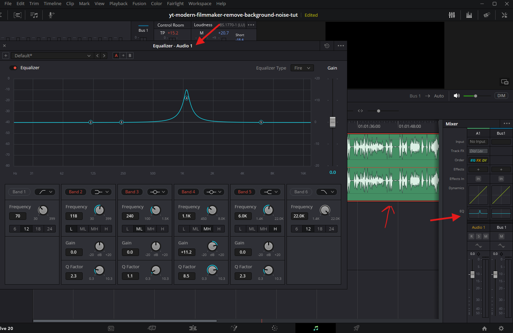
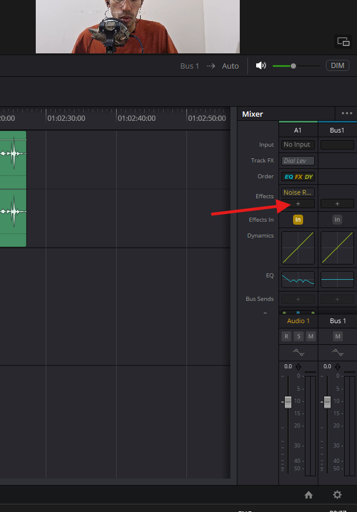
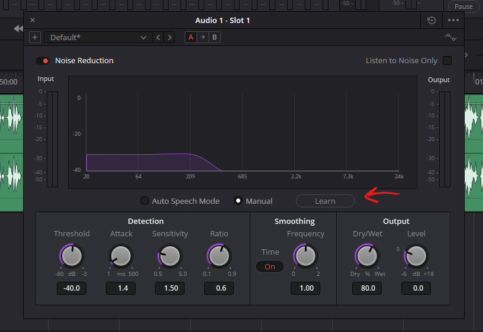
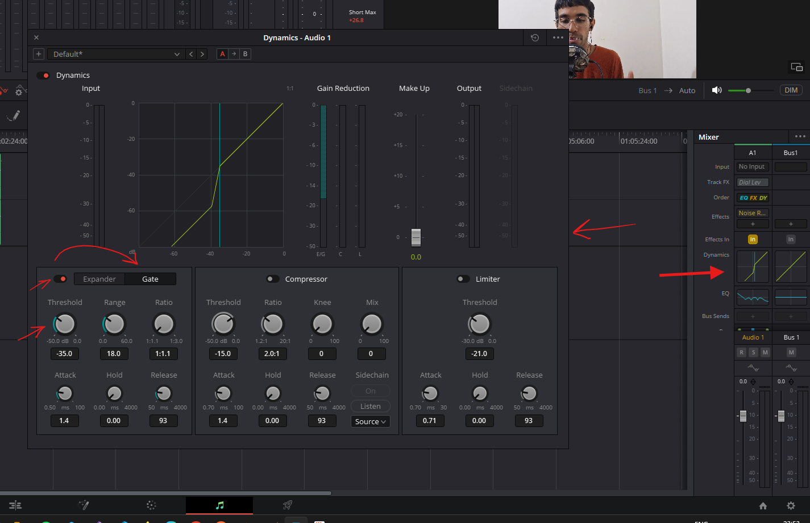

# **Fairlight Audio**

## viewport

### adjust audio clip waveform height

- 

## Tip

- if there is so much of noise, them final result will have low volume, that why add music to fill noise up

## preparations

- right click on the audio clip and [unlink them if possible](./edit.md#link-clips-or-audio-or-unlink-them)
- right click and select "`Normalize audio levels`"
- select target loudness as ITU-R BS 1770-1
- standard for youtube is -14 LKFS

# Order

- select track
- 
    - set the order for processing audio
        - ex. EQ FX DY
            - set first equilizer -> effects -> dynamics

# Equilizer

- select track
- 

# effects

- 

## Noise Reduction

- restoration -> noise reduction

### learn

- use `learn` before using the setting, to capture the noise frequencies
- 
- move the slider to the point where you want the learning to start
- press learn and play the audio and then stop

## Noise Gate

- 
- click on dynamics
- flip to gate
- set the threshold - this cuts any sound that is under this value
