# Fusion

## Nodes

<b>Note:</b> keyboard shortcut

- press <kbd>SHIFT</kbd> + <kbd>SPACE</kbd>
  - to bring up menu to select all types of nodes
- pressing <kbd>SHIFT</kbd> and dragging the node will snap it out
- pressing <kbd>SHIFT</kbd> and dragging the node over a line will attach it to other nodes

### grouping

- 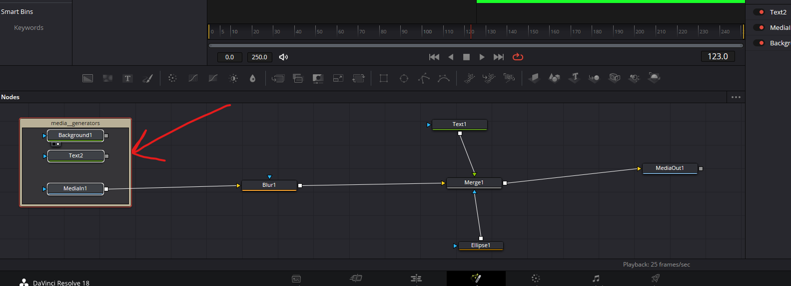
    - select nodes and press <kbd>SHIFT</kbd> + <kbd>SPACE</kbd>
    - search for `Underlay`
    - select it to have a box for the selected nodes

### Detach nodes

- 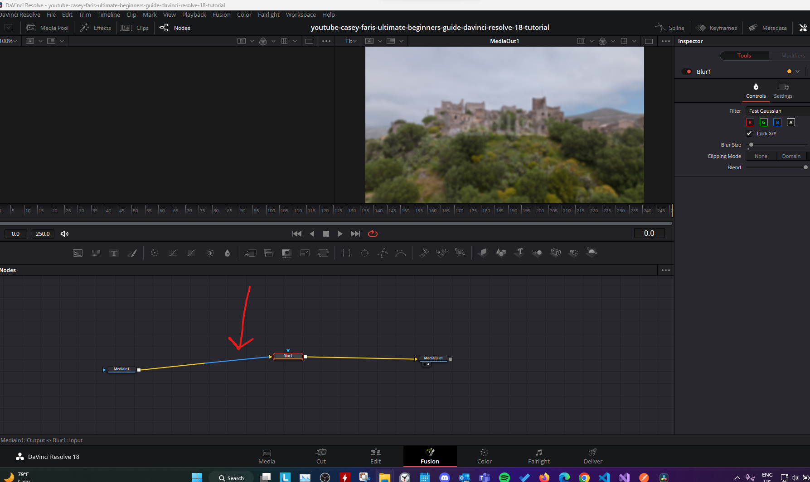
    - click on the blue line

### Merge node

- 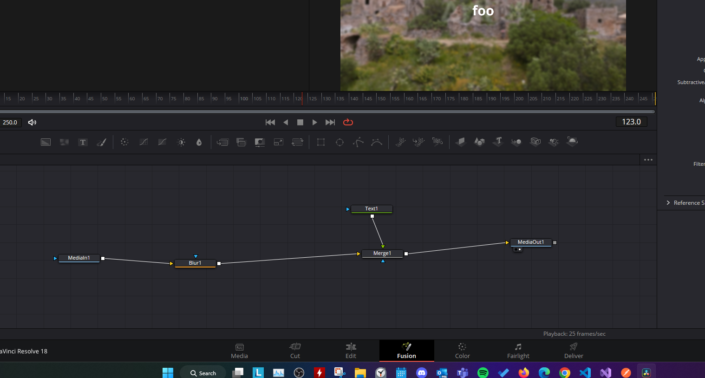
    - merges other nodes

<b>Note:</b> another way of adding the merge node to another node is connect the point 1 with the point 2 in the below image

- 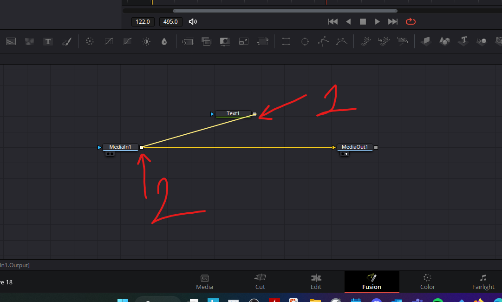

### underlay

- for grouping the nodes
- 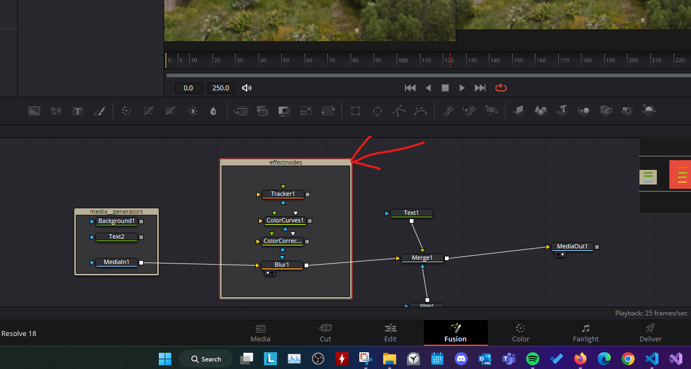

<b>Note:</b>

1. for moving the underlay only press <kbd>ALT</kbd> and select the `underlay box`
2. now to rename it after selection press <kbd>F2</kbd>

## Grouping

- select all the nodes that you want to group
- press <kbd>CTRL</kbd> + <kbd>G</kbd>
- 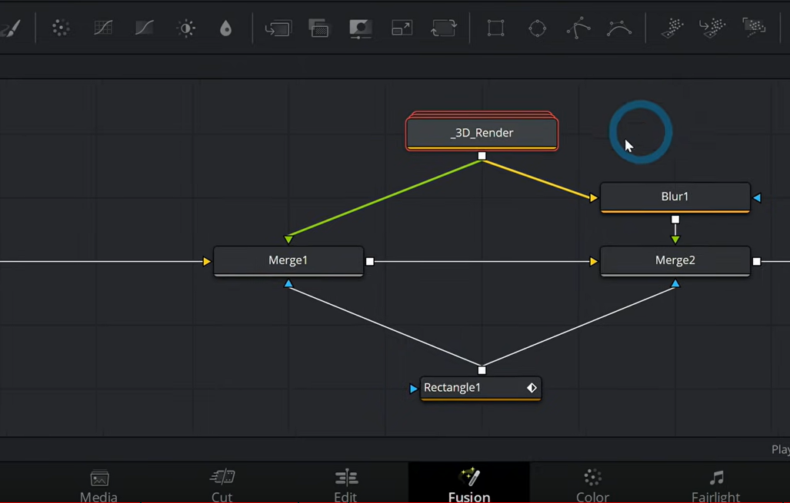
- to expand double click the group
- 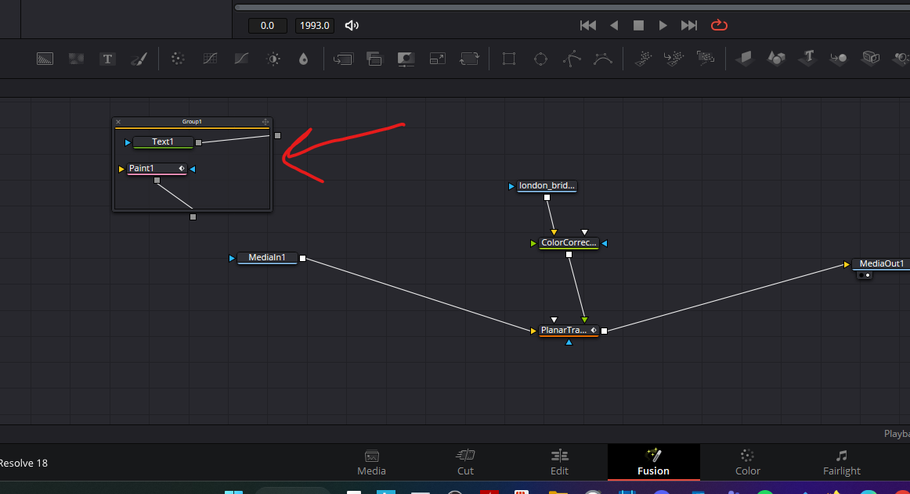

## Mask

- 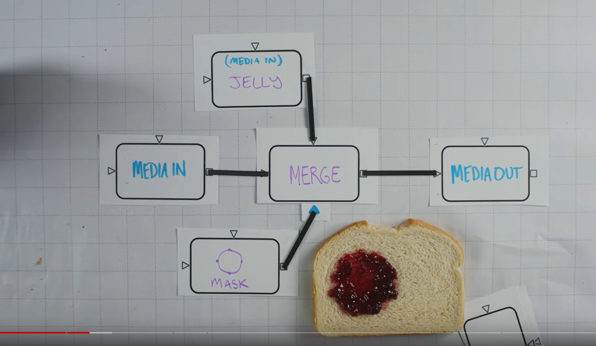
    - allows to select portion of the video to control the merged node
- 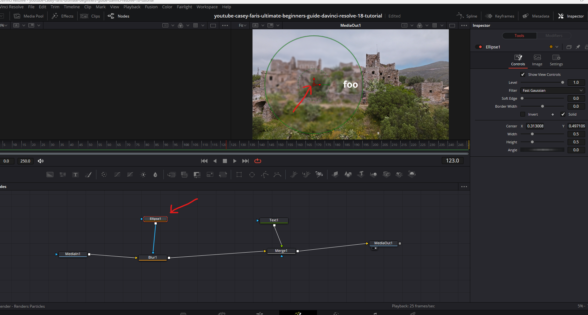
    - ellipse1 is the mask node 
    - and using the handler we can drag the blur portion for the video
- Mask with merge
  - 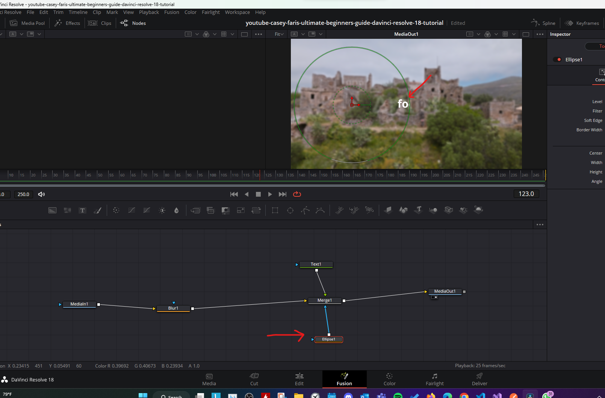
  - attaching a mask to merge node, limits the merged portion only (i.e. the text node in the example)

## viewers

- 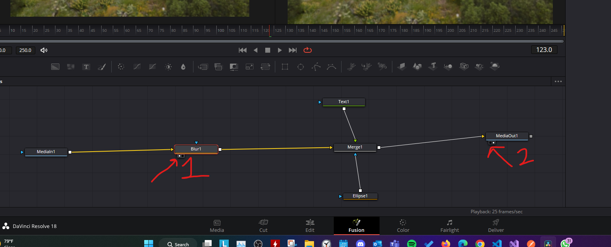

<b>Note:</b> keyboard shortcut

- select the node and press <kbd>1</kbd> or <kbd>2</kbd> to assign the node to viewer 1 or 2

## Replace green screen

### Delta keyer

- 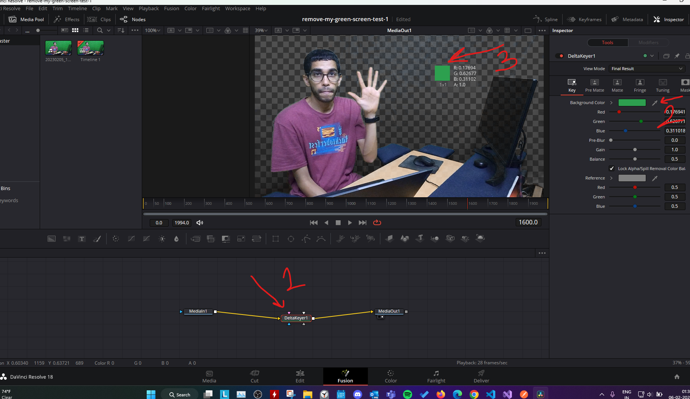
- drag the color picker over the green color to replace it
- then drag any media and merge it as `background`
  - and the delta keyer should be `foreground`
- 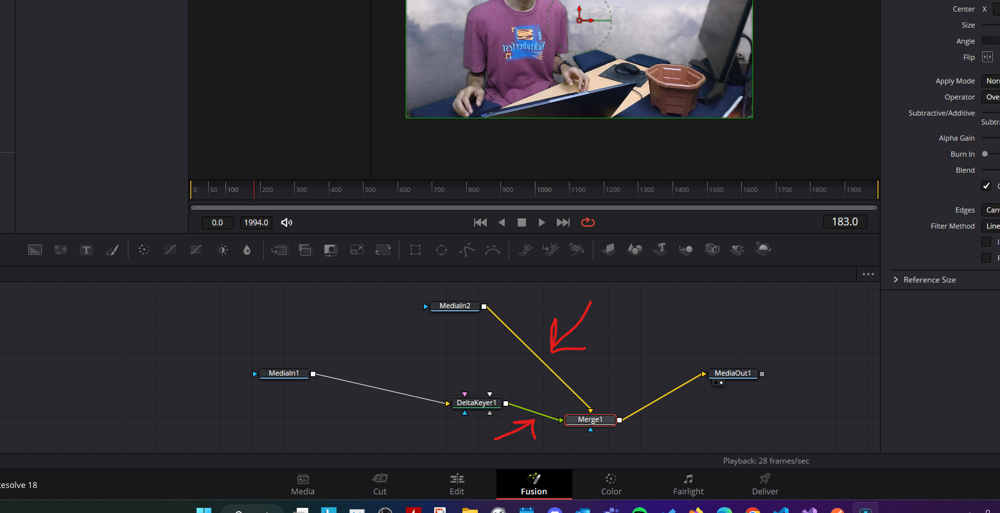
