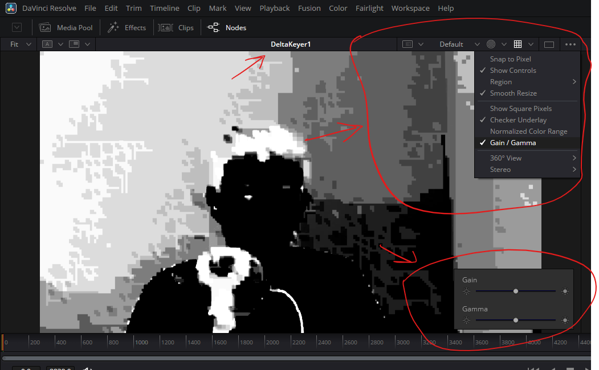
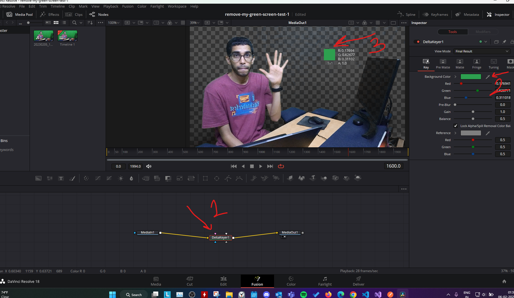
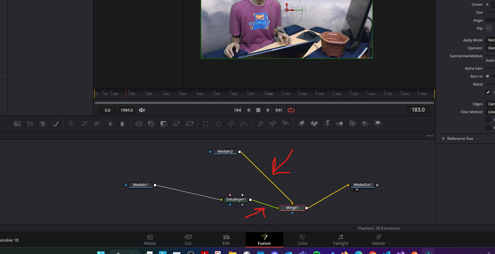

# **green screen**

# viewport

## preview video output

- select the delta keyer, press 1
- 

# Delta keyer

- 
- drag the color picker over the green color to replace it

## add background

- then drag any media and merge it as `background`
  - and the delta keyer should be `foreground`
- 

## garbage matte input

to ignore everything in a selected portion

- add any shape like bspline
  - adjust it on the time line
- connect it to the garbage pin

**Note**: in case the mask is hiding the non selected area, play with delta keyer inspector -> Mask -> Invert

## solid matte input

- Defines areas that should be fully opaque (visible) in the final matte

## Inspector Properties

### Pre matte

- draw by mouse click and drag on the video frame
  - this selects the colors to ignore
