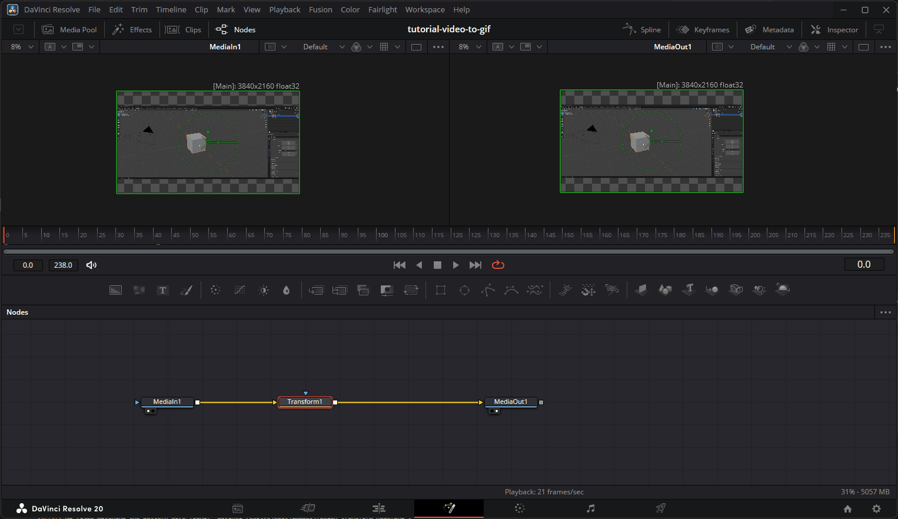
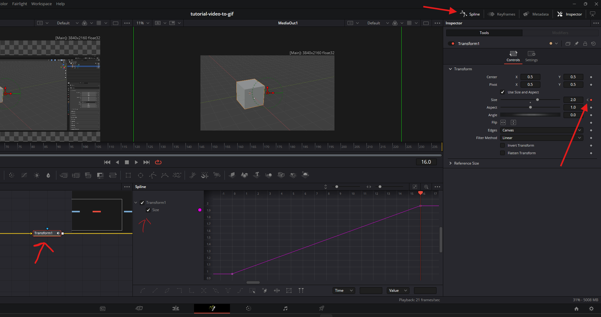
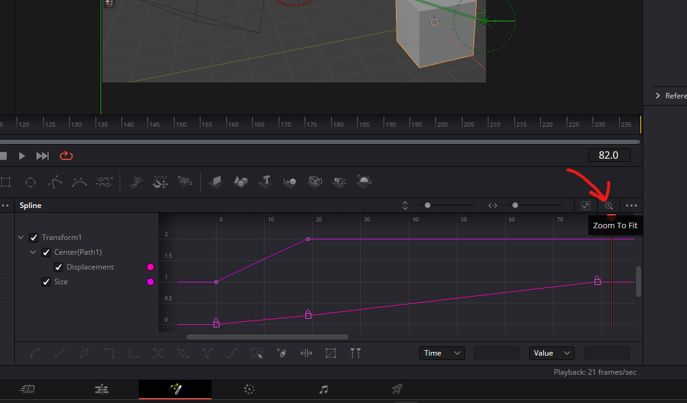
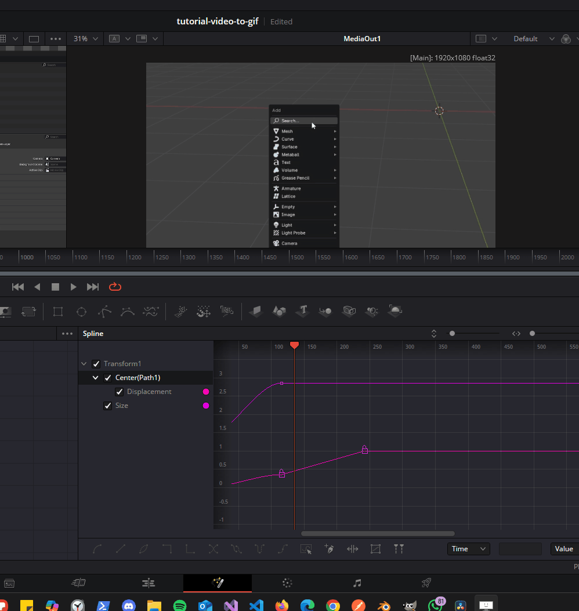
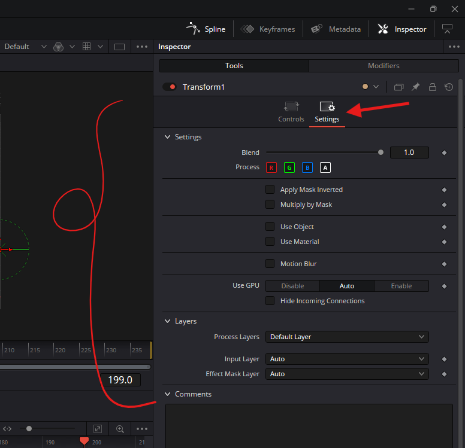

# **Nodes**

## Transform

lets you zoom in, move to specific portions of a video

### keyframes

- 
- set the frame location to first frame
- click on tranform node
- go to inspector
- click on keyframe
- move to next frame
- adjust nodes properties to animate, example zoom, postion etc

### Curve Editor

- 
- click on spline
- select the keyframes

#### fit view

- 

#### add bezier or ease in / out

- select the curve keyframes point
- press <kbd>s</kbd>

#### remove the bezier or make it linear

- select the curve keyframes point
- press <kbd>shift</kbd> + <kbd>l</kbd>

#### make a quick / fast transition

- select 2 keyframe
- right click on any of the keyframe
- select step in or out
- 

### Features Settings

here we can add more effects automatically, like motion blur

- 
    - select transform node
    - go to inspector
    - go to settings

#### motion blue

- check motion blue
- set the "Quality" to 10 or as required
