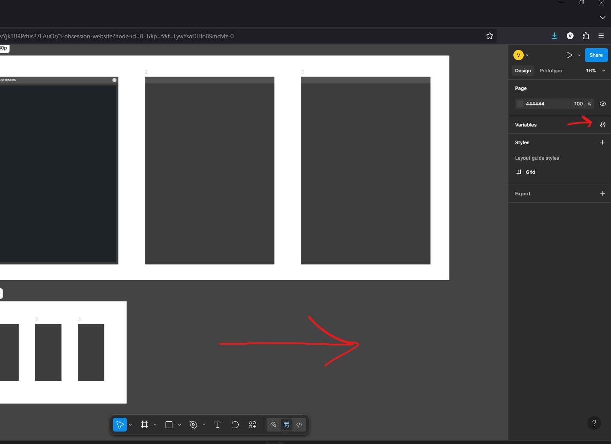
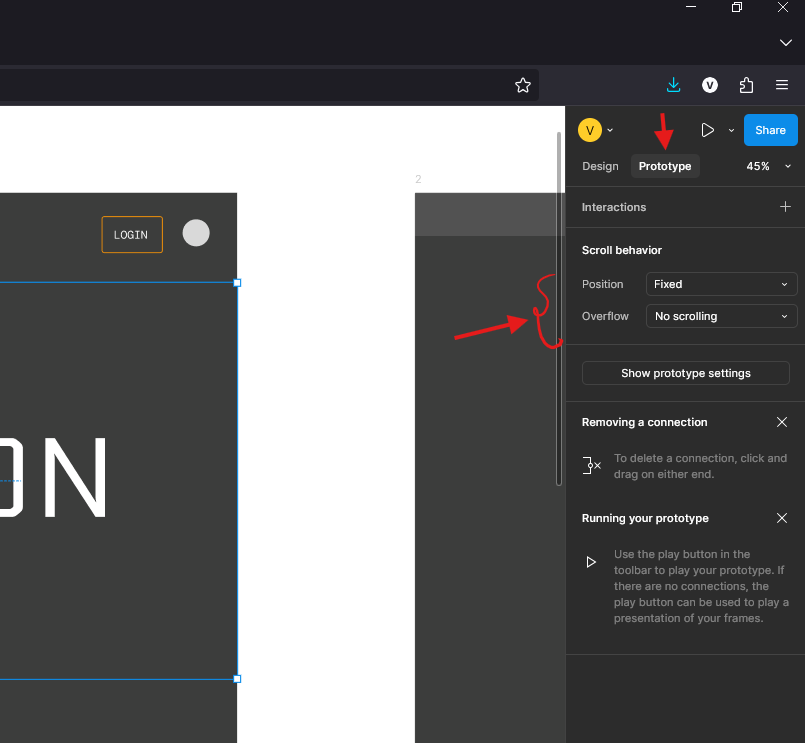

# Variables

- 
    - click on the page i.e. NOT on any frame, section, etc
    - then the right panel will show the variables section

# frame

## static background (no scroll)

- add frame
- goto prototype
- select position - fixed and overflow - No scrolling
- 
