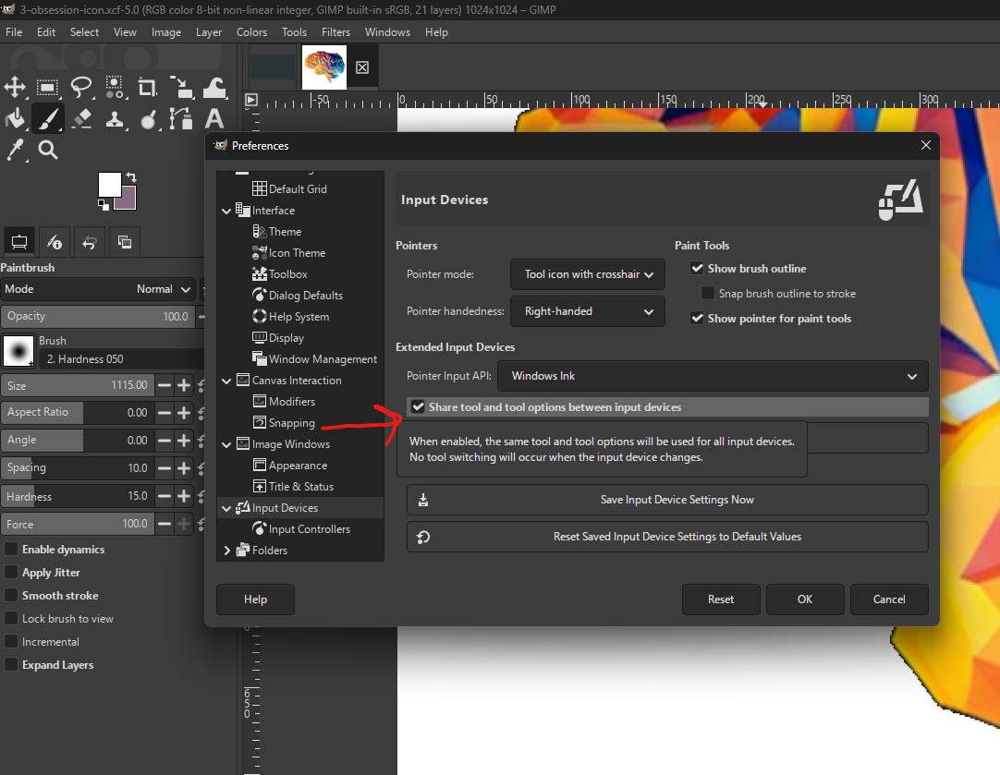
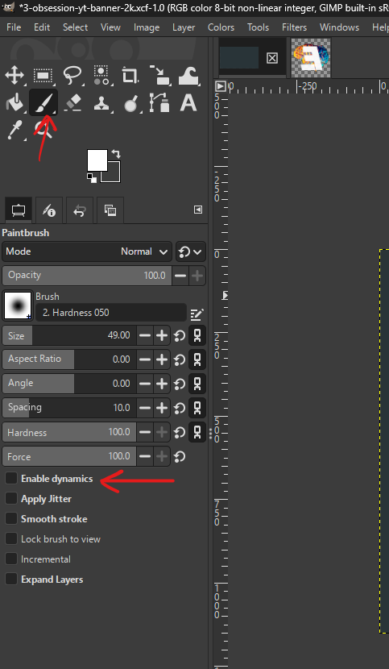
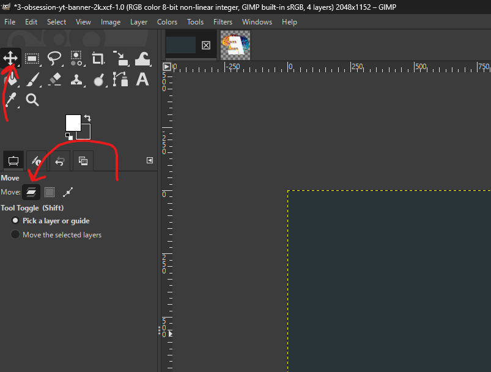
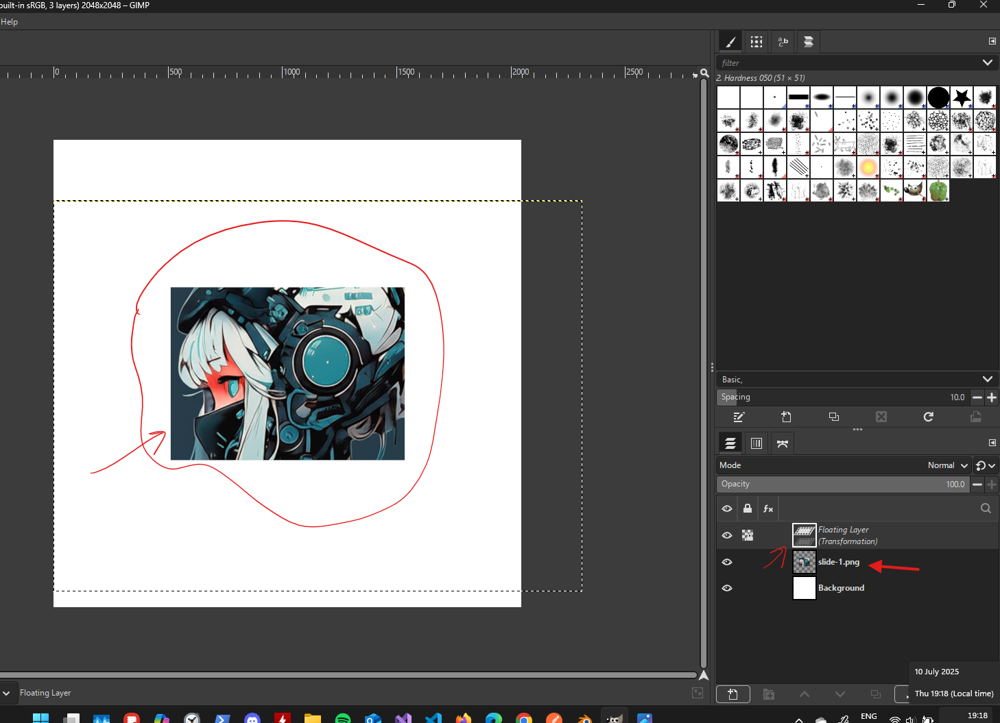

# **Gimp**

# Settings

## not tools switching

- stop the tools swtiching while switching between mouse and drawing pen
- edit -> preferences → Input Devices
- Look for the option: “Share tool and tool options between input devices”
- 
- Enable this setting

## no pen pressure

- 
- disable this

# Viewport

- rotate - shift + middle mouse and move

# Selections

## fine selection

- after the selection press shift + q
- the selection turns red
- use paint brush (p)
  - white to make more red
  - black to remove
- 
- to exit press shift + q again

## move selection

# Tools

## move

### in case curve is displayed on mouse (path move is selected)

- 
- select this to move layers properly

# issues

## scaled iamge produces transformation layer

- 
- clear the selction
