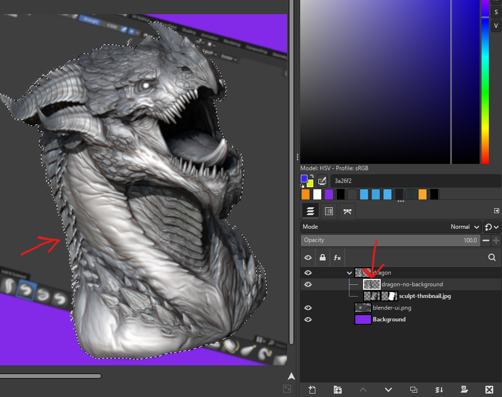
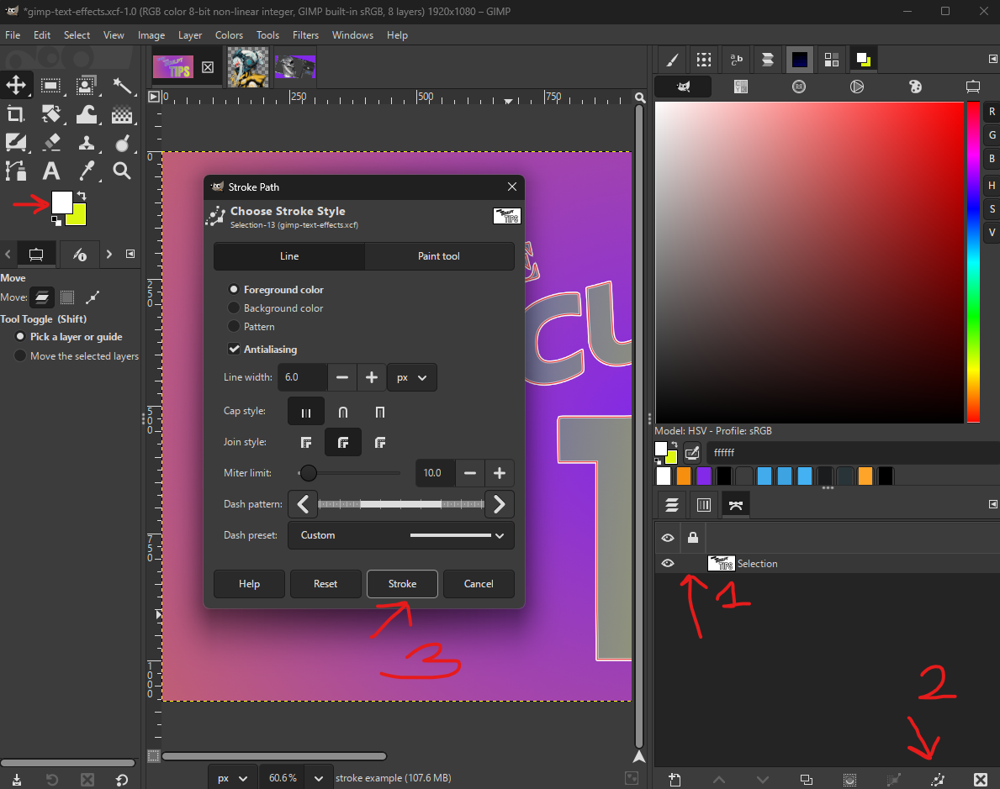
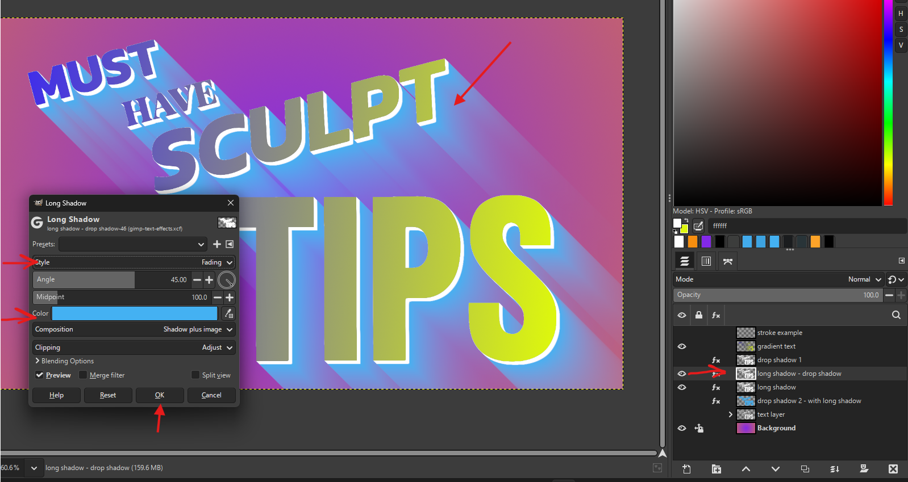

# **Gimp**

# Settings

## not tools switching

- stop the tools swtiching while switching between mouse and drawing pen
- edit -> preferences → Input Devices
- Look for the option: “Share tool and tool options between input devices”
- 
- Enable this setting

## no pen pressure

- 
- disable this

# Viewport

- rotate - shift + middle mouse and move

## UI

### how to show the tabs

- 
- clicking on any will open that window in these tab area

# layers

## move all layers

- select all layers
- hold shift and move them

# Selections

## select only the layer content (not the border) or silhouette

- 
- hold alt and click on the layer in the layer panel

## fine selection

- after the selection press shift + q
- the selection turns red
- use paint brush (p)
  - white to make more red
  - black to remove
- 
- to exit press shift + q again

## move selection

- in the move tool select "Selection" and then we can move the selection
- 

## save selection as path

- go to paths and "click on selection to path"
- 

## convert path to selection

- go to paths and "click on selection to path"
- 

# Tools

## move

### in case curve is displayed on mouse (path move is selected)

- 
- select this to move layers properly

## Gradient

- under bucket fill tool

### gradient tool settings

- 
- highlighted are colors, invert, type, shape, and where to begin from (center of a image)

## Text

- **TIP:** if working with rotated text then use italic
- 

### select only the text

- 
- press alt + click on the layers to select only text
- 
- save the selection by converting it to a [path](./gimp.md#save-selection-as-path)

### draw stroke around the text

- you need to have the [selection saved as path](./gimp.md#save-selection-as-path)
- 
  - select the path and click on draw along the path

# Effects (filters)

## long shadows

- 
- select the layers
- goto filters and "Light and shadow" -> long shawdow
- chose different styles, length, angle and color for customizations

**Note**: if you only want to keep shadow - choose the `Composition` settings

## drop shadows (for hover effect)

### using drop shawdow

- filters -> "Light and shadow" -> drop shawdow

### using long shawdow

- filters -> "Light and shadow" -> long shawdow
- style -> as finite or fading
- 

# issues

## scaled iamge produces transformation layer

- 
- clear the selction

# Image

## find the center of the image

- 
- add horizontal and vertical guide
