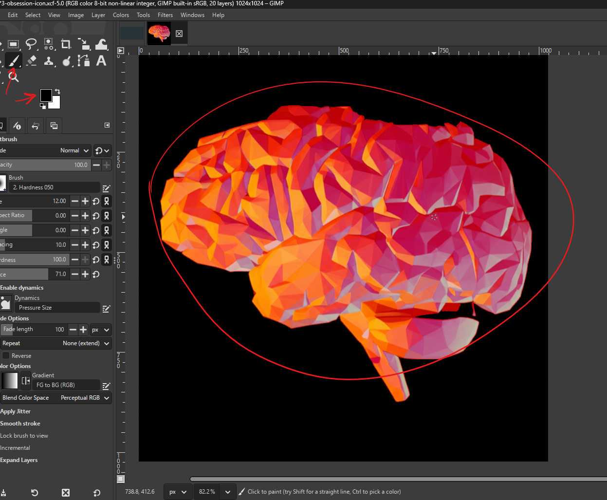

# **Gimp**

# Settings

## not tools switching

- stop the tools swtiching while switching between mouse and drawing pen
- edit -> preferences → Input Devices
- Look for the option: “Share tool and tool options between input devices”
- 
- Enable this setting

## no pen pressure

- 
- disable this

## move tool setting - in case curve is displayed on mouse

- 
- select this to move anything properly

# Viewport

- rotate - shift + middle mouse and move

# Selections

## fine selection

- after the selection press shift + q
- the selection turns red
- use paint brush (p)
  - white to make more red
  - black to remove
- 
- to exit press shift + q again
