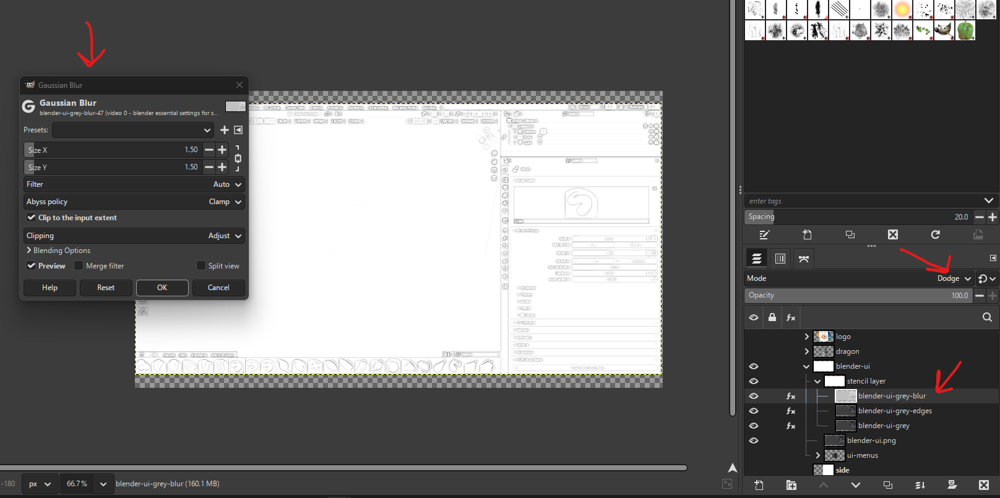
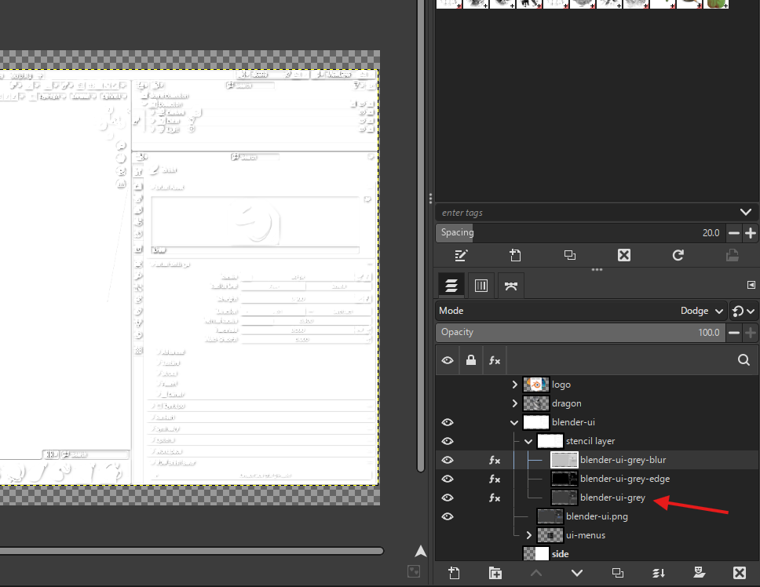

# Special Effects

# Stencil like or drawing sketch

- make the layer grey [desaturate](../basics/gimp.md#colors-desaturate)
- add gaussian blur
  - duplicate it
  - change the layer mode to [dodge](../basics/gimp.md#layers-modes)
  - goto color -> [invert](../basics/gimp.md#colors-invert)
  - add gaussian blur from [filters](../basics/gimp.md#gaussian-blur)
  - 
  - the result will be as shown in the image above
- refine edges
  - duplicate again the original layer
  - filters -> edge -> neon
  - goto color -> [invert](../basics/gimp.md#colors-invert)
    - if the color become too white then use mode [dodge](../basics/gimp.md#layers-modes)
    - if the color are too dark then use mode [multiply](../basics/gimp.md#layers-modes)
- 
- make sure the original image is at the end and blur and edge refine layers are above
- adjust the levels of `edge refine` layer required to highlight more black and white
  - input levels -> mid tone (middle triangle) -> to left or right to darken or lighten
