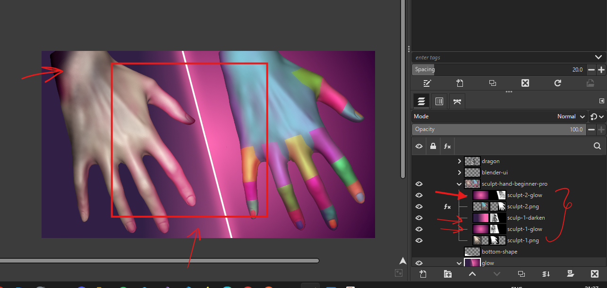

# Special Effects

# Stencil like or drawing sketch

- make the layer grey [desaturate](../basics/gimp.md#colors-desaturate)
- add gaussian blur
  - duplicate it
  - change the layer mode to [dodge](../basics/gimp.md#layers-modes)
  - goto color -> [invert](../basics/gimp.md#colors-invert)
  - add gaussian blur from [filters](../basics/gimp.md#gaussian-blur)
  - 
  - the result will be as shown in the image above
- refine edges
  - duplicate again the original layer
  - filters -> edge -> neon
  - goto color -> [invert](../basics/gimp.md#colors-invert)
    - if the color become too white then use mode [dodge](../basics/gimp.md#layers-modes)
    - if the color are too dark then use mode [multiply](../basics/gimp.md#layers-modes)
- 
- make sure the original image is at the end and blur and edge refine layers are above
- adjust the levels of `edge refine` layer required to highlight more black and white
  - input levels -> mid tone (middle triangle) -> to left or right to darken or lighten

# outer glow

- draw the line using the "path tool" and stroke the path
- create dulpicate layer and give the color
  - mode should be "Normal" only, idk why `screen` or `dodge` doesn't work
- to this newly created layers add guassian blue filter
- duplicate it further to add more glow
  - more layers more glow
- 

# darken the areas to highlight area we want people to focus

there is no way to highlight the focus point, so we darken the unnecessary araes

- may be we can use filters -> bloom

 

- use brush with less hardness
- 
  - darken the unimportant areas

# light reflection on a object

- 
- on the layer where the reflection should be, place the light texture on top of it
- set the mode to [overlay](../basics/gimp.md#layers-modes)
- paint on the alpha layer of the glowing or darken layers
