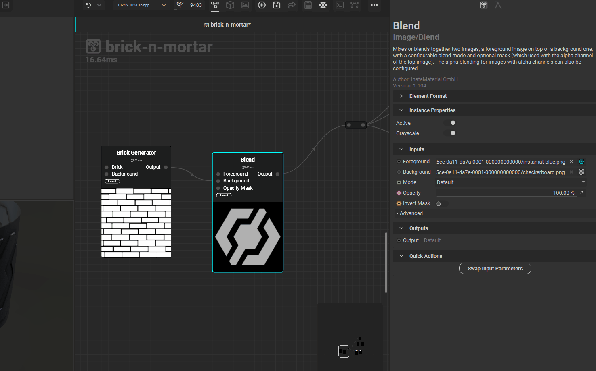
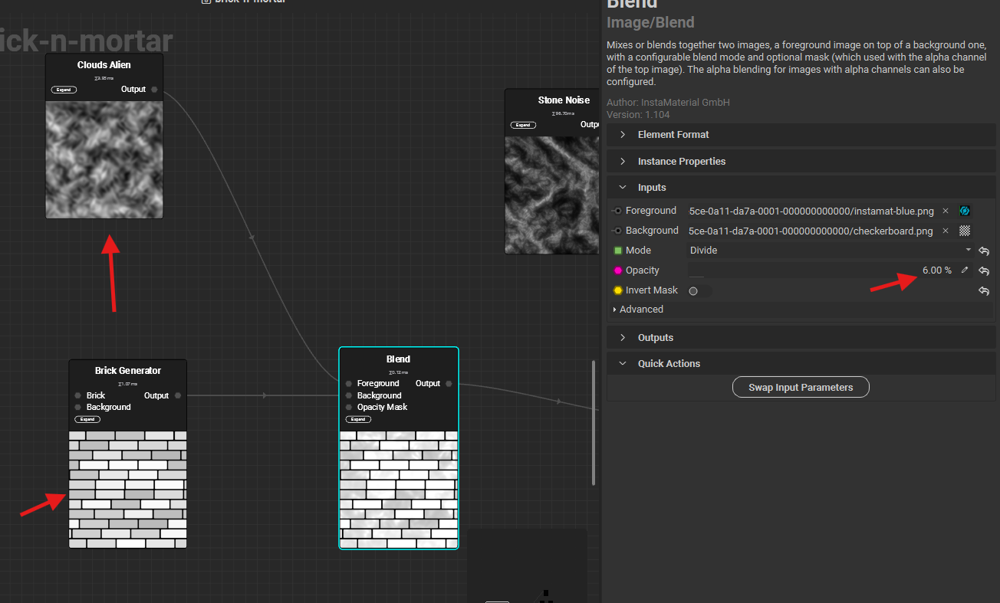

# blending

## swap inputs (foregroud and background)

- 

## blending modes

### divide

cuts sharp between the foreground and background

- 

#### how to use

- 
- IMPORTANT - input greyscale pattern should have grey color bricks or pattern
  - as the pattern is not shown on white
- lower the opacity (eg. 7)
