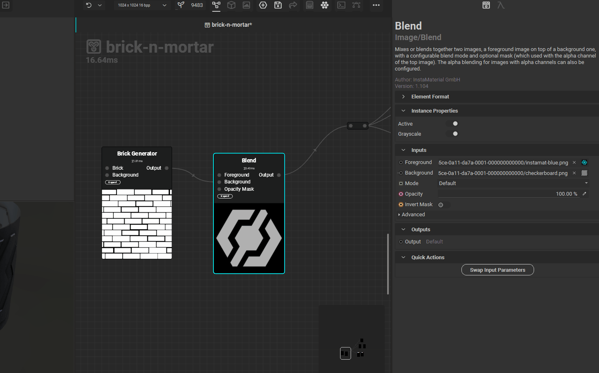
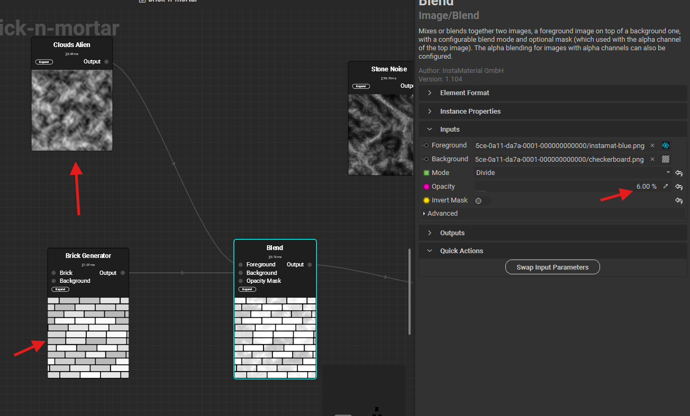
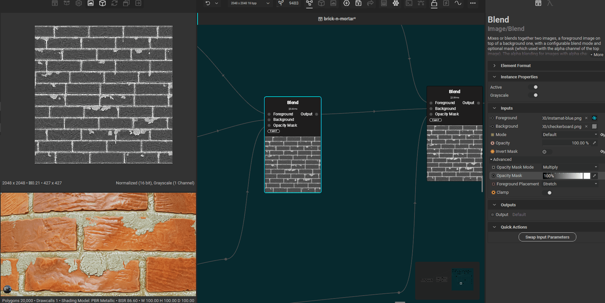

# blend node

# swap inputs (foregroud and background)

- 

# blending modes

## divide

divides the non white background colors by the non white foregroud colors

 

IMPORTANT:

- input greyscale pattern should have grey color bricks or pattern
- as the pattern is not shown on white
- same for greyscale and non greyscale nodes

 

- 

### how to use

- 
- lower the opacity (eg. 7)
- make sure both the foreground and background has some non white component, otherwise there will be NO visible changes
  - same for greyscale and non greyscale nodes

## invert mask

inverts the opacity mask

- 

# blend height node

has a output mask, that seperates the input top and bottom

- 
