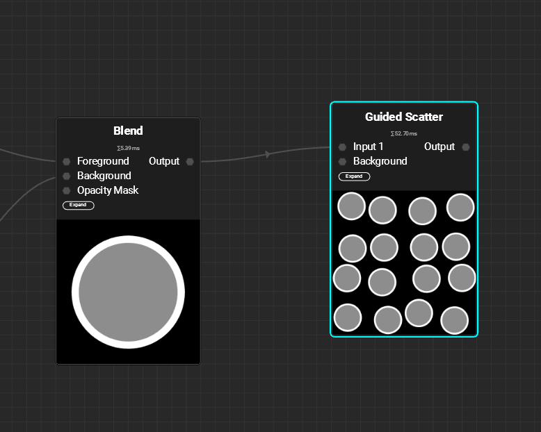
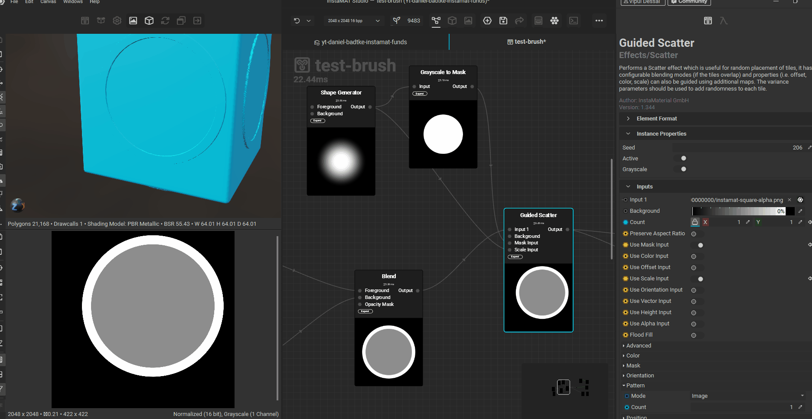
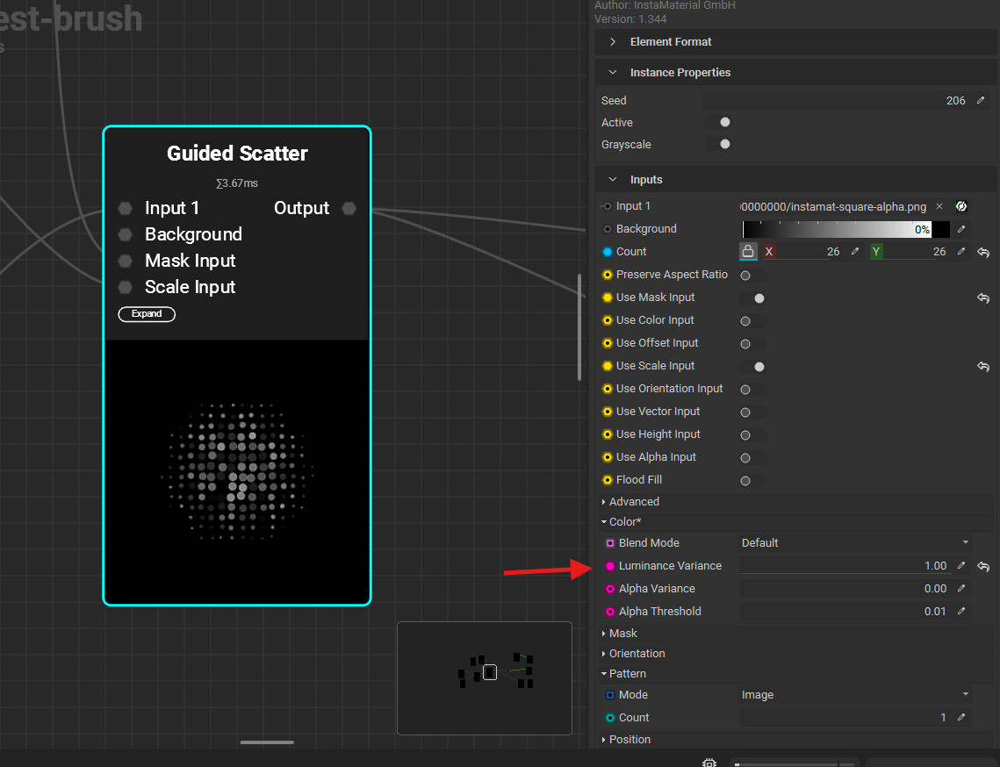

# transform node

- 

# directional warp

control the direction of dripping like effect

## works better with

- 2 layers are merged (blend), like one layer creates brick and second layer is mortar

## settings

- 
- set direction -> 1
- angle - as required, above example its 270 degree
- trail mode
  - maximum (for extending into the blacks)
  - increase the trail length and lower trail fade
- adjust the intensity

# fractal warp

## works better with

- sloped fractal sum

# guided scatter

- 

## count

- enable the "mask input" and "scale input" in the node property panel
- 
- count property increases the density in the of the input shape in the given area limited by the mask
- scale input gradient affects the clutter disttribution

## random color

- 
