# **Insta Mat**

# packages

- 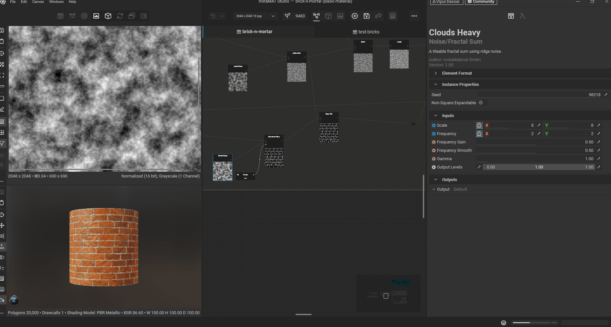
- click on packages
- in the top menu -> File -> new Project

## projects

- packages is parent of projects
- add new projects of type such as element graph, asset texturing etc

# Viewport

## enable 2d or 3d view

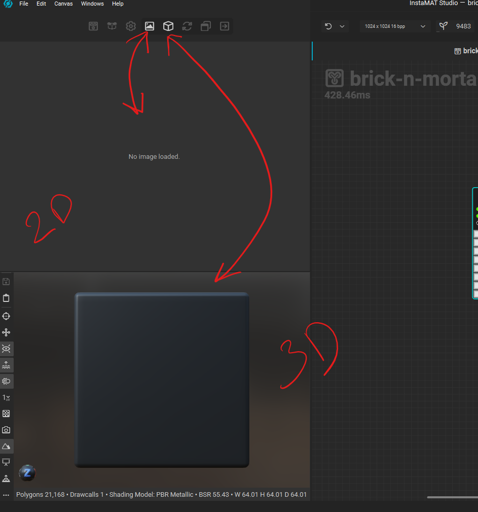

## 2d view

### checkboard texture

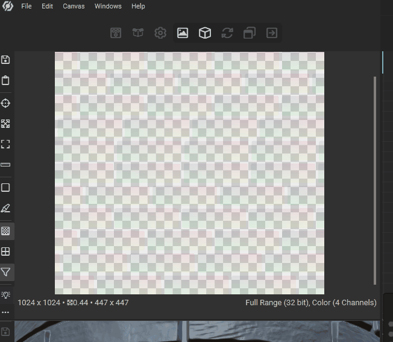

### image resolution or size

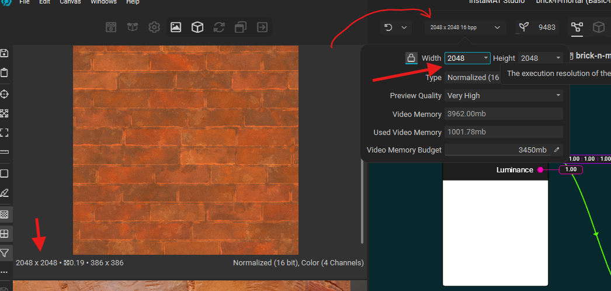

## 3d view

- adjust camera - alt + left click and move move
- adjust light - shift + right click and move mouse

### mesh

- 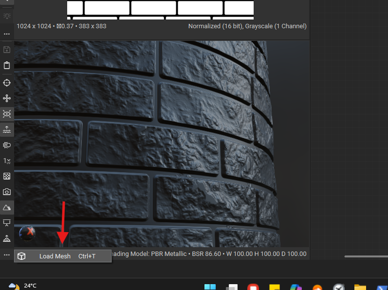
- ctrl + t

### change env

- ctrl + b

### 3d viewport settings

- 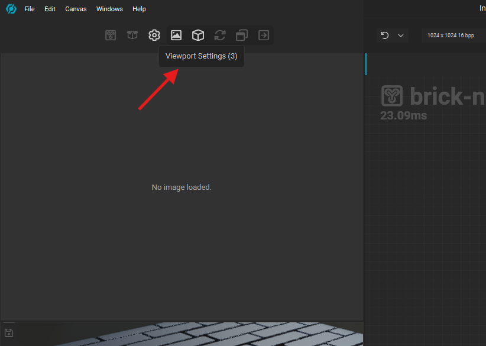

#### height intensity

- 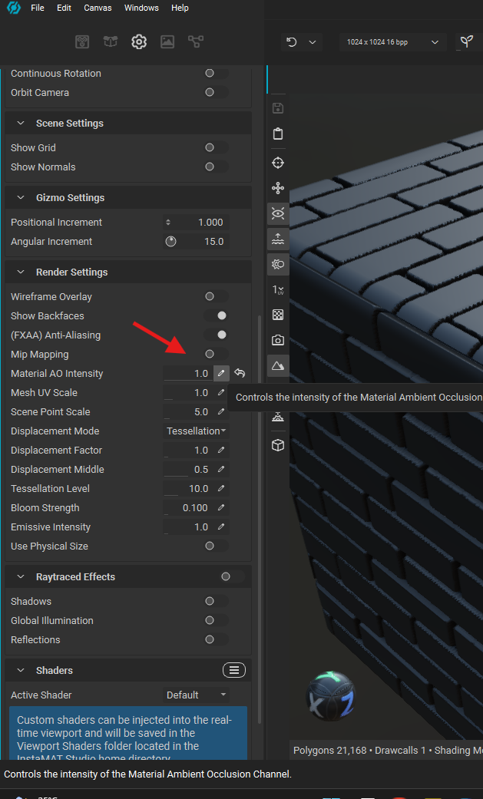
- make the "Material AO intensity" to 1

## search

- press space

## multi select

- shift + click and drag

## duplicate

- select the node, alt + click and drag

## alpha or transparency

if the image is NOT a greyscale then it will have a alpha channel

- 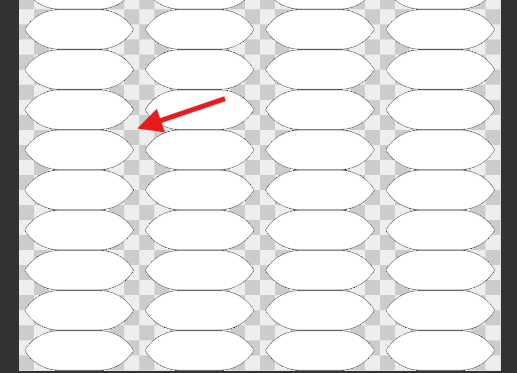

## nodes properties

- 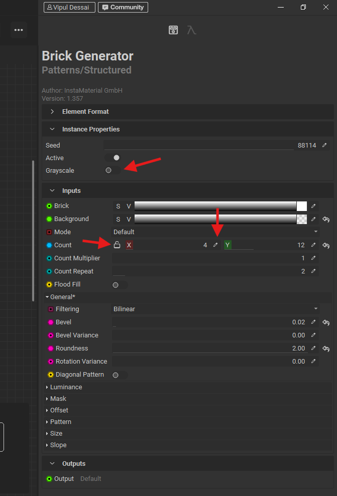
- unlock to have a different x and y items
- select the pen to type the value
- select greyscale for using it for drawing patterns

## disable node

- select node and press h, press h to unhide

## drag node connector group

- press ctrl + click on the node connectors and drag
  - in SD its shift + click and drag

## group nodes or frame nodes

- shift + c
  - add title, description and color

## organise nodes

use the reroute image node

- 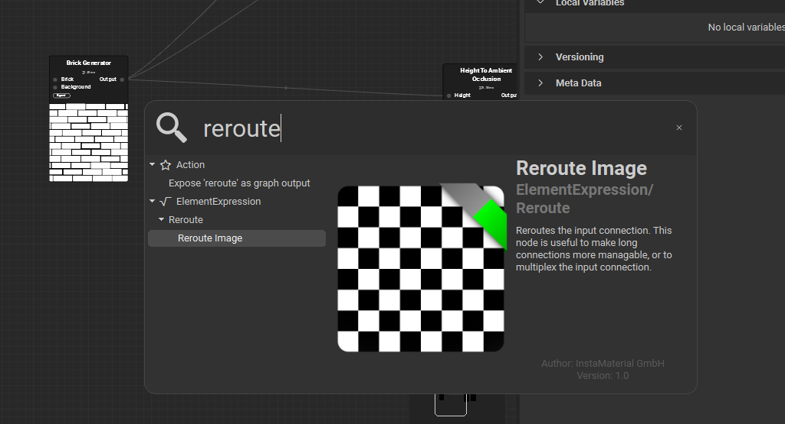

### how to use reroute image node

- 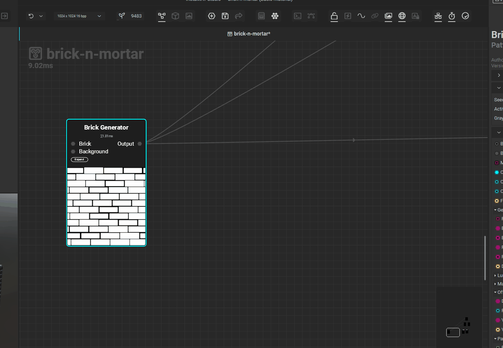
    - use ctrl and drag the node connectors group

## how to add node in between

- 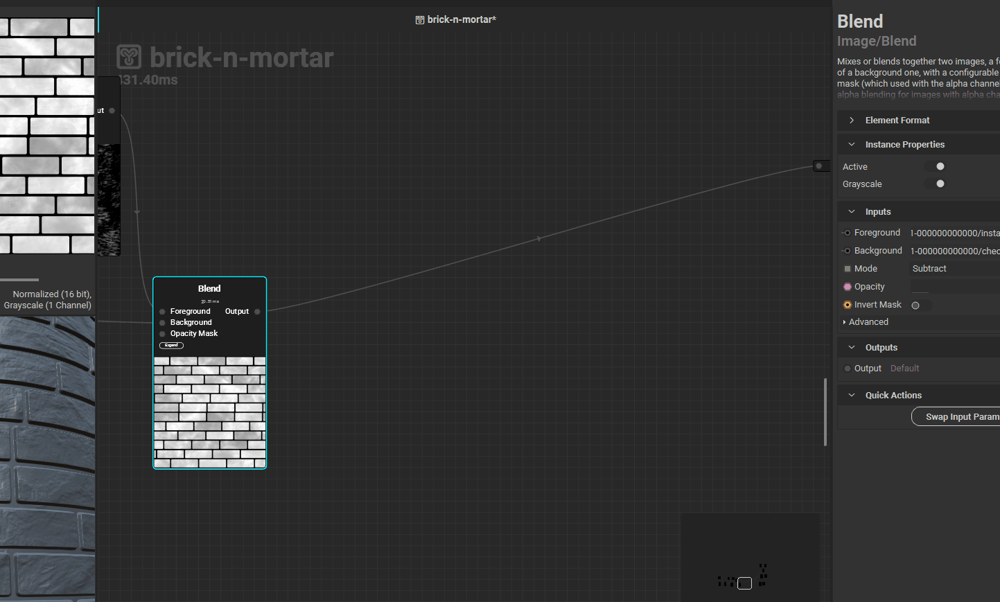
- right click and search for the node
- double click to drop the node

## variables

### expose variables

- select the node
- in the properties panel -> right click -> expose

#### expose multiple

- right click node -> expose input parameters
- select the variables -> rename if requred
- hit expose

### exapose variable manually

- 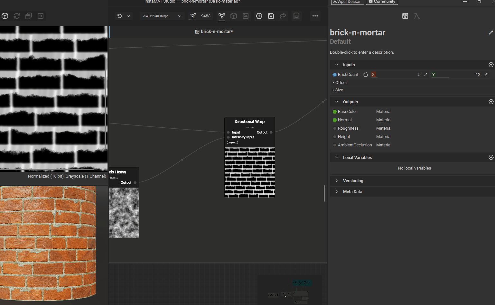
  - create the varible and add type, adjust the more properties
  - drop it
  - drag the pin onto expand and attach to desired pin

**Note**: same way a local variable can be attached

### rearrange output variables

- 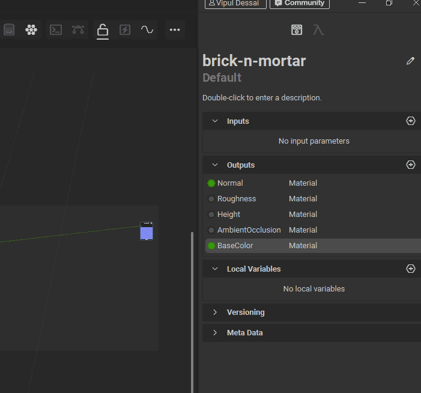

### resize input / output var name

- 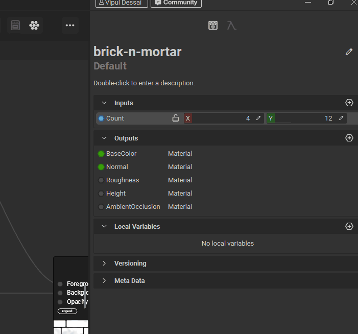

### rename input variable

- 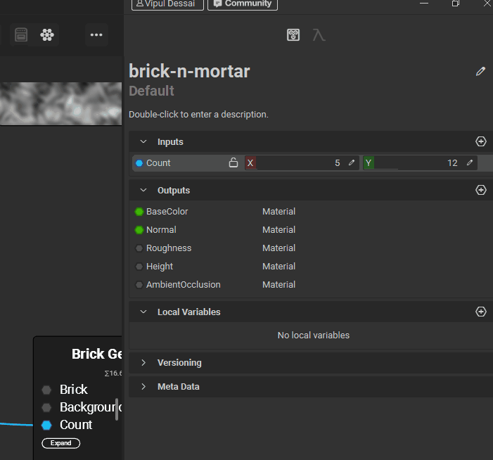

### more properties

- 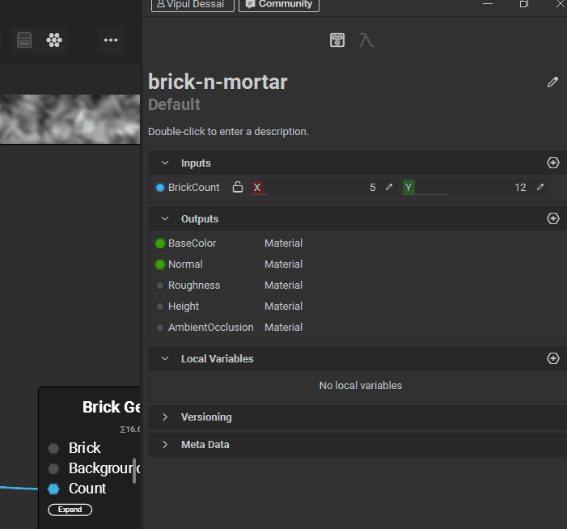
- adjust properties such as
  - control -> make it a slider
  - unit -> a custom name that will appear next to variable value

### remove category

- 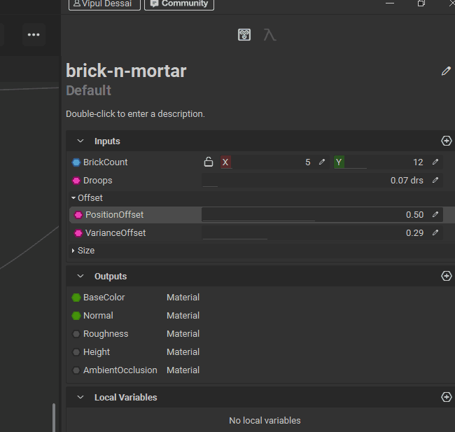

# export

- 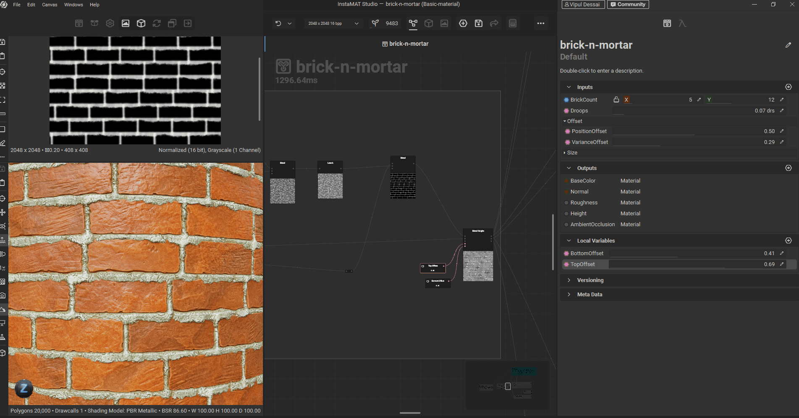
- file -> expoert image and data outputs

## creating template

so that exporting is structured format

`TODO` - notes

## export and use in other projects

`TODO` - how to expose element graph as brush to other projects in the same or different packages
