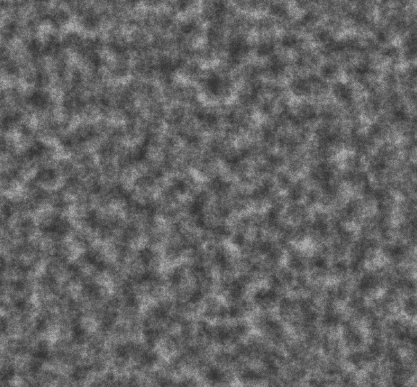
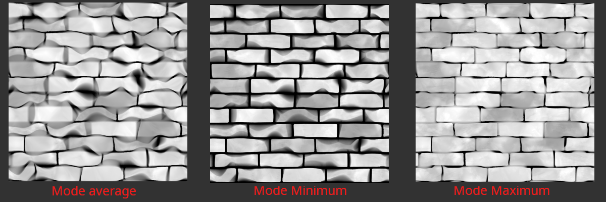
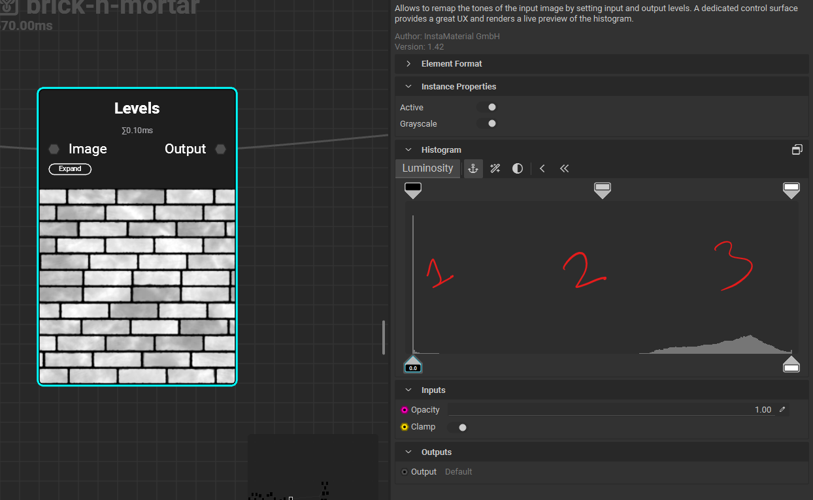
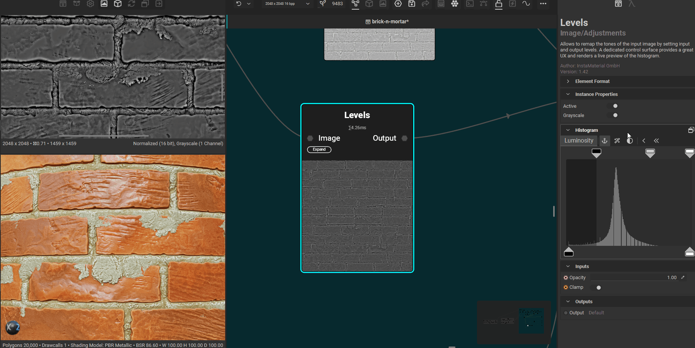
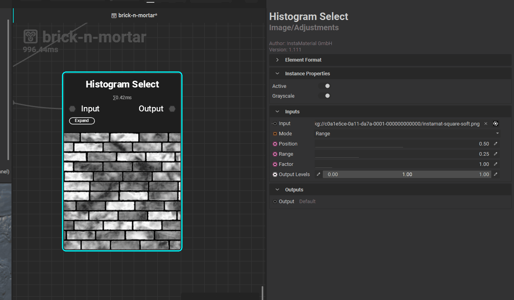

# **filter nodes**

# high pass filter

- **Preserves sharp transitions:** like edges, corners, and textures.
- **Removes smooth areas:** such as sky, skin, or blurred regions.
- **Used for sharpening:** often as part of unsharp masking or edge detection.

## example usage with dense noise

 

# sharpen (high pass filter i.e. makes high frequency image)

- rapid changes in intensity (e.g. edges, fine details, noise)
  - A zebra’s stripes = high frequency (black ↔ white rapidly)

## where to use

- good place is just at the end of creating the base color (albedo), just before output node

# blur (low pass filter i.e. makes low frequency image)

- Low frequency = gradual changes (e.g. smooth gradients, flat regions)
  - A foggy sky = low frequency (soft, slow tonal shifts)

# slope blur

for distorting greyscale's image white portion

## sample count (quality)

- increase from 16 to 32

## intensity

- controls the mode effect and input from height or direction

## modes

- 
    - avg - extends into black
    - min - extends black into white, shrinking the white
    - max - extends more into black

# guided blur

## works better with

- with liquid noise

# levels

- 
- 1 - number black pixels from greyscale image
- 2 - number grey pixels from greyscale image
- 3 - number white pixels from greyscale image

## Adjustments

- move the bottom left slider to right to make image white
- move the bottom right slider to left to remove white from image

## inverse or flip output

- 

# histogram

## histogram select

### inverse greyscale with black and white only component

- 
- lower the position to zero
