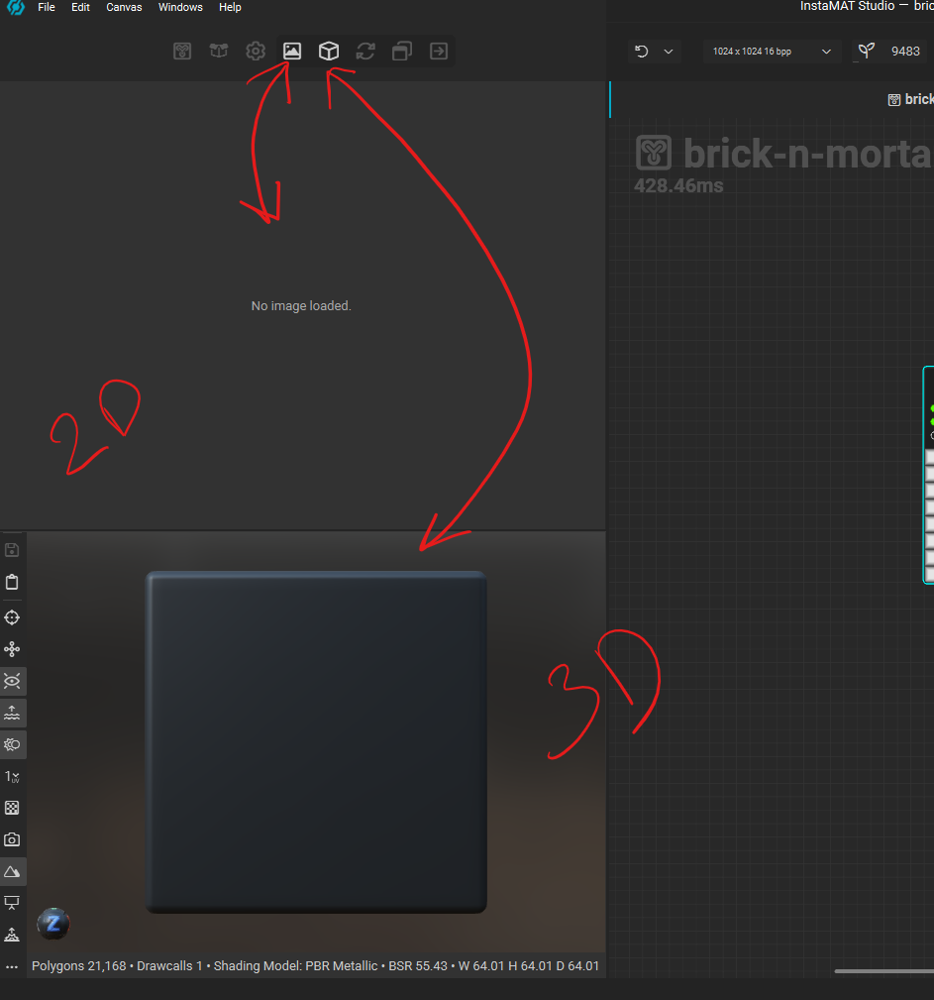
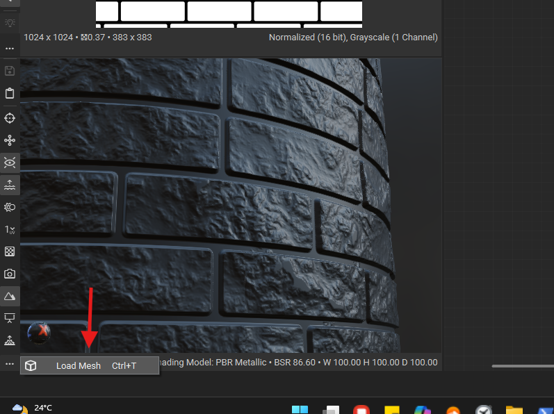
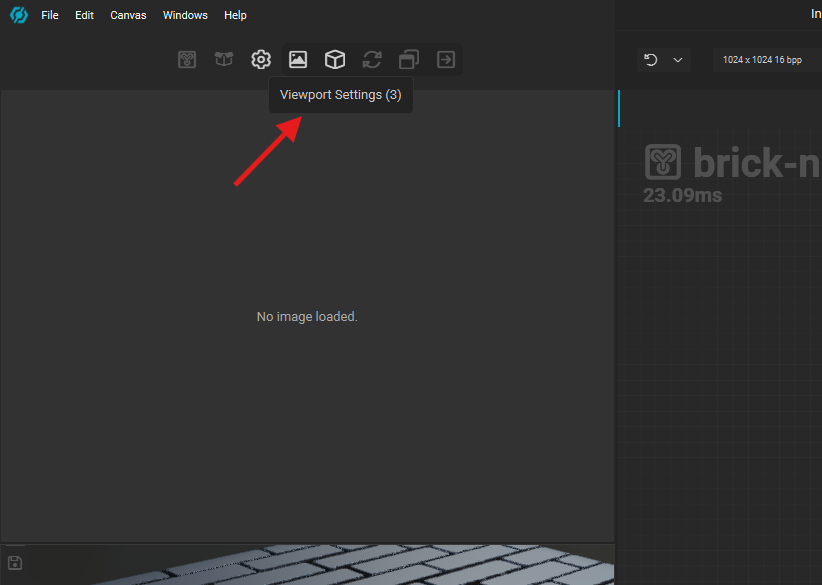
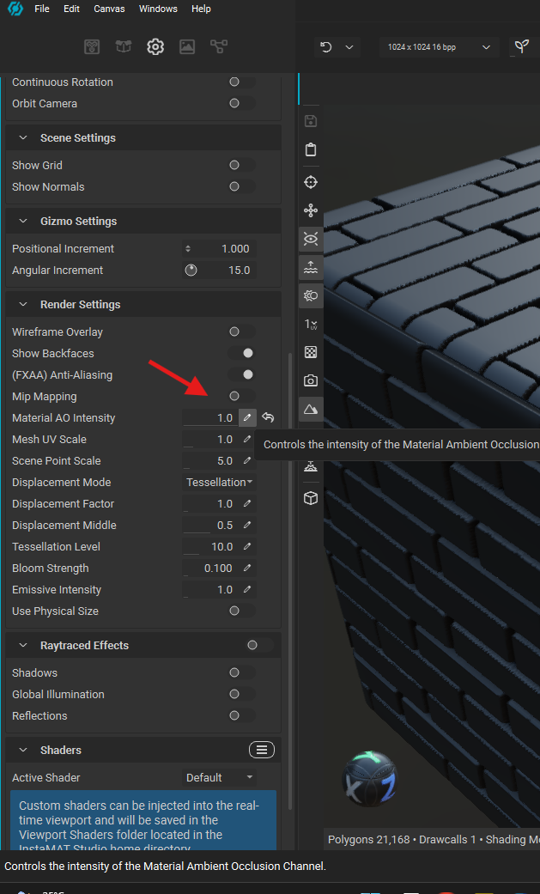
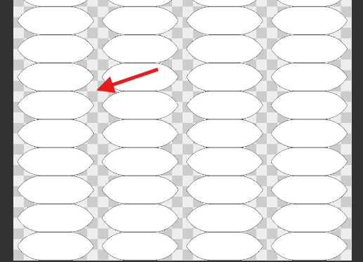
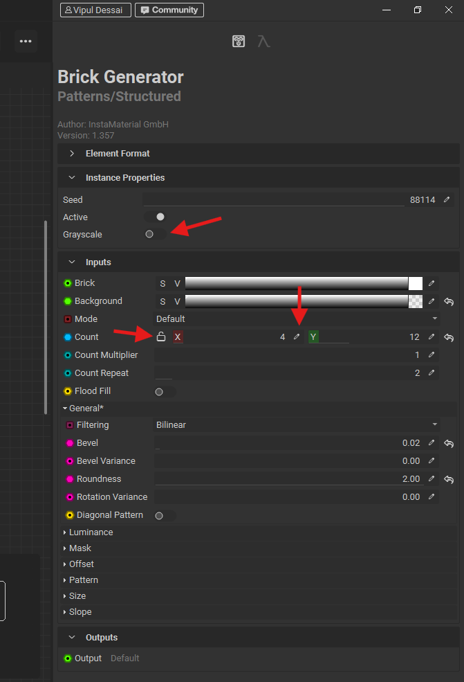
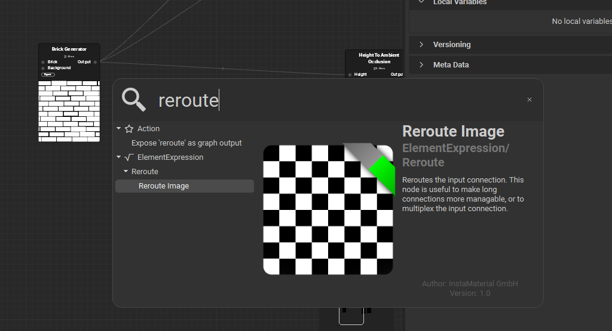
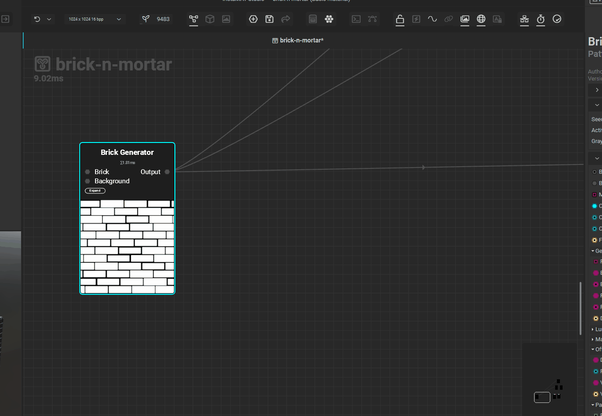
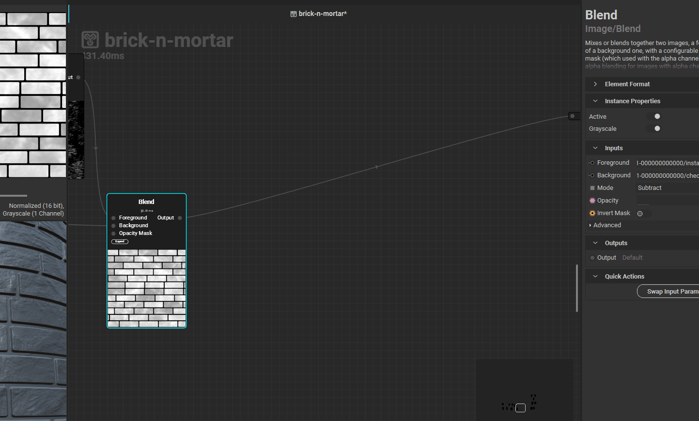

# **Insta Mat**

# Viewport

## enable 2d or 3d view

## 2d view

## 3d view

- adjust camera - alt + left click and move move
- adjust light - shift + right click and move mouse

### mesh

- 
- ctrl + t

### change env

- ctrl + b

### 3d viewport settings

- 

#### height intensity

- 
- make the "Material AO intensity" to 1

## search

- press space

## multi select

- shift + click and drag

## alpha or transparency

if the image is NOT a greyscale then it will have a alpha channel

- 

## nodes properties

- 
- unlock to have a different x and y items
- select the pen to type the value
- select greyscale for using it for drawing patterns

## disable node

- select node and press h, press h to unhide

## drag node connector group

- press ctrl + click on the node connectors and drag
  - in SD its shift + click and drag

## organise nodes

use the reroute image node

- 

### how to use reroute image node

- 
    - use ctrl and drag the node connectors group

## how to add node in between

- 
- right click and search for the node
- double click to drop the node
