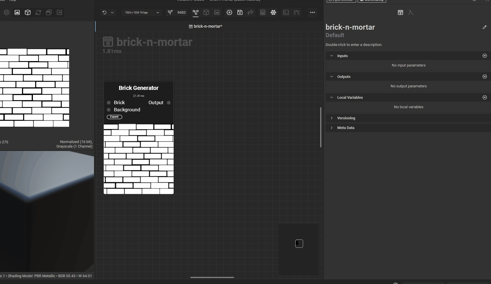
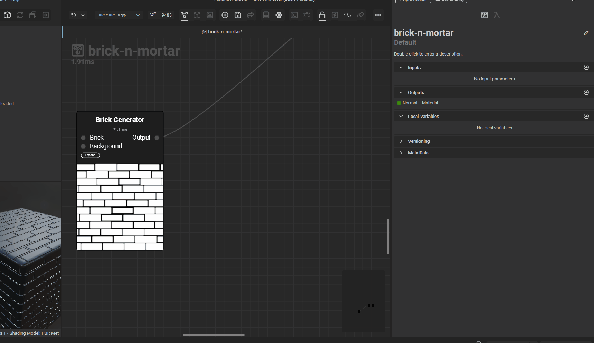
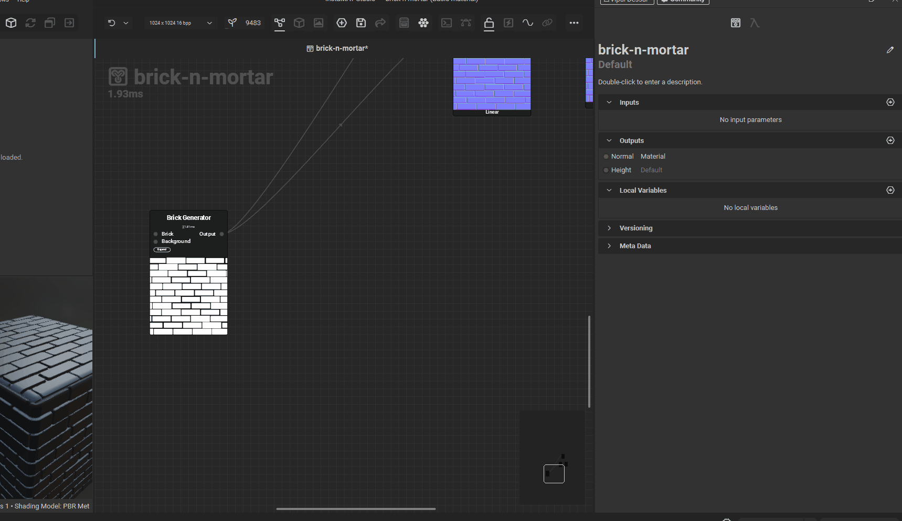
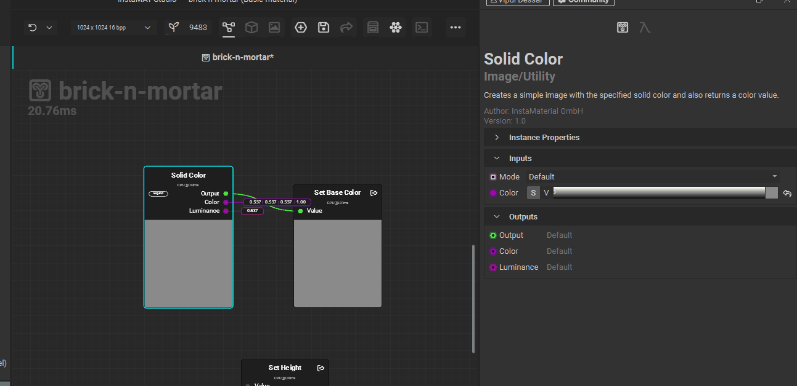
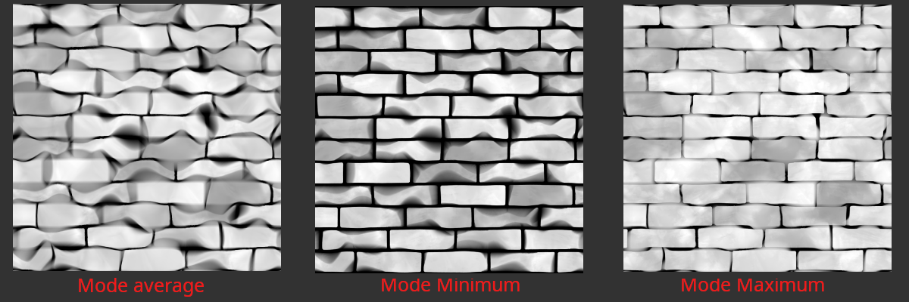
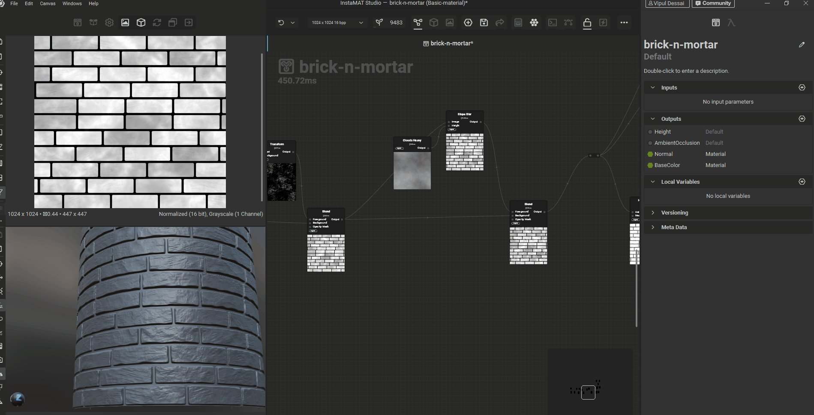

# **Nodes**

# output

## name and type - output property

the name and type is like the usage in substance designer

| Name             | Type             | coversion node              |
| ---------------- | ---------------- | --------------------------- |
| Height           | ElementImageGray | -                           |
| AmbientOcclusion | ElementImageGray | Height to ambient occlusion |
| Normal           | ElementImage     | Height to normal            |
| BaseColor        | ElementImage     | Solid Color                 |

## create variable

- 
- give proper name refer the table (name and type table)

## expose as output variable

- 

## height conversion

- 

# Noise Nodes

- clouds alien
- clouds heavy
  - scale - 1
  - freq gain - 0.2
  - freq smooth - 0.8
- stone noise
- swipes and wipes
  - scale - 35%
  - variance - 65%
  - smudge blur - 20%

# solid color

- 

- S - saturation
- V - Value
- square box - hue

# transform node

- 

# slope blur

for distorting greyscale's image white portion

## intensity

- controls the mode effect and input from height or direction

## modes

- 
    - avg - extends into black
    - min - extends black into white, shrinking the white
    - max - extends more into black

# Flood fill (hand pick shapes of greyscale)

convert black-and-white masks into region-aware data structures

## convert the uv details to mask

use flood fill to mask

- 

### equivalent in substance designer (SD)

- use multiple node to acheive this
  - flood fill to random greyscale
  - histogram scan
  - contrast
