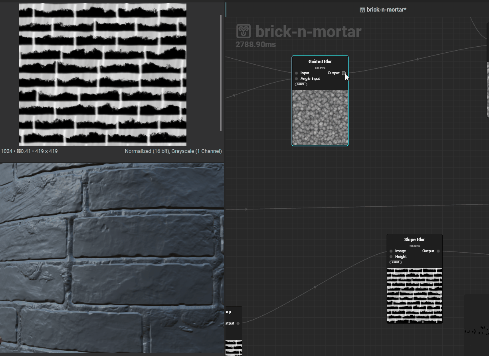
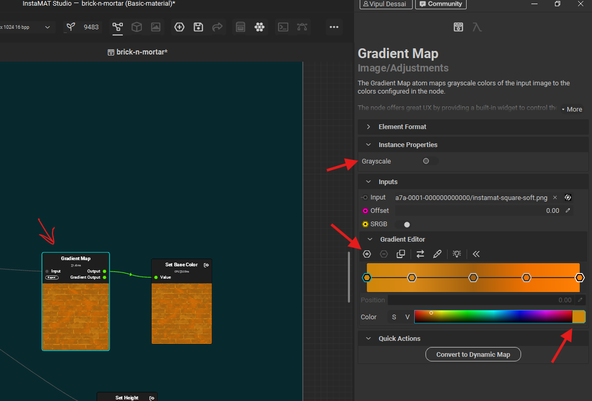
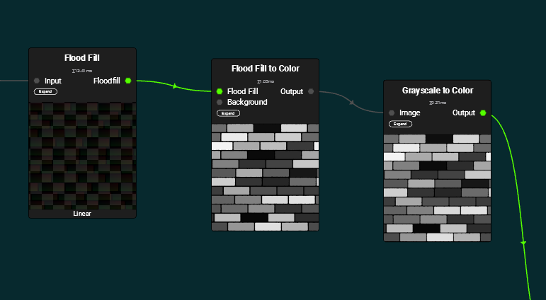

# **Nodes**

# common

## nodes input

- for input like height etc, we can input noises, also we can input output of other nodes
- 

# output

## name and type - output property

the name and type is like the usage in substance designer

| Name             | Type             | coversion node                                    |
| ---------------- | ---------------- | ------------------------------------------------- |
| Height           | ElementImageGray | -                                                 |
| AmbientOcclusion | ElementImageGray | Height to ambient occlusion                       |
| Normal           | ElementImage     | Height to normal                                  |
| BaseColor        | ElementImage     | Solid Color, gradient                             |
| Roughness        | ElementImageGray | Height to normal -> Normal to curvature -> levels |

## create variable

- 
- give proper name refer the table (name and type table)

## expose as output variable

- 

## height conversion

- 

# colors

## solid color

- 

- S - saturation
- V - Value
- square box - hue

## gradient map

allows multiple colors based on the greyscale

- 

# Flood fill (hand pick shapes of greyscale)

convert black-and-white masks into region-aware data structures

## convert the uv details to mask

use `flood fill to mask`

- 

### equivalent in substance designer (SD)

- use multiple node to acheive this
  - flood fill to random greyscale
  - histogram scan
  - contrast

## convert to random greyscale colors

- 

- add a `flood fill to color`
- connect it to "greyscale to color", so that it can be plugged in to blend node
- now adjusting the `seed` of `flood fill to color` will generate random colors
