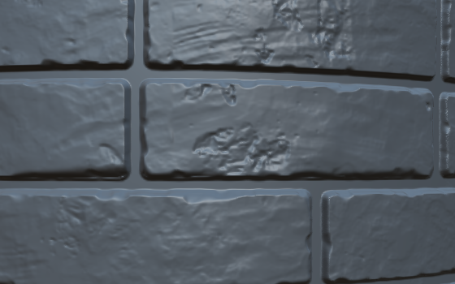

# Noise Nodes

# cloud

## clouds alien

- default settings

## clouds heavy

- scale - 1
- freq gain - 0.2
- freq smooth - 0.8

## clouds smooth

- default settings

# stone

## stone noise

- default settings

# cracks

## swipes and wipes

- scale - 35%
- variance - 65%
- smudge blur - 20%

# cell structures

## voronoi

- scale - 73

### where can be plugged in

- slope blur
  - use very less intensity eg. 1%

# dirt

## smudged dirt

kind of like chipping off pieces from bricks

- 

# Liquid

## liquid noise

- scale - 6

## applications

- make cement/mortar moist

## works better with

- guided blur

# Dense Noise

- default settings
