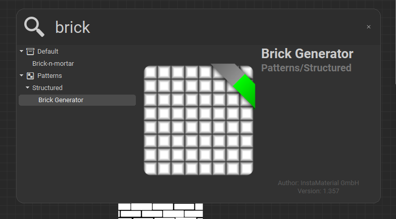
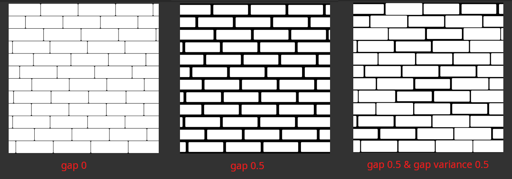

# **shape nodes**

# brick generator

- search brick in the graph (press space)
- 

## offset

- 
- offset - distance and variance

## size

for brick size and gap between nodes

- 

## color

adjust inputs -> luminance -> variance
