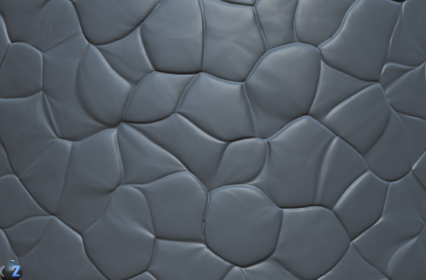
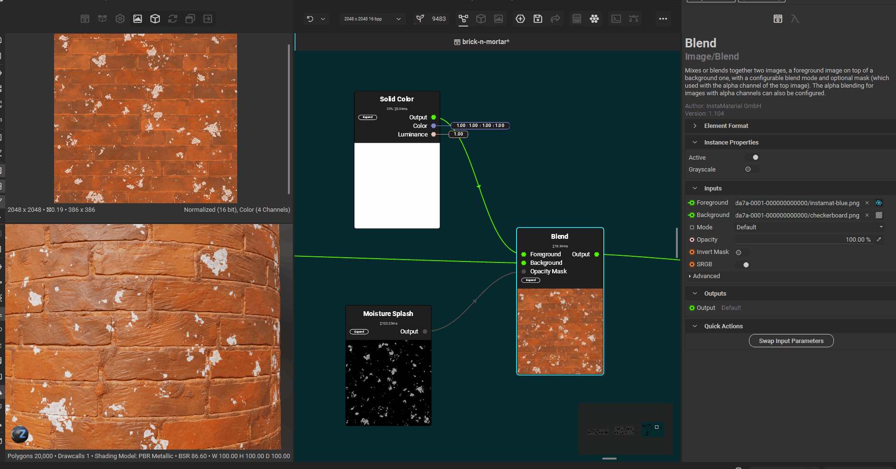
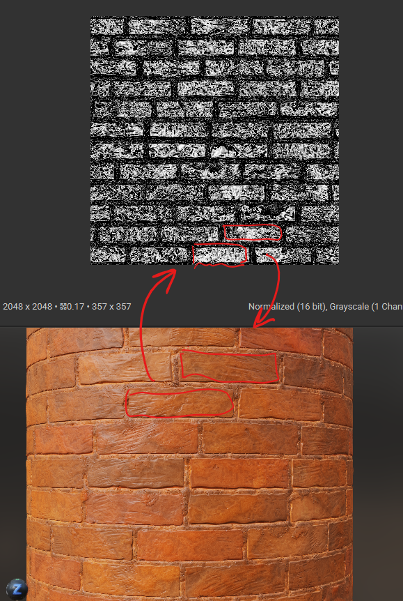
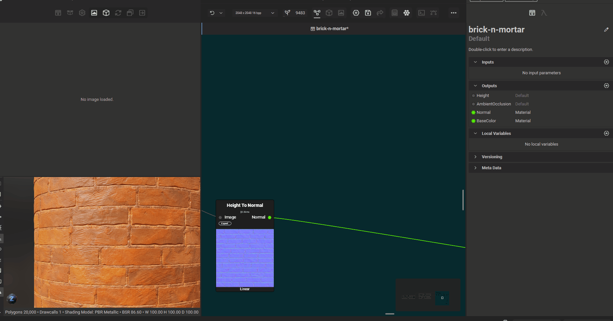

# Techniques

# inflate the noise texture

 

- 
- add blur node to cloud noise
- make sure the cloud noise has enough scale
- adjust the slope blur intensity

## applications

- to form mortar

## dry mortar to moist mortar

 

- add the guided blur
- add liquid noise as height
- set a very low intensity on the quided blur
- 
- adjust the blend mode if required, to make it intense or subtle

## use levels to inflate more or less overall

 

- 
- use levels node ajustments

# splashes

## simple solid color overlay

- 
- use solid color, blend and any type of noise node
- use overlay in blend mode, adjust the opacity

# create a mask only of only flat surfaces

## how to create

- 
- add `normal to curvature`
- add a blend node to concave (foreground), select the mode to subtract
- add a blend node to convex (foreground), select the mode to subtract
- connect output from `normal to curvature` to concave blend node
- connect output from concave blend node to convex blend node
- 
- add the levels node and adjust the levels so to select only the whites
- later this can be used with blend with divide mode
  - whose foreground is non pure white
  - and background is also non pure white

## alternative

- instead of `normal to curvature` and using convex/concave, just use `facing normal` node
- connect it to levels directly and adjust the levels to select only mid whites
