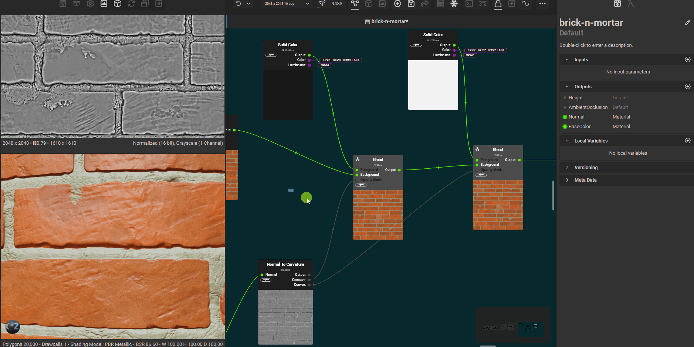

# Techniques

# create basic mask to seperate 2 parts of material

- use height blend
  - have top and bottom input be somehow seperated with histogram select (refer `histogram select - inverse greyscale` notes)
- once the base and mask is output from the `height blend`, create 2 nodes from the `output` pin and connect as foreground and background to a blend node
- connect the mask output pin from the `blend height` to the opacity of the blend node
- adjusting the foreground levels will control top portion of `blend height`
- adjusting the background levels will control bottom portion of `blend height`

# inflate the noise texture

 

- 
- add blur node to cloud noise
- make sure the cloud noise has enough scale
- adjust the slope blur intensity

## applications

- to form mortar

## dry mortar to moist mortar

 

- add the guided blur
- add liquid noise as height
- set a very low intensity on the quided blur
- 
- adjust the blend mode if required, to make it intense or subtle

## use levels to inflate more or less overall

 

- 
- use levels node ajustments

# splashes

## simple solid color overlay

- 
- use solid color, blend and any type of noise node
- use overlay in blend mode, adjust the opacity

# create a mask only of only flat surfaces

## how to create

- 
- add `normal to curvature`
- add a blend node to concave (foreground), select the mode to subtract
- add a blend node to convex (foreground), select the mode to subtract
- connect output from `normal to curvature` to concave blend node
- connect output from concave blend node to convex blend node
- 
- add the levels node and adjust the levels so to select only the whites
- later this can be used with blend with divide mode
  - whose foreground is non pure white
  - and background is also non pure white

## alternative

- instead of `normal to curvature` and using convex/concave, just use `facing normal` node
- connect it to levels directly and adjust the levels to select only mid whites

# select the edges

## how to create

- use normal to curvature with radius around 0.17
- use concave output with blend mode subtract, foreground H0 S0 V0.094
- use convex output with blend mode overlay, foreground H0 S0 V0.95
