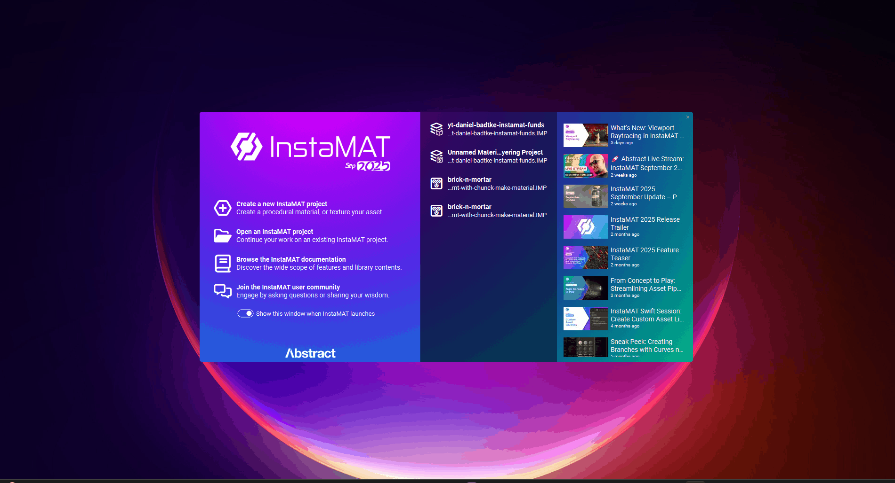
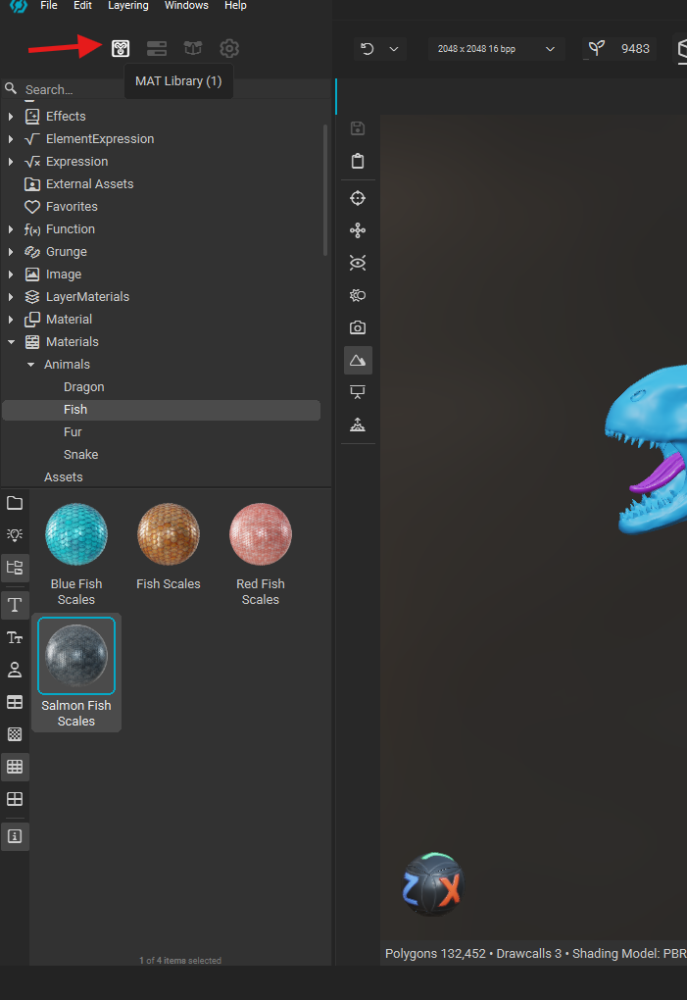
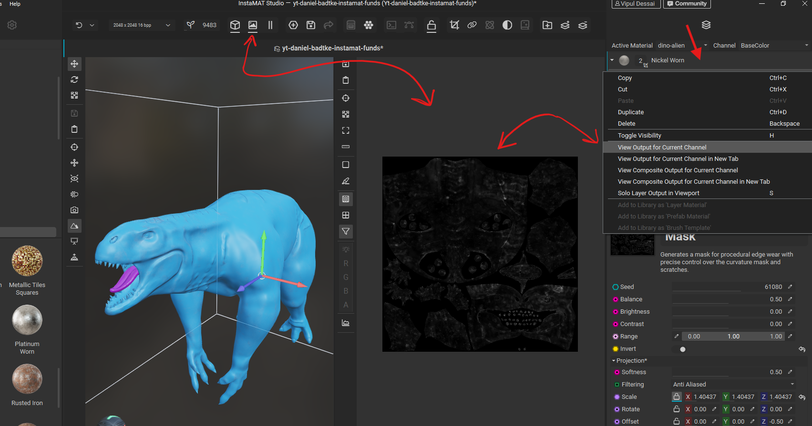
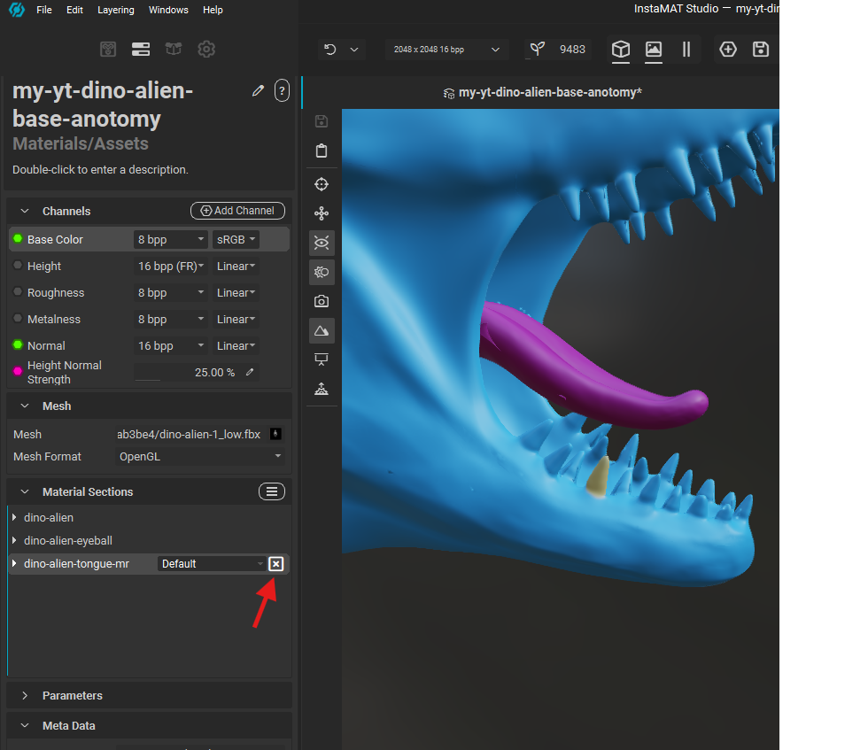

# **instamat basics**

# create project

- 
- select "Asset Texturing"
- select the low poly mesh
- select create empty template

# library

- 

# 2d

## view layer output on UV

- 
- first enable the the `2d image view`
- right click on any layer
- select `view output for current channel`

# 3d

## cycle maps

- press c

### switch to PBR (restore lights and env)

- 
- go to the viewport settings
- switch from solo material to PBR

## hide a mesh or material

- 
- click on the x button
