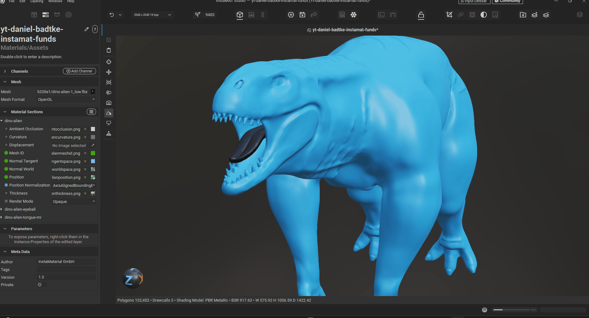
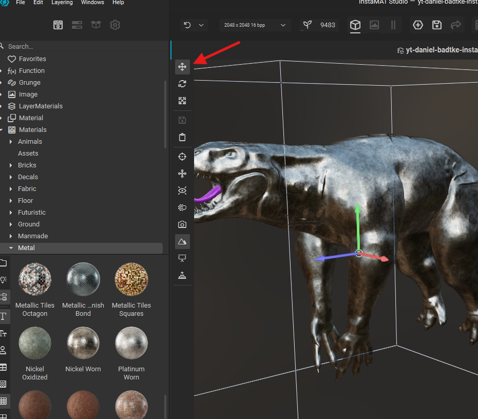
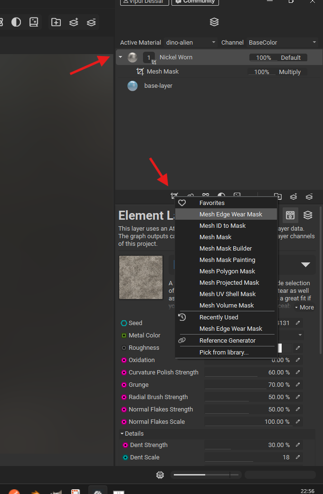
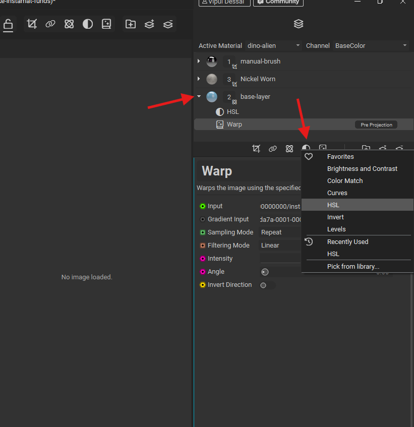
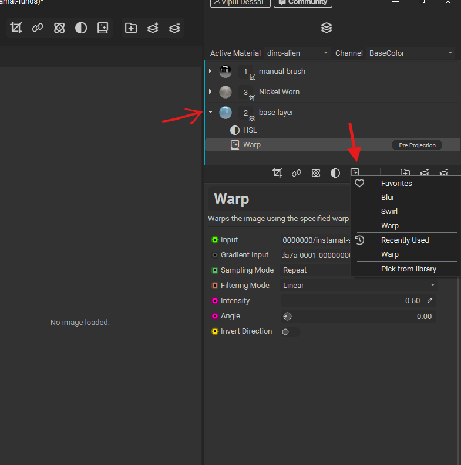
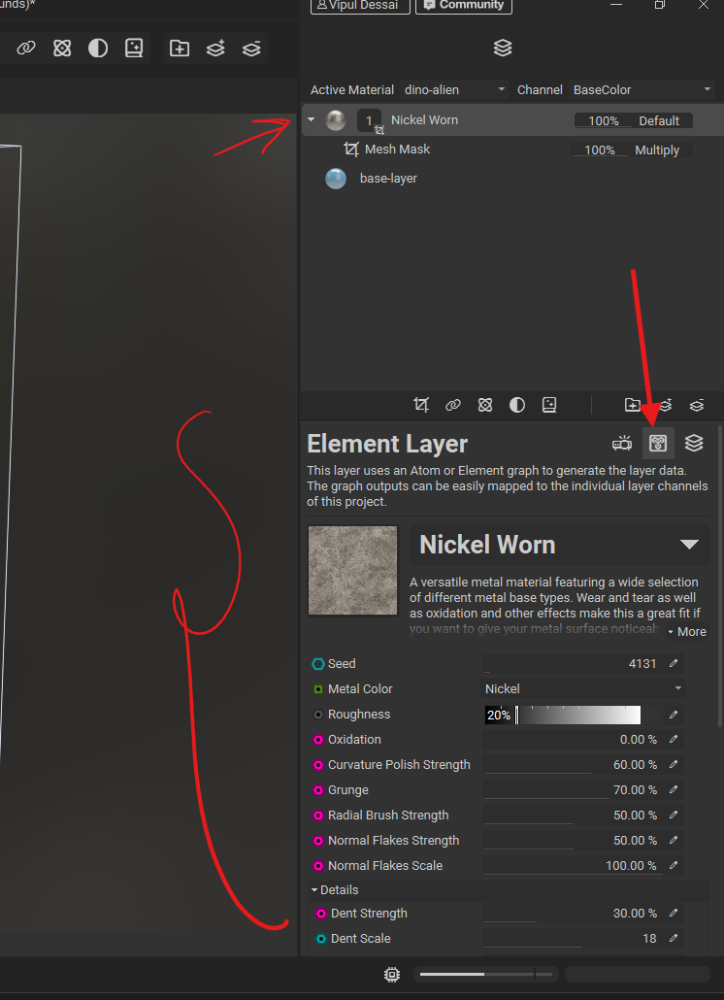
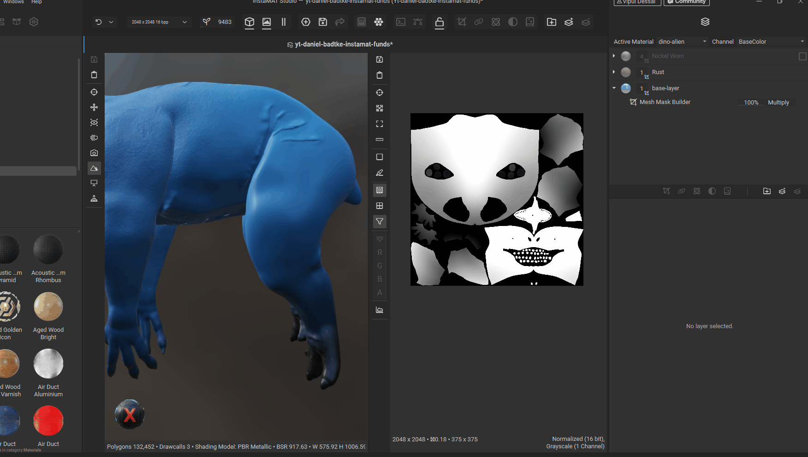
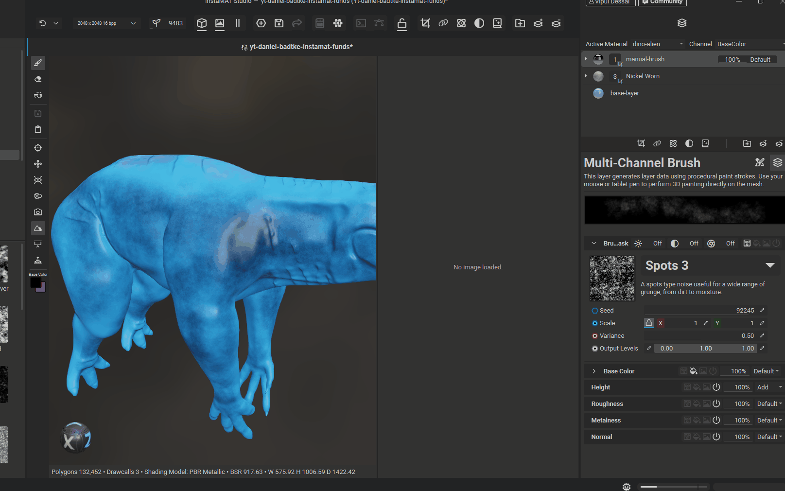
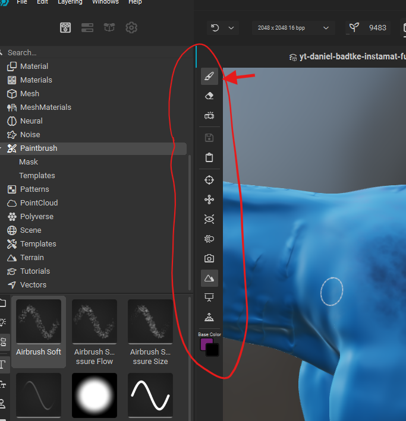
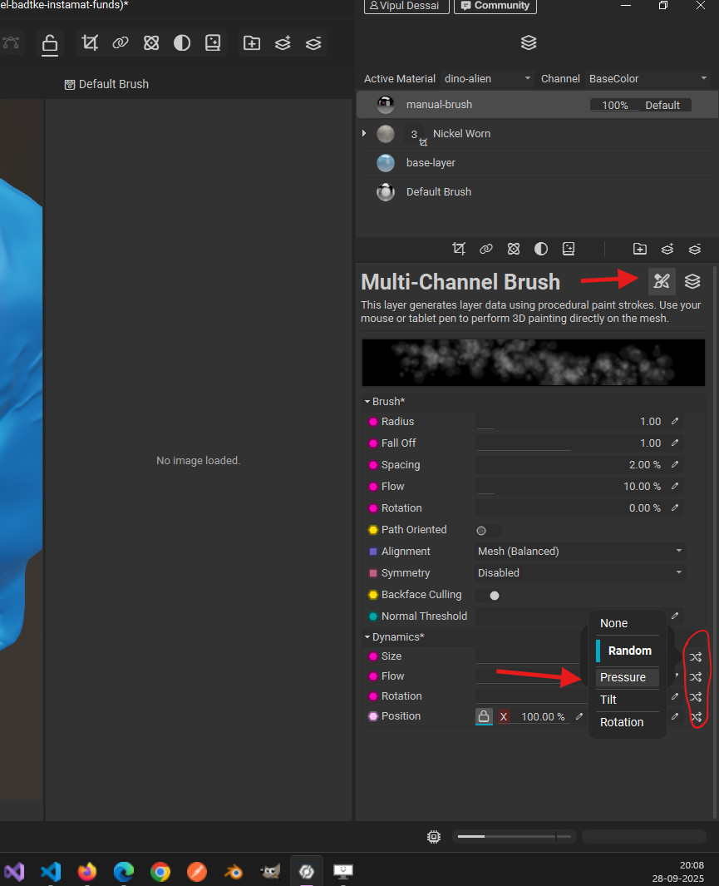

# layer

## add

- 
- add "Multi channel layer"
- switch to layers channel
- if the layers channel look disabled, then fill color to initialize
- adjust the colors as needed

## move scale or rotate layer

- 

## add mask

- 
- select the layer
- click the menu button and choose mask type

## add filter

- 

## add effects

- 

# material

## add

- open the mat library, search, select, drag and drop the material onto the mesh

## properties panel

- 

# mask

## view mask

- right click on mask -> `view output for current channel`

## invert mask

- 
- goto mask property
- toggle invert

## mask builder

### adjust contrast

adjusts the gradient's fading between point A and B

- 
- adjust -> gradient -> contrast

# brush layer

- 
- to change the brush pattern -> from the mat library -> double click on any `paintbrush/templates`

## change brush texture

- 
- **note:** if nothing is visible then switch off the "user library content"

## brush side panel

- 

## enable tablet

- 

## shortcuts

- draw line - hold shift and drag
- z - eraser
