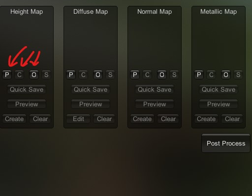
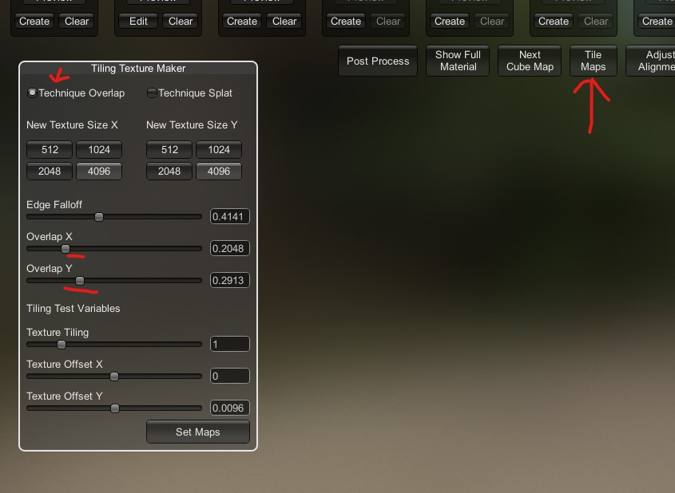

# Open file
- 
- <kbd>Left Click</kbd> on button `O` and select the file

# edit the map
- click on the `Edit` button
- Diffuse reveal slider
  - shows before and after the effects

# create
- click on other maps `create` button to adjust sliders map the new type of map
  
## normals
- need to create the `height map` and then the `create` option for the the normal will be available

# diffuse
- after finalizing click on `Set as diffuse` button 

# view finalize material
- click on `Show Full material`

# fix the tile image edges or seems
- 

# test the lights
- click on `Next cube map`