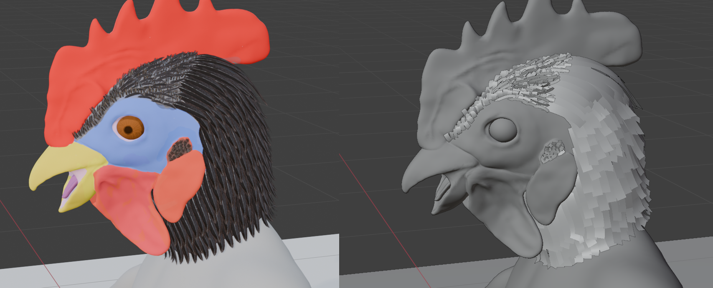

# Feathers

## large feathers

- use curve with bevel object and arrange them manually
- particles doesnt let you twist or rotate the feather
  - same even for the curve -> empty hair (geo nodes)
- 
