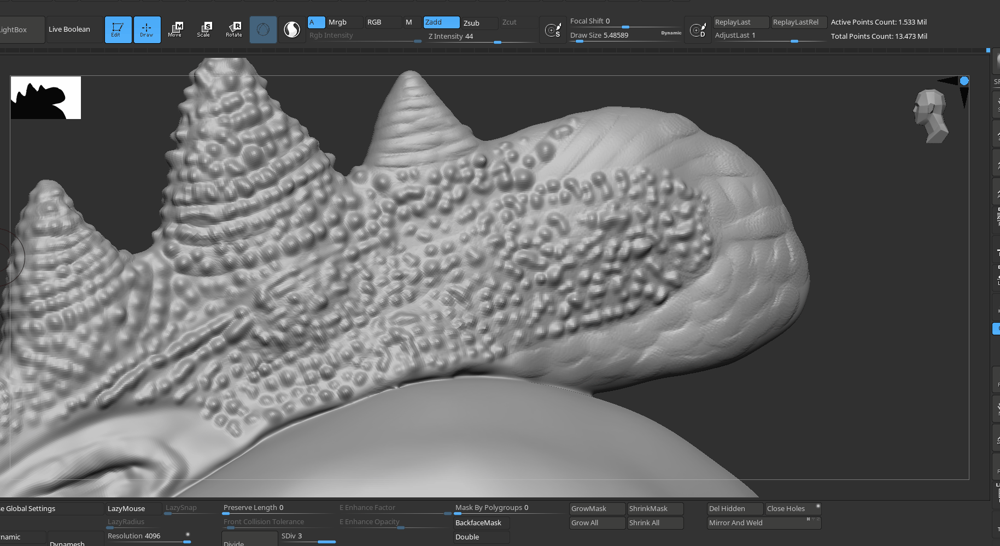

# drag a hole on a surface

- 
- with standard brush and alpha and dragRect, with intensity

# Eye iris sculpting

- use radial symmetry
- 

# quick extruded pores

- 

- use standard brush
- z intensity to 44 or higher
- to mark 1 pore drag quickly from right to downwards left
