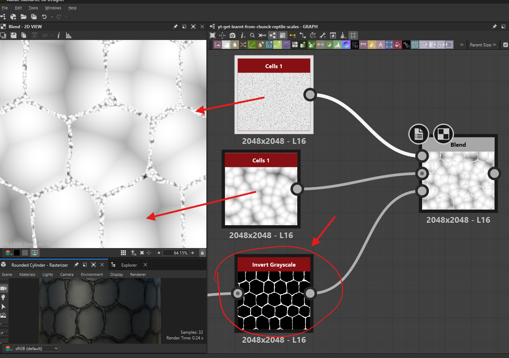
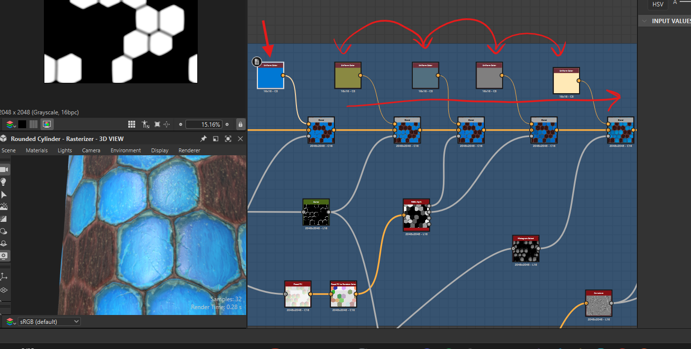

# blend node

- use to merge different nodes and
- control visibility with black and white with [`curve node`](./nodes.md#curve-node)
- 

## opacity mask

- 
- mask is common for all blending nodes
- white part of the mask will be replaced by details from foreground
- black part of the mask will be replaced by details from background
- if no mask is attached then full layer is visible

## blending modes

- copy - default
- subtract
  - lays on top of foreground
  - keeps white and gets rid of black from the foreground onto the background
- multiply
  - opposite of `subtract` mode
  - lays on top of foreground
  - keeps black and gets rid of white from the foreground onto the background
- overlay
  - kind of like detailed transparent glass layer
    - foreground is that glass layer
- divide
  - needs non pure white in the foreground and background

**Note:** 
- overlay and multiply help keep multiple blends hue synced
- 