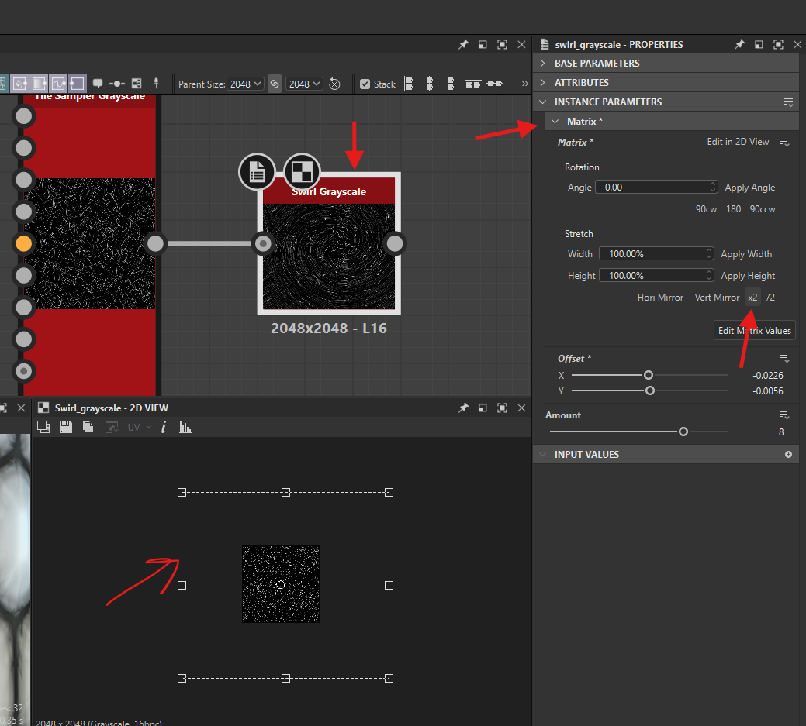
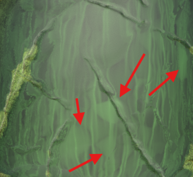

# bevel

## positive

pushes the shape from inside to outside

- 

## negetive

pulls the shape from outside to inside

- 

## smoothness

- 

## normal map

bevel node outputs a norml map

### normal format

- set to OpenGL
  - `TODO` - find what is required for adobe substance painter material

# vector warp greyscale

- warps the greyscale input details around the normal input
- 

## normal format

- set to OpenGL
  - `TODO` - find what is required for adobe substance painter material

# swirl geryscale

## increase mask size

- 

## how to swirl

- properties -> instance parameters -> amount

# directional warp

## how to use

- use with a cloud noise to make make jagged lines

# directional scratches

## settings

- angle
- angle random

## application

### scrtaches with dots

- 

#### how to use

- 
- vector map can take the `normal` node output (normal from height node)
- blend mode overlap
