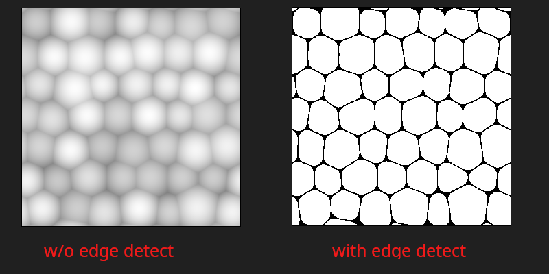
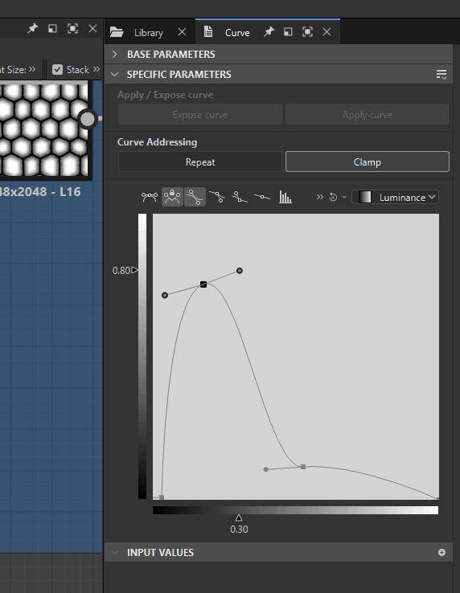
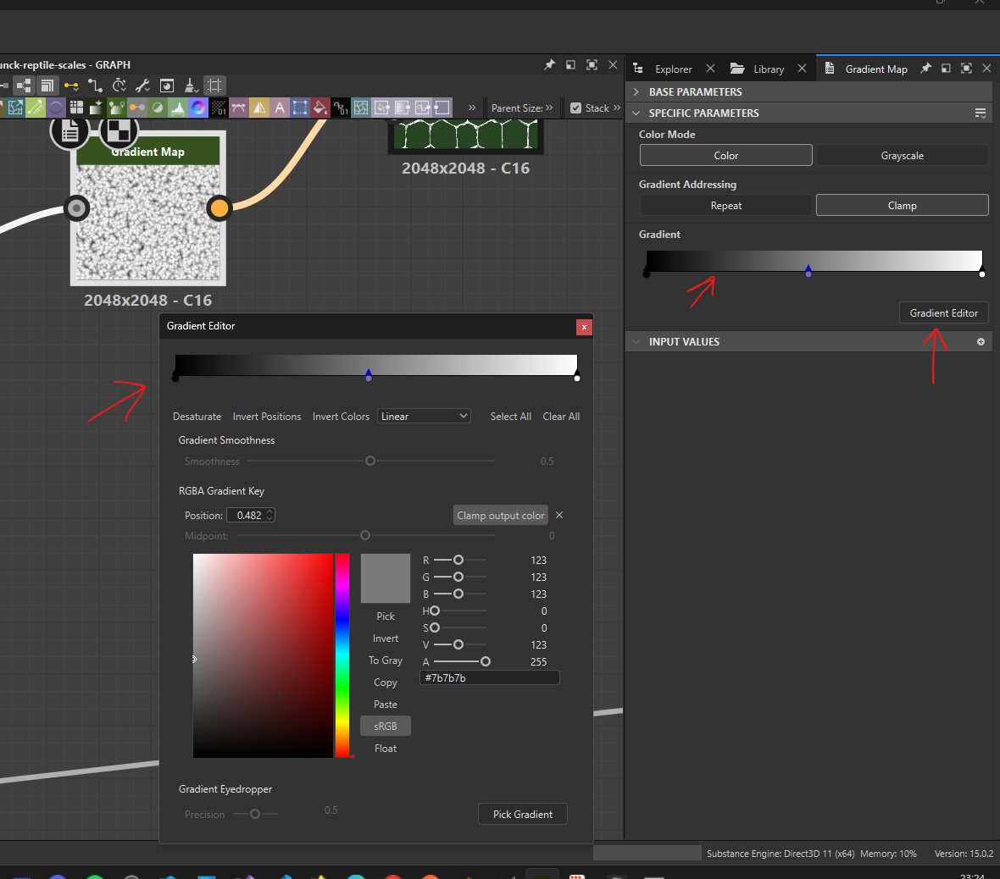

# blur

## slope blur

### settings

- increase the samples
- keep the intensity low like 0.07

### how to use

- can be used with noises like `fractal sum base`, `Gaussian Noise`

# edge detect

- 

# curve node

- same as photoshop or gimp node
- 

## add more rings

- 

## lock while adjusting

- 

# histogram select

use the histogram select as a mask for the blend to select different parts of the material

# gradient map

## gradient editor

- 
- either double click on the gradient slider
- or click on "Gradient Editor"
- color can be greyscale or any color
