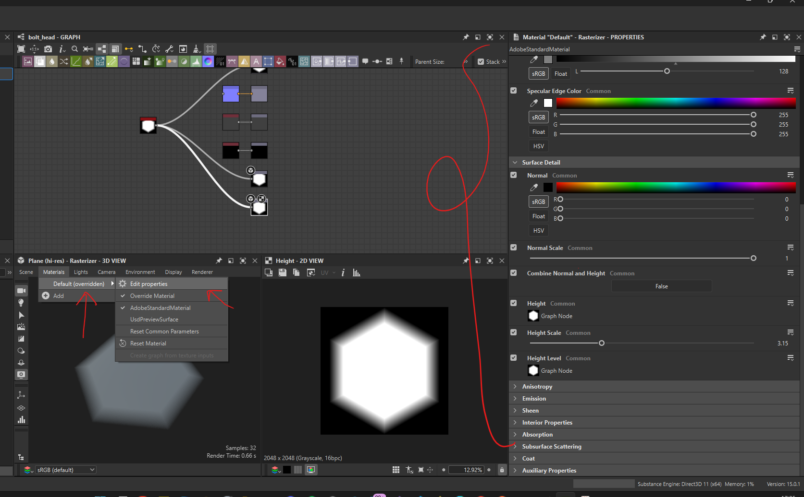

# Material Properties

- 

## height

- refer substance designer basics for `which node to view` in 3d view, and set it to height output node
- then set the height scale `Value` to something more than 1 (eg. 10)
- 
