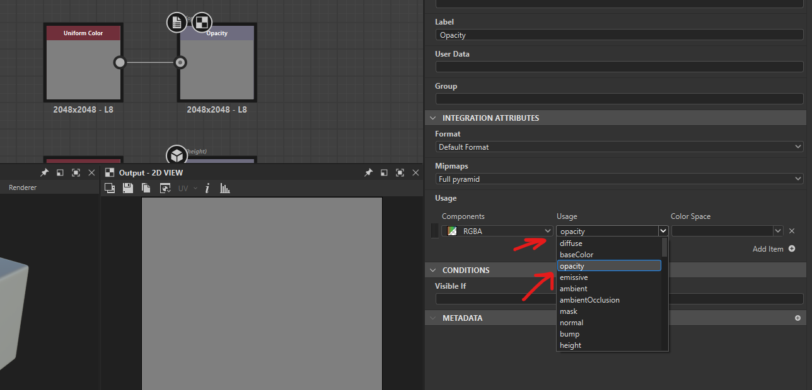

# **Nodes**

# Output Nodes

## add

- in the graph press "space" -> search for "output"
- 
- add id and label
- in the "Integration attributes" select its usage

## Properties

### Usage

#### Opacity

whatever is black is hidden, and only white is visible

- 
- select the usage as `Opacity`

# uniform color

## change color

controls the detail of the output node

- 

### open color picker

- 

# normal

## intesity

make normal details more visible

- 

# Flood fill (hand pick shapes of greyscale)

- convert black-and-white masks into region-aware data structures
- the input should have defined edges i.e. the details should not be too smooth or low frequency

## flood fill to gradient

allows to control the gradient of each item seperated using `flood fill`

- 

### applications

- could be used to create overlapping grid
- 

## flood fill to random color

### convert it to greyscale

use `rgba split`
