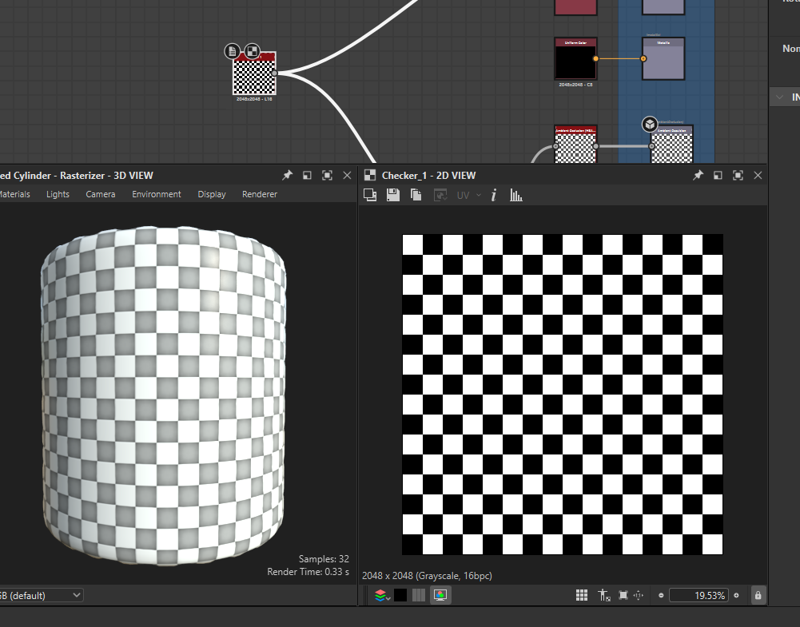

# **Nodes**

# Output Nodes

## add

- in the graph press "space" -> search for "output"
- 
- add id and label
- in the "Integration attributes" select its usage

## Properties

### Usage

#### Opacity

whatever is black is hidden, and only white is visible

- 
- select the usage as `Opacity`

# Input Node

## uniform color

### Properties

#### change color

controls the detail of the output node

- 

##### by output

- roughness -> controls reflection
- metallic -> metal

## normal

### properties

#### intesity

make normal details more visible

- 

# edge detect

- 

# bevel

## positive

pushes the shape from inside to outside

- 

## negetive

pull the shape from outside to inside

- 

## smoothness

- 

# checker

checker board pattern

- 

# Noise - `TODO`

## bnw spots 2

todo - note settings hear
