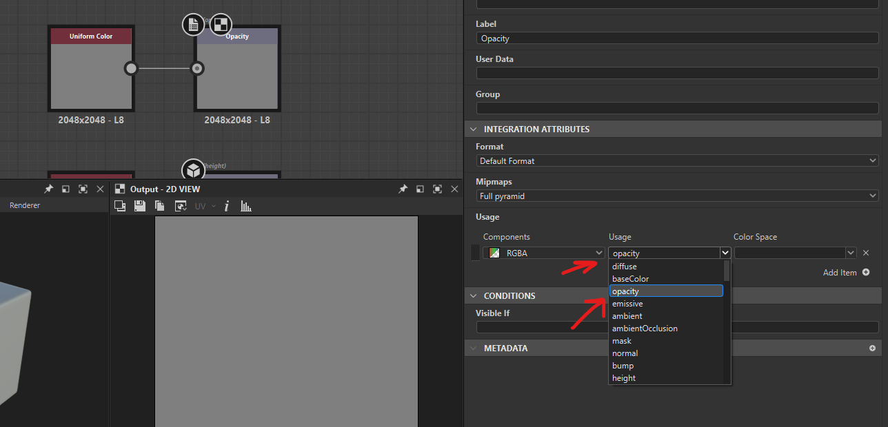
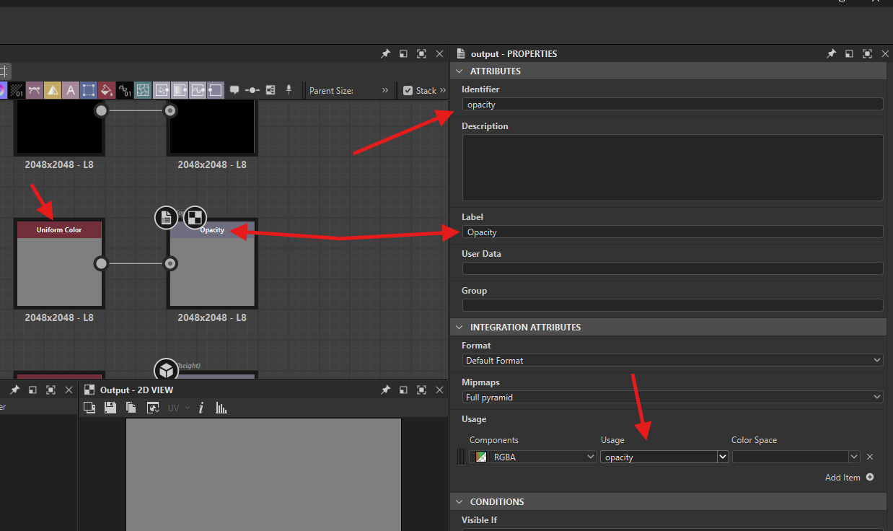
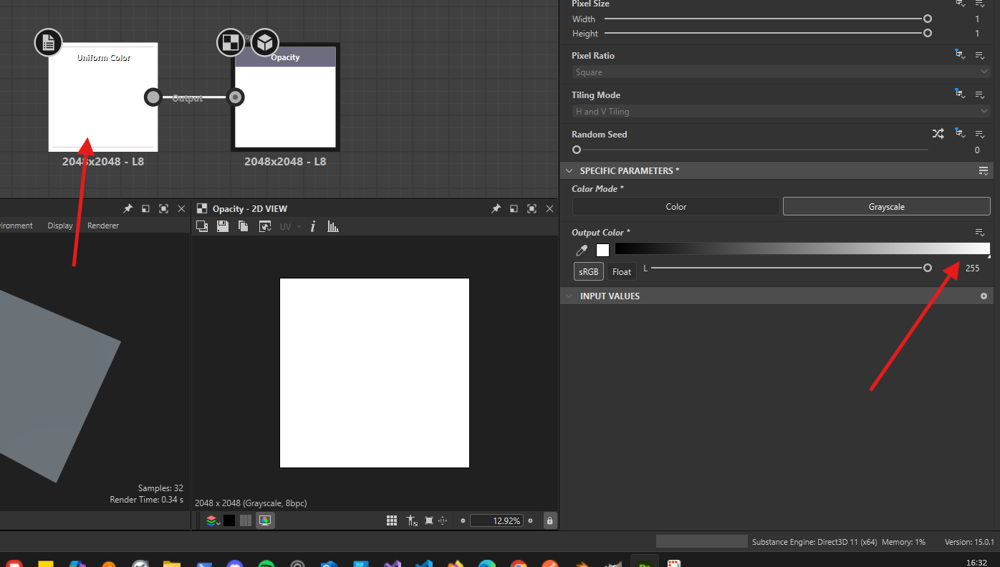
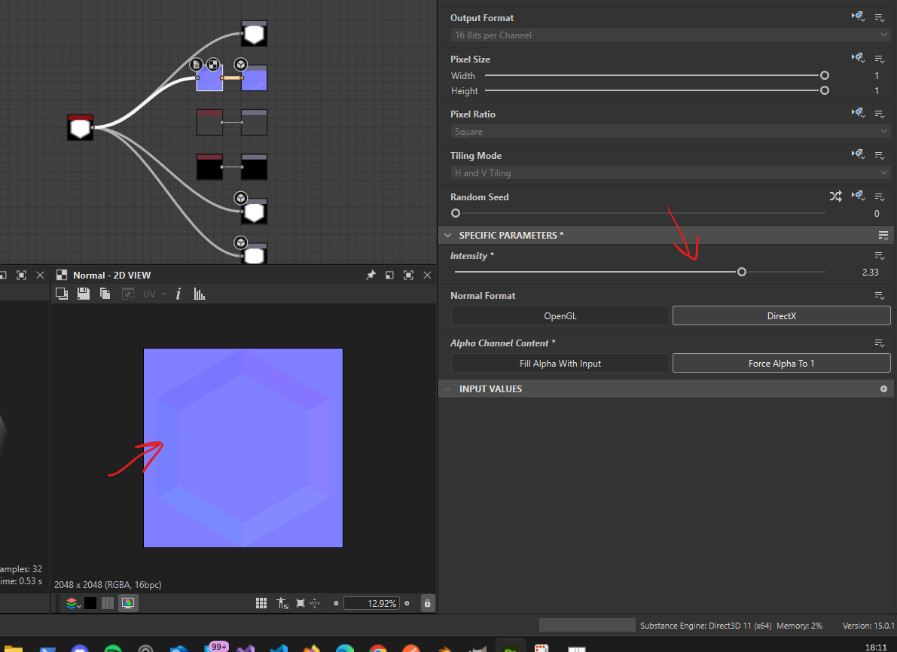
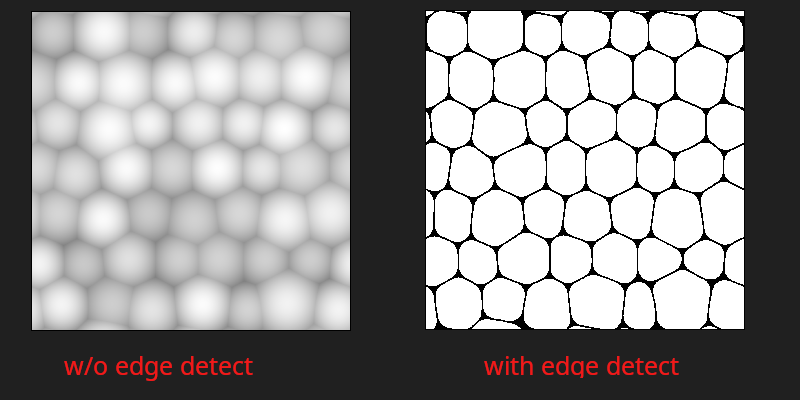
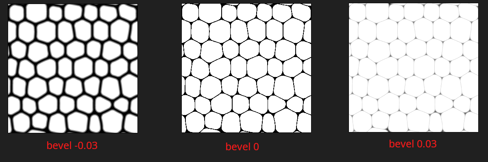
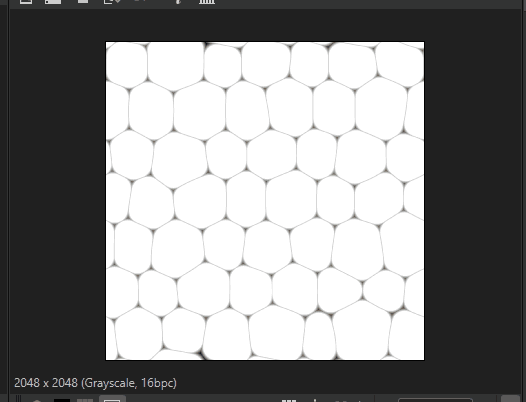
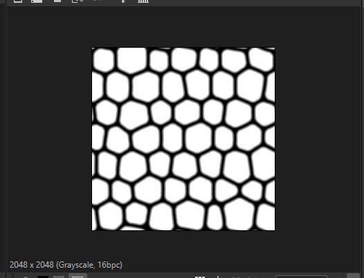
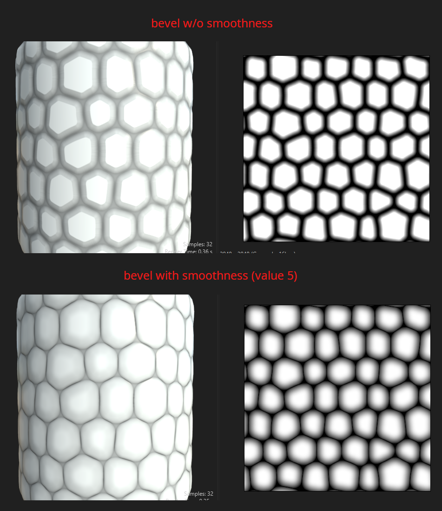
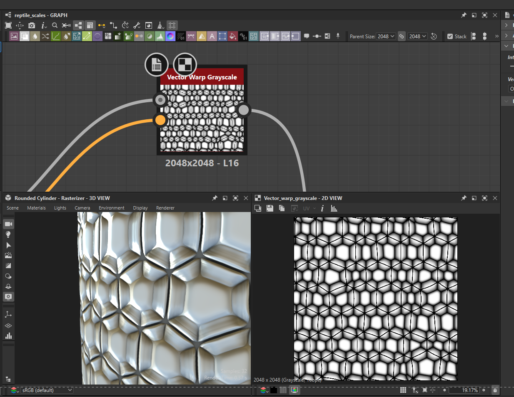

# **Nodes**

# Output Nodes

## add

- in the graph press "space" -> search for "output"
- 
- add id and label
- in the "Integration attributes" select its usage

## Properties

### Usage

#### Opacity

whatever is black is hidden, and only white is visible

- 
- select the usage as `Opacity`

# Input Node

## uniform color

### Properties

#### change color

controls the detail of the output node

- 

##### by output

- roughness -> controls reflection
- metallic -> metal

## normal

### properties

#### intesity

make normal details more visible

- 

# edge detect

- 

# bevel

## positive

pushes the shape from inside to outside

- 

## negetive

pulls the shape from outside to inside

- 

## smoothness

- 

## normal map

bevel node outputs a norml map

### normal format

- set to OpenGL
  - `TODO` - find what is required for adobe substance painter material

# vector warp greyscale

- 

## normal format

- set to OpenGL
  - `TODO` - find what is required for adobe substance painter material

# blend node

- use to merge different nodes and
- control visibility with black and white with [`curve node`](./nodes.md#curve-node)
- 

## mode

- 
    - copy is sharp
    - subtract kind of fuse together
    - multiply 
        - gets rid of white from the foreground
        - overlays black only from background
    - overlay is subtle and smooth like

# curve node

- same as photoshop or gimp node
- 

## add more rings

- 
