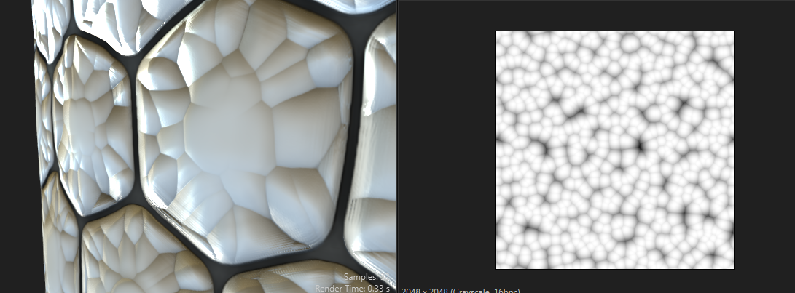

# cells

- 

# bnw spots 2

default settings

# fractal base sum

## how to use

- use it with slope blur

## settings

- adjust max and min levels

# gaussian noise

## applications

### stepping cut kind of effect

- 
- use slope blur grayscale with min belnding mode
- gaussian node settings
  - scale - 23
  - disorder - adjust as required
