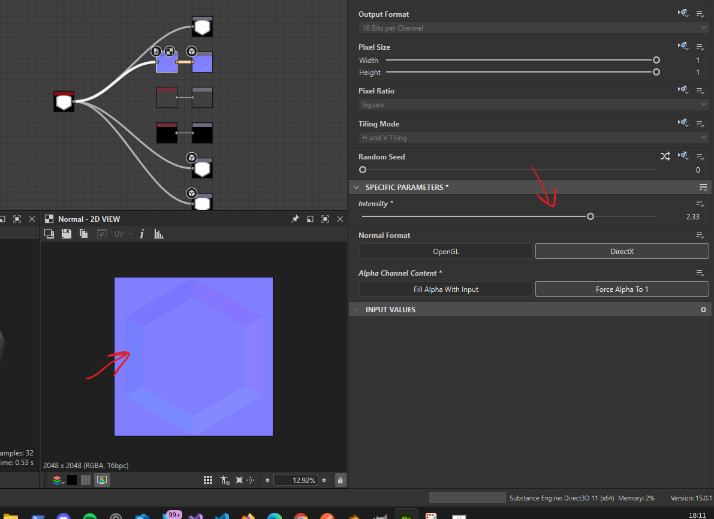

# normal

its `height to normal` node from instaMat studio

## intesity

make normal details more visible

- 

## how to combine

### normal blend

if need a mask then use normal blend or else use the normal combine

### normal combine

- if no mask is needed
- select the technique as `high quality`

#### how to use

- use height to normal map (i.e. normal node), so that we can control normal output intensity
- connect it to the normal combine, set technique as `high quality`
