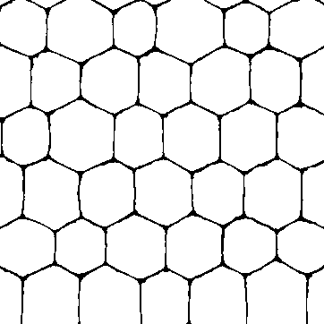
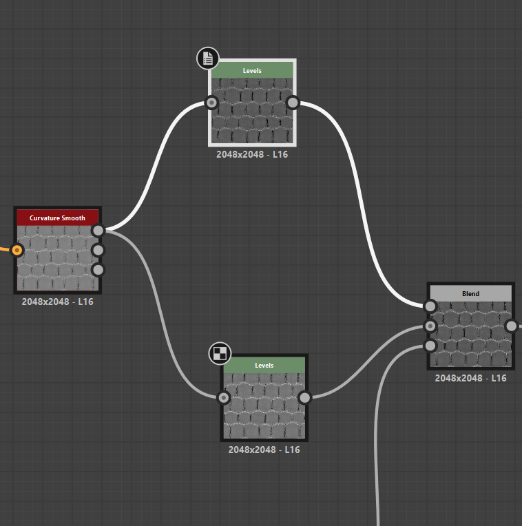

# roughness

# create roughness map

- add `curvature smooth` from `height to normal` i.e. `normal` node
- add levels to it
  - glossy - if the levels are dark
  - rough - if the levels are white

## how to use

to setup 2 parts material roughness so that both can be controlled individually

- first we need a binary mask
- 
- use 2 levels node to control each of parts
- 
