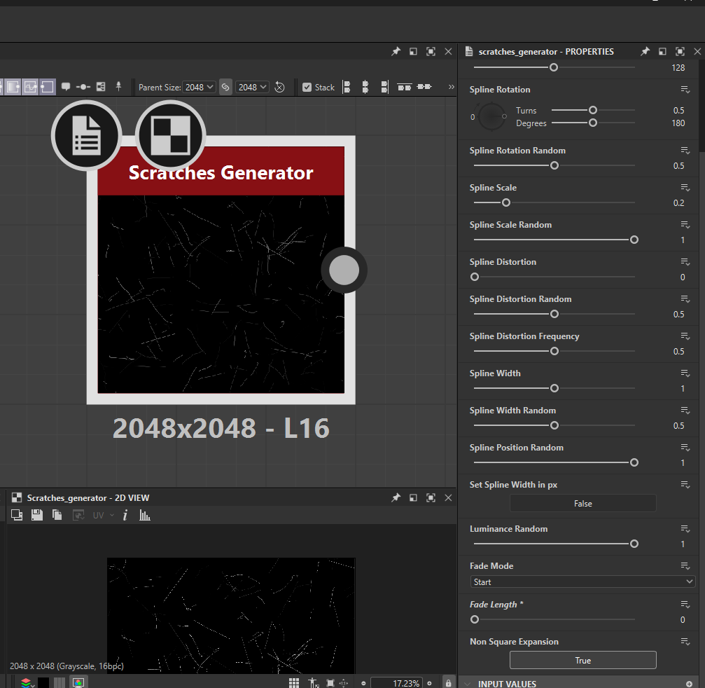
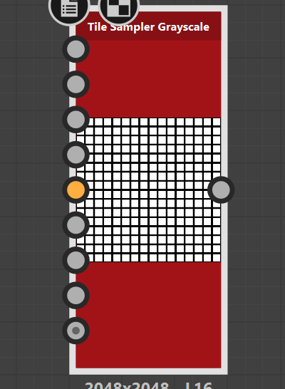

# **Shape Nodes**

# Polygon

## Gradient

make border look like bevel

- 

# Tile random greyscale

for reptile scales, bricks

- 

## basics settings

- x ammount - 6
- y amount - 6
- pattern
  - paraboloid
  - 
- size
  - random x and y -> 0
- shape
  - 
    - scale - 8.67
    - scale random - 0.84
      - if there is too much of gap, then reduce the scale random
- color
  - blending mode
    - 
      - confines the shape size
  - random greyscale color
    - 

## honey comb or helix shape

- 
- offset - 0.5
- offset random - 0.03
- random - 0.07

# checker

checker board pattern

- 

# scratches generator

- 

# tile sampler greyscale

can be used to create scratches, etc

 

