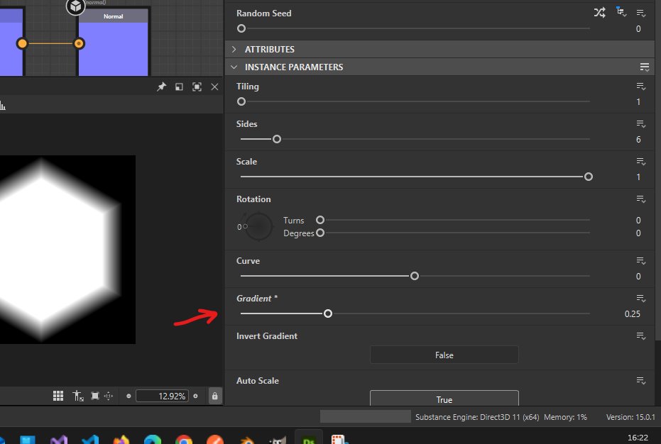
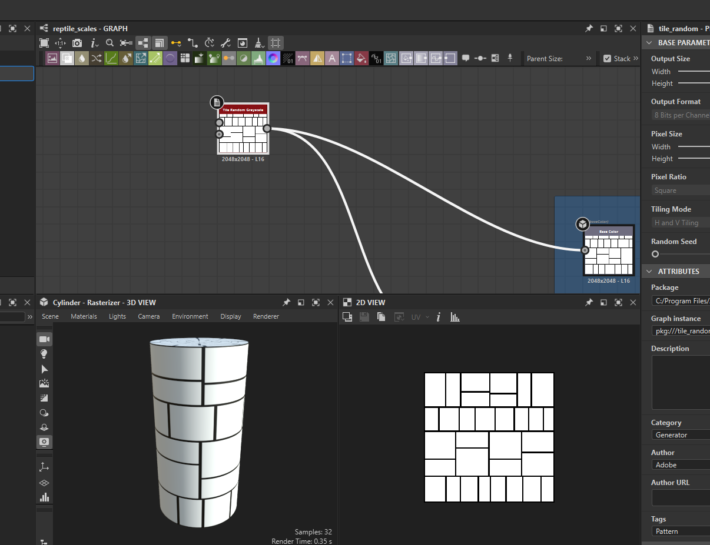
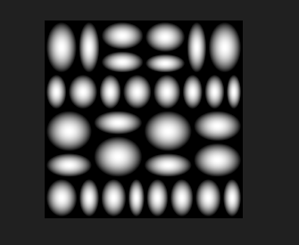
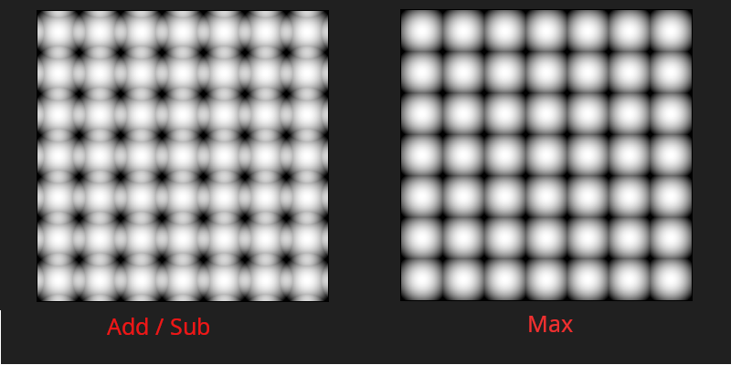
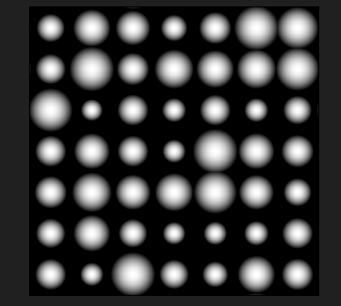
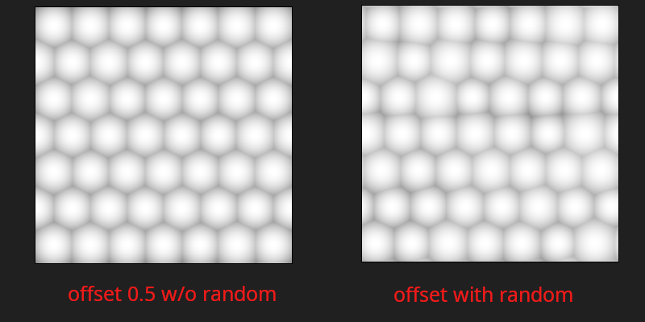
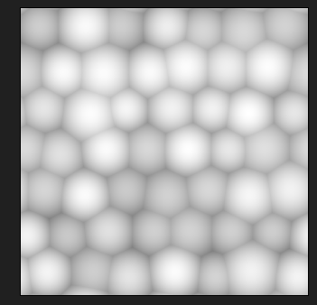
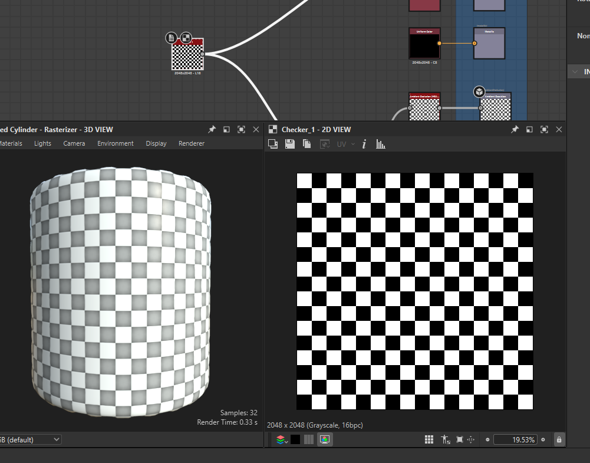

# **Shape Nodes**

# Polygon

## Gradient

make border look like bevel

- 

# Tile random greyscale

for reptile scales

- 

## patterns

under instance paratmeters -> patterns

- paraboloids
  - 

## blending mode

- 

- under instance paratmeters -> color
  - blending mode dropdown

## random scale

- 

- under instance paratmeters -> shape
  - scale
  - scale random

## honey comb or helix

- 

- under instance paratmeters -> position
  - offset - 0.5
  - offset random - 0.03
  - random - 0.07
- adjust scale and scale random as required

## color

### random

- 

# checker

checker board pattern

- 
