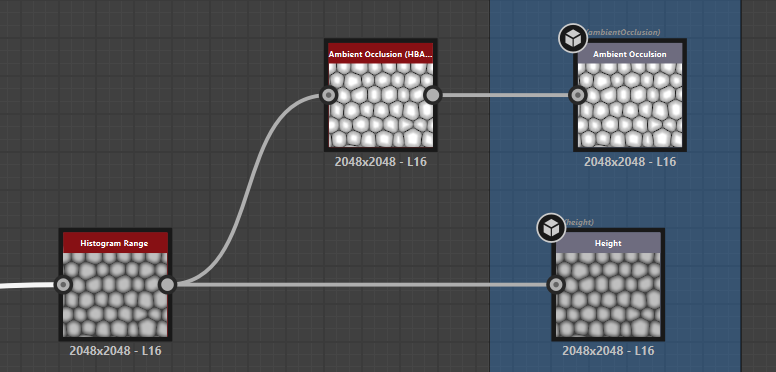
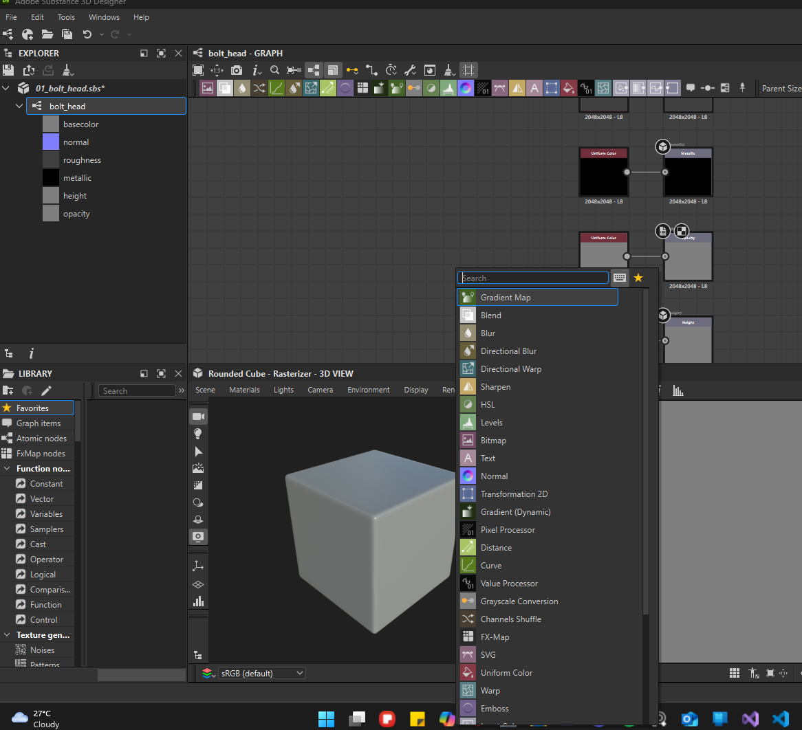
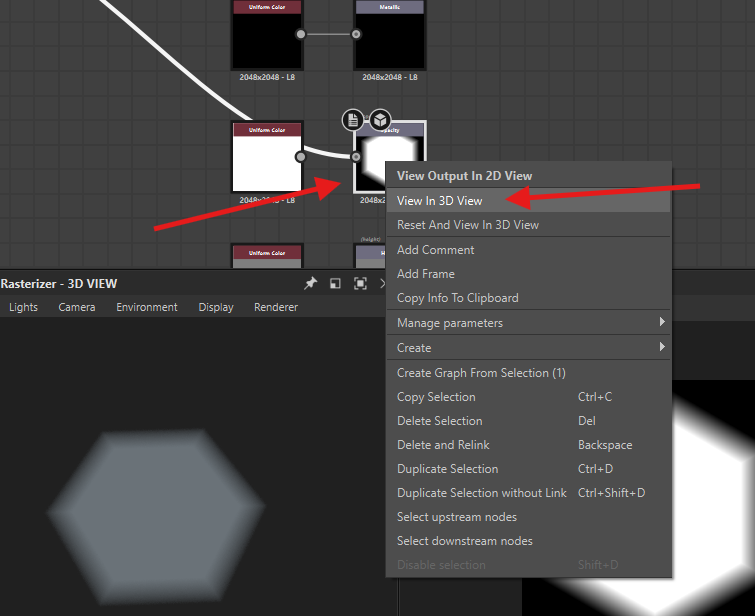
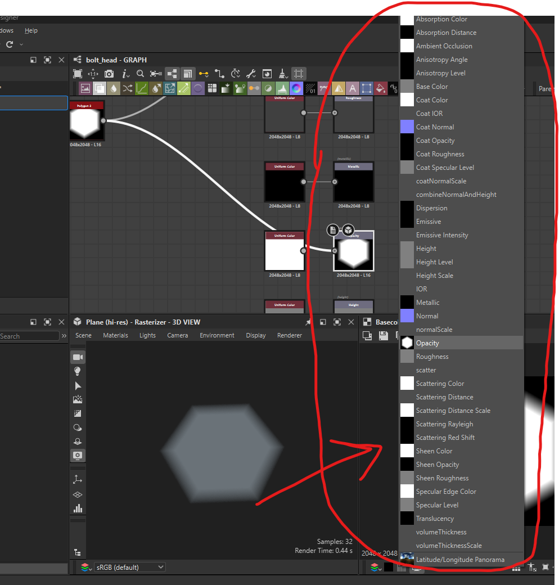
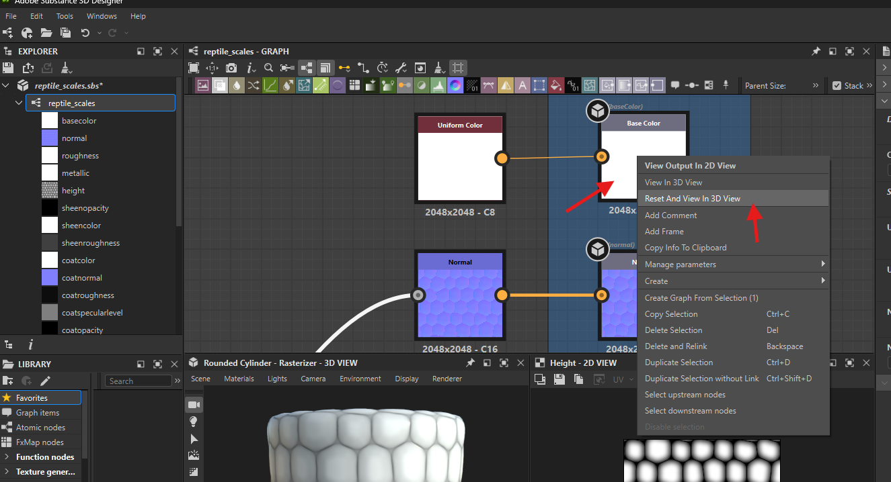
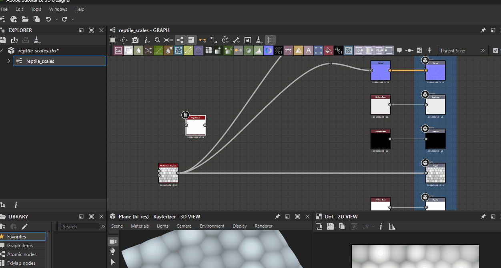
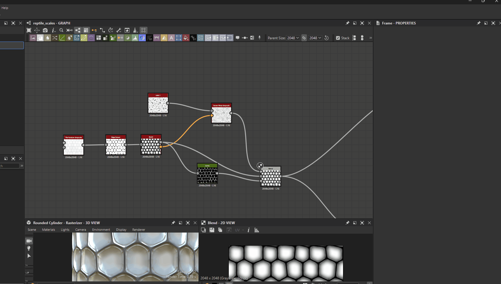
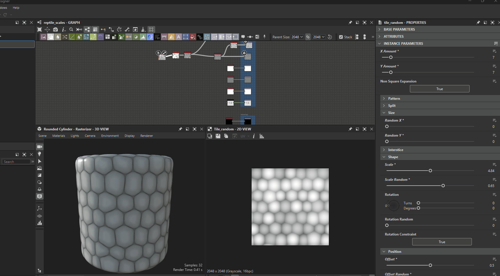
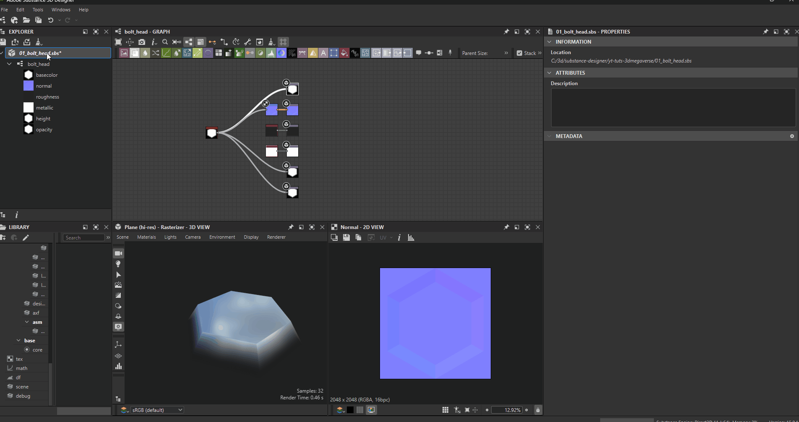
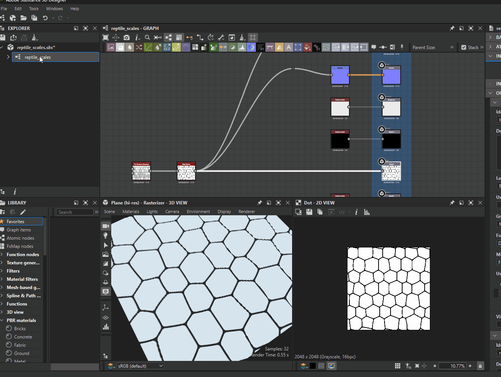

# **Substance designer basics**

# Create

## new project

- new
- select any template like "Adobe Standard Material"
- search and add output node and set usage as ambientOcclusion
- 
- add ambient occlusion HBAO node
- add histograme range node
- connect it to ambient occlusion hbao and height
- 
- set `view in 3d view` for following
  - base color
  - normal
  - ambient occlusion
  - height

**Note:** opening existing projects reset the 3d view, so set the 3d view again using `view in 3d view`

# Viewport

## light

- to adjust light - shift + right click and move mouse

## search

- in the graph press "space"
- 

## duplicate

- select node
- ctrl + d

## disable node

- select node
- shift + d

## 2d view

### which node to view

- double click on any node

## 3d view

### shape

- 

### which node to view

- right click on node -> view in 3d view
- 
- select the name of the channel you have right clicked
- 

#### reset and view only one

- right click the channel you which you want alone
- 
- select the name of the channel you have right clicked
- 

## connect nodes

- press shift and pull out or plug in the pins
- 

### search and connect

- select the node press space and drop and node

## group

- 

# enviornment

- 

# export

## material

- 

## alpha (for substance painter brush)

- 
