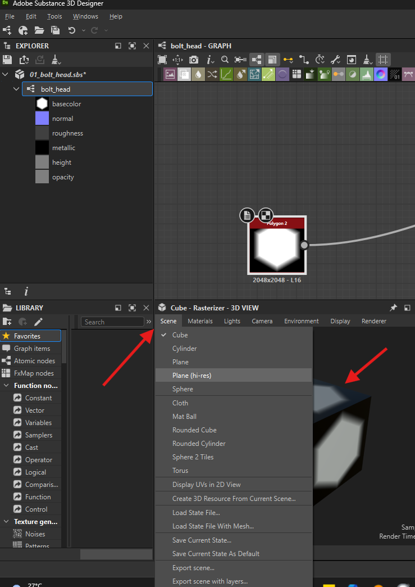

# **Substance designer basics**

# Create

## new project

- on home page click "New"
- select any template like "Adobe Standard Material"
- search and add output node and set usage as ambientOcclusion
- 
- uniform color node setup for base color (this is a CG technique for efficiency)
  - 
  - change base parameters -> inheritance -> absolute
  - lower width and height to 4 so that its 16px
- add ambient occlusion HBAO node
- add histograme range node
- connect it to ambient occlusion hbao and height
- 
- set `view in 3d view` for following
  - base color
  - normal
  - ambient occlusion
  - height

**Note:** opening existing projects reset the 3d view, so set the 3d view again using `view in 3d view`

# Viewport

## search

- in the graph press "space"
- 

## add node in between

- select the node -> press space -> search and select the node -> drops the node connecting to previous node
- or select a connector wire -> press space -> search and select the node -> drops the node on the connecting wire

## duplicate

- select node
- ctrl + d

## disable node

- select node
- shift + d

## connect nodes

- press shift and pull out or plug in the pins
- 

## group

- 
- select nodes
- right click
- add frame

## organise lines or connectors

- hover over the connector line
- press alt to see the preview of joint
- click to finalize

## change the material size

- 

# 2d view

## view node in 2d view

- double click on any node

# 3d view

## light

- to adjust light - shift + right click and move mouse

## rendering object

- 

## which node to view

- right click on node -> view in 3d view
- 
- select the name of the channel you have right clicked
- 

## view all

- 
- right click on the graph
- view outputs in 3d view

## reset and view only one

- right click the channel you which you want alone
- 
- select the name of the channel you have right clicked
- 

# enviornment

- 

# export

## material

- 

## alpha (for substance painter brush)

- 
