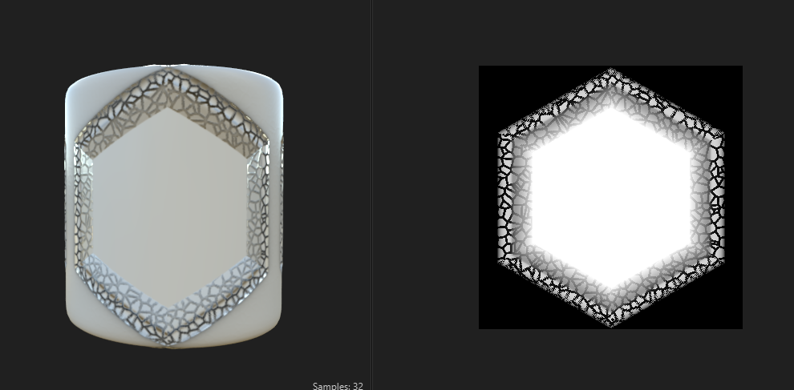

# **techniques**

# add any pattern only along the edges

 

- 
- connect bevel normal to `vector warp greyscale`
- 
- adjust bevel and curve

## add the colors along the edges or rims

- 
- this is the curve node settings for coloring the edges

# binary fluid pattern using guassian noise

 

- for the guassian blur node
  - adjust scale like eg. 10
  - distortion to rotate the texture
- for histogram scan
  - position - more than 0.5 (eg. 0.65)
  - contrast - 1

# create cracks using noise

- 
- use `cells 4` noise as foreground and background for a blend node
  - adjust the scale of both of them
  - blending mode is `copy`
- use the above - [`binary fluid pattern using guassian noise`](./techinques.md#binary-fluid-pattern-using-guassian-noise) to create a mask for the blend
- add a `edge detect` and `directional warp` with `clouds 1` noise

# make edges jagged with noise

- add `directional warp`, increase the intensity, set more than value 1
- 

# scratches from tile sampler greyscale

- x ammount - 50
- y ammount - 50
- pattern - paraboloid
- size
  - size
    - x - 0.04, y - 1.29
  - size ramdom
    - adjust as required
  - scale - 3.71
  - scale ramdom -
- Position
  - position random - 3.15
- rotation
  rotation random - 0.23
- color
  - mask random - 0.4
  - color random - 0.4

## additional nodes connection

- swirl greyscale -> rotate
- directinal warp
  - adjust the intensity and angles
- slope blur with fractal base sum
  - 
    - why to use slope blur with fractal sum base here

#
