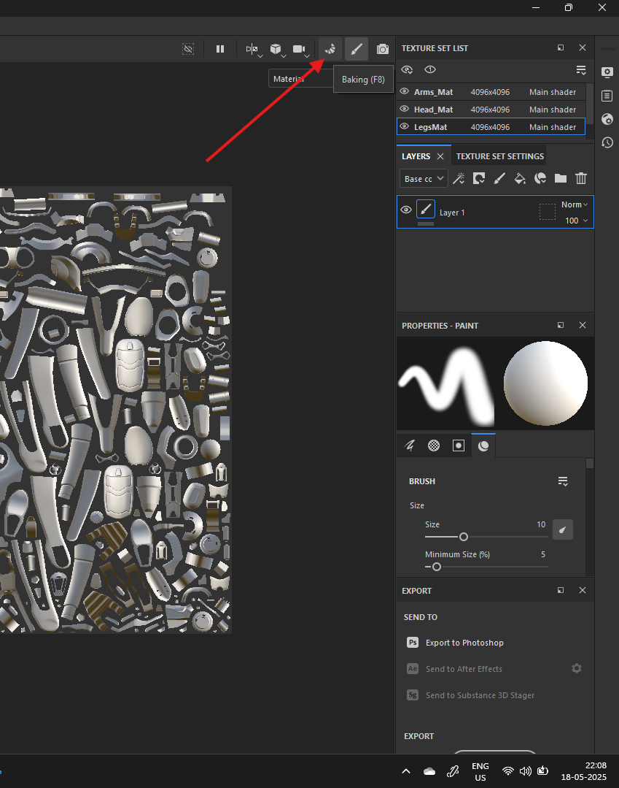

# Bake

# Recommendations

- have a righer res model (high polycount model)
- or higher res normal map baked from higher res map
- if still model is low poly then use this
- 

# open

- 

# Create

- mesh map settings
- 
    - set res to 4k

# common settings

set settings for each type of map in `Mesh Map Bakers`

- 
    - click on any map to see the settings in `Mesh Map Settings`

## ID

- Color Source - Mesh ID / Polygroup
- Color Generator - Random

## Ambient Occulsion

- 
    - secondary rays - to very high
    - set `self occlusion` -> only Same Name mesh
        - to not bake the shadows

## Curvature

- method should be `Generate from mesh`
  - but if using low poly then use `Generate from normal map`
    - set details to high - i.e. `1`

## position

- no change

## Thickness

- secondary rays - to very high
- set `self occlusion` -> only Same Name mesh

# Bake

- 
    - press the bake button and wait

## go to paint viewport

- 
    - button next to bake option
