# Brush

## adjust brush properties

- Scale
  - 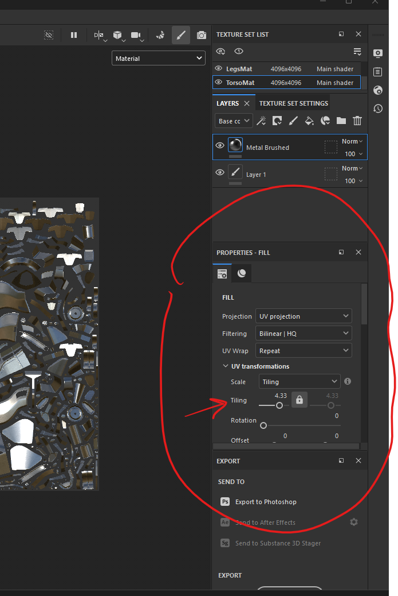
  - under UV transformation -> tile
    - adjust/increase setting tile from 1 to 32, till it feels right
- tint
  - parameters
    - [brush name] color
      - ex. Metal color
      - adjusting the color to make it dark light or different color
- [brush name] roughness
  - to shiny to less shiny

## technical paramters

### normal intensity

- 
- increase / decrease the `normal` roughness

- 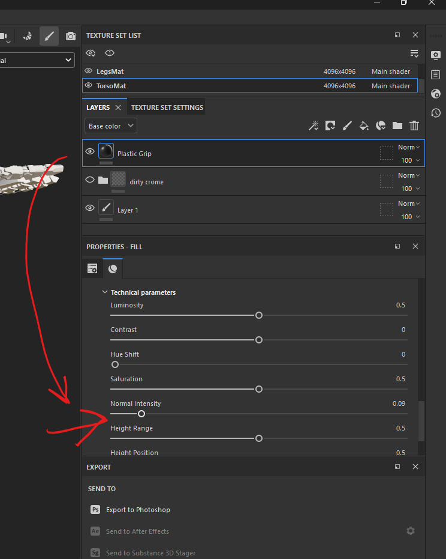

# layers

## group

- 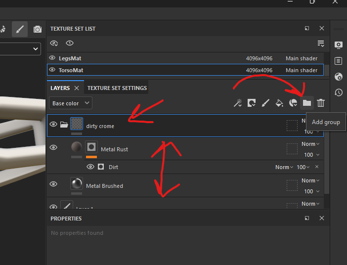
- you can also add the mask to folder

## masks

- 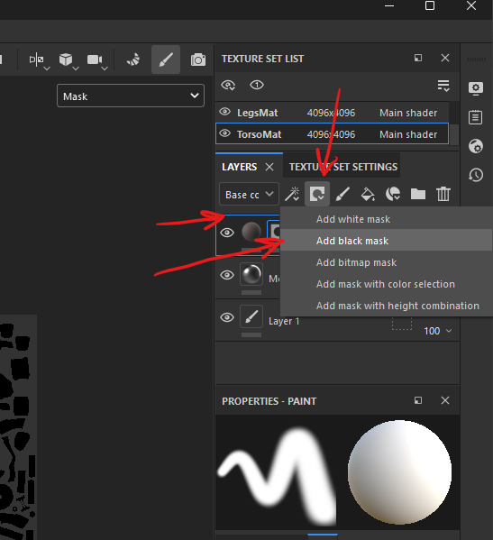
- add black mask to hide entire layer
- add white or draw white on black mask to make it visible
- press alt and select the mask
- 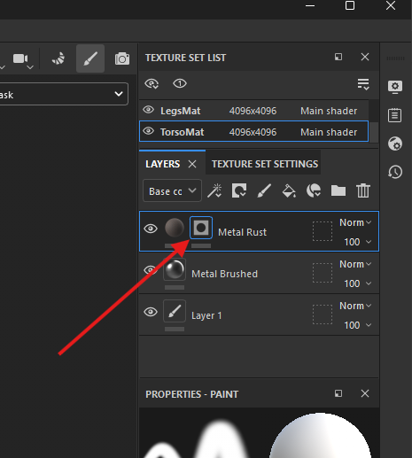

### smart mask layer (pattern for mask)

- drag and drop the asset to the mask
- 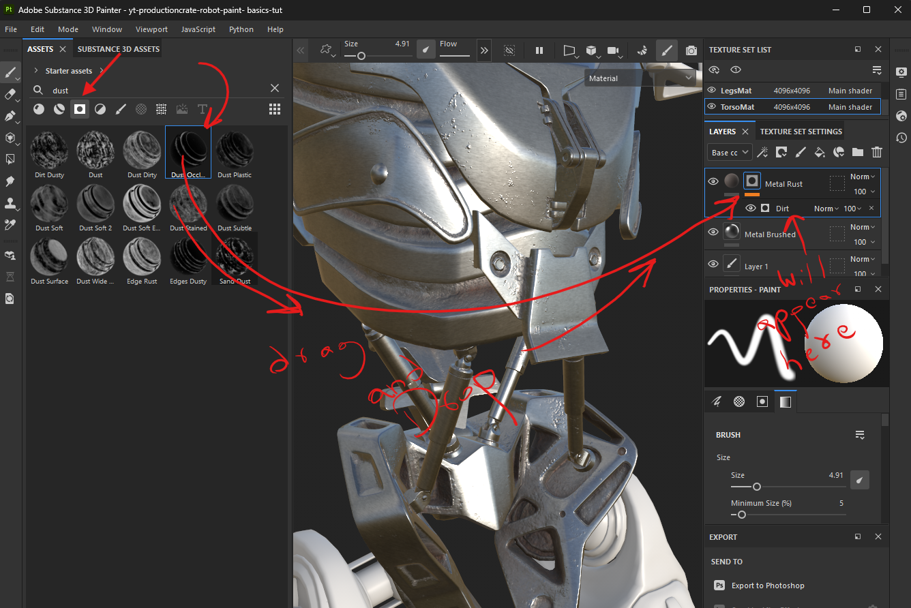
  - the mask pattern appears below the layer details

### create custom smart mask (pattern for mask)

- add fill layer
- 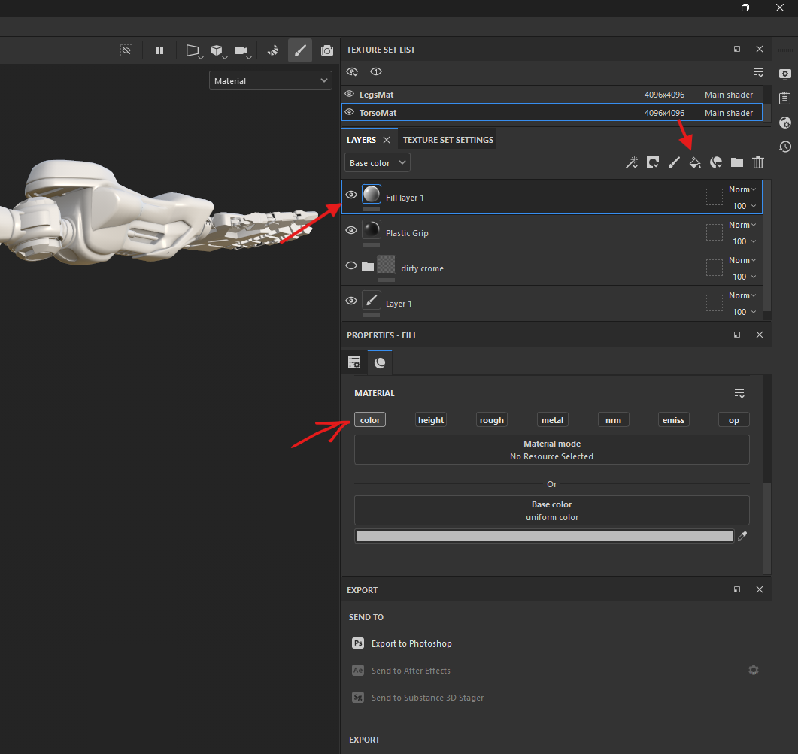
- disable all except color
  - if we dont want to adjust the shinyness or anything
- 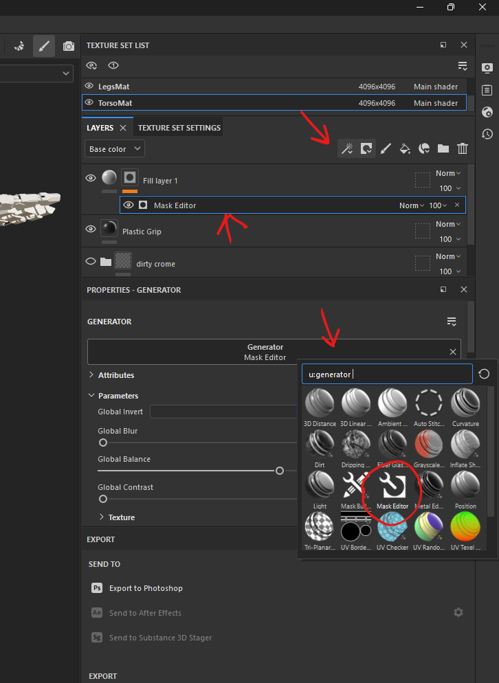
- add generator
  - click on the magic wand
  - select add generator
  - click on generator section and select mask editor
- modify generator settings
  - select the mask
  - adjust the curvature
  - 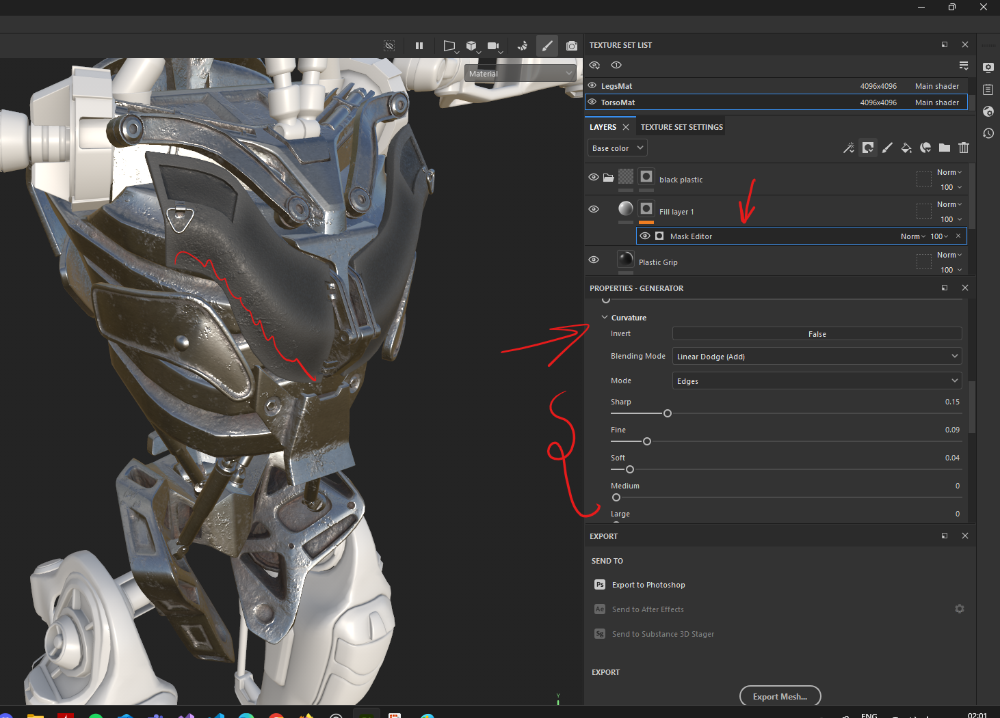
  - to soften the edges for the mask

## create smart materials

- right click on the folder containing layer
  - add a prefix like custom or whatever to search easily in assets
- select create smart material

# polygon fill

instead of manually painting, paint the mesh using `polygon fill`

## Mesh fill

- 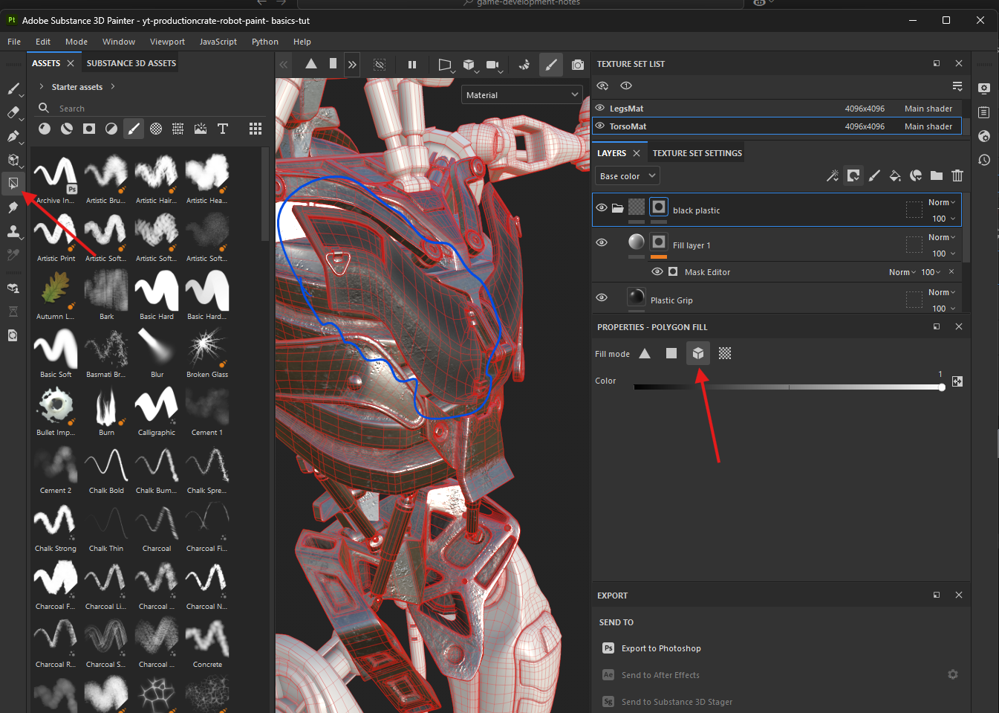
  - the entire mesh (highlighted in blue)
  - the color slider
    - white - fully masked
    - black - to remove the mask

## UV

- 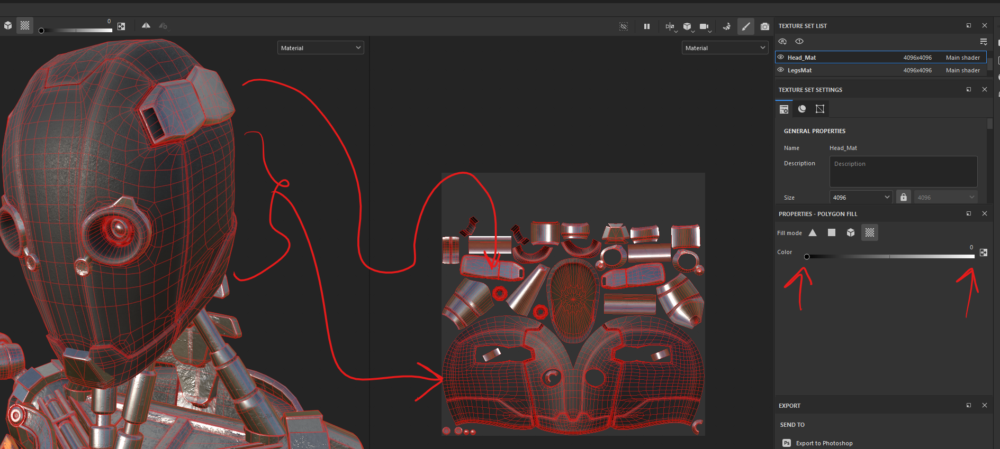

# smart materials (paint with custom pattern)

to figure out the folder structure and settings of smart material, disable all layers in it

- 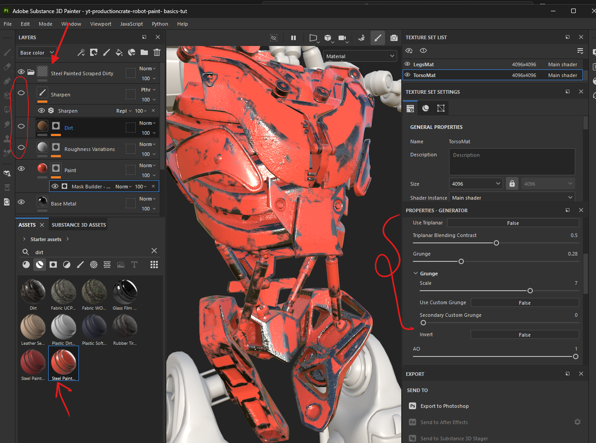

## create
