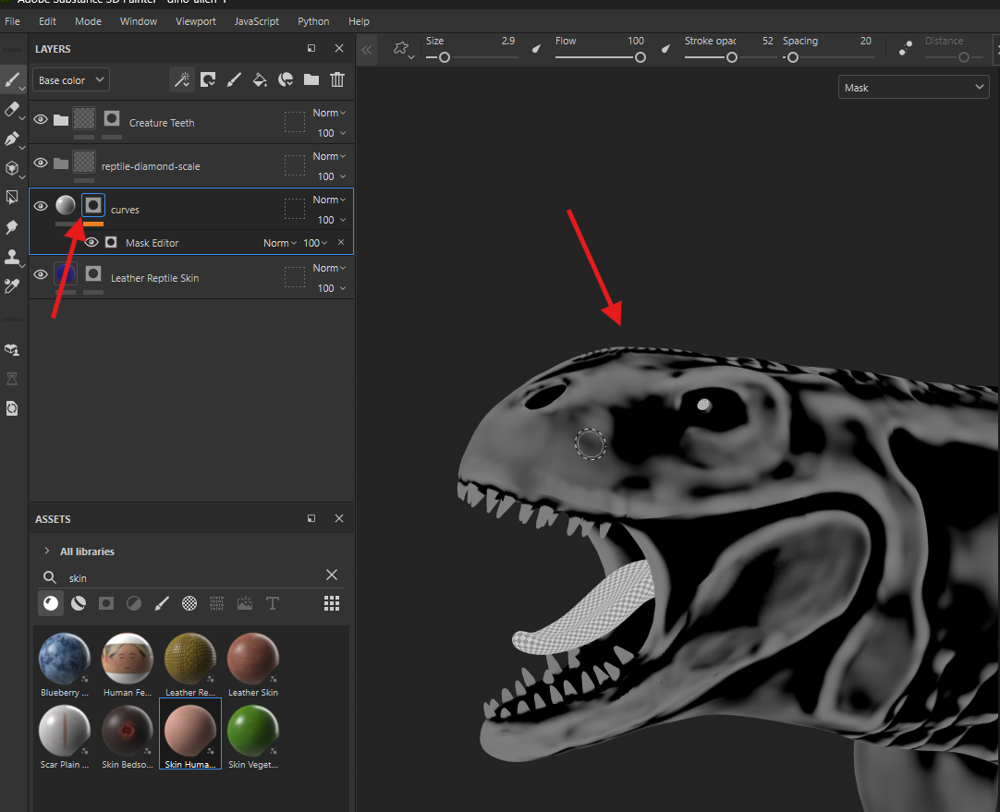

# smart mask layer (pattern for mask)

- drag and drop the asset to the mask
- 
  - the mask pattern appears below the layer details

## create custom smart mask (pattern for mask)

- add `fill layer`
- 
- disable all except color
  - if we dont want to adjust the shinyness or anything
- 
- add a black mask to the `fill layer`
- select the mask
- click on the magic wand -> add generator
- click on generator section and select mask editor
- alt + click on the black mask
- 
- the mask should look like this
- now we can add a material to this
- 
- so that only the white portion of the mask will be visible

### modify generator settings

- select the mask
- adjust the curvature
- 
- to soften the edges for the mask

## paint mask editor

- once a mask editor is added, it directly manipulates the mask
- 
- right click the black mask -> add paint
- 
- select the mask with alt + click and paint black
- 
- now the material will be gone
- 
