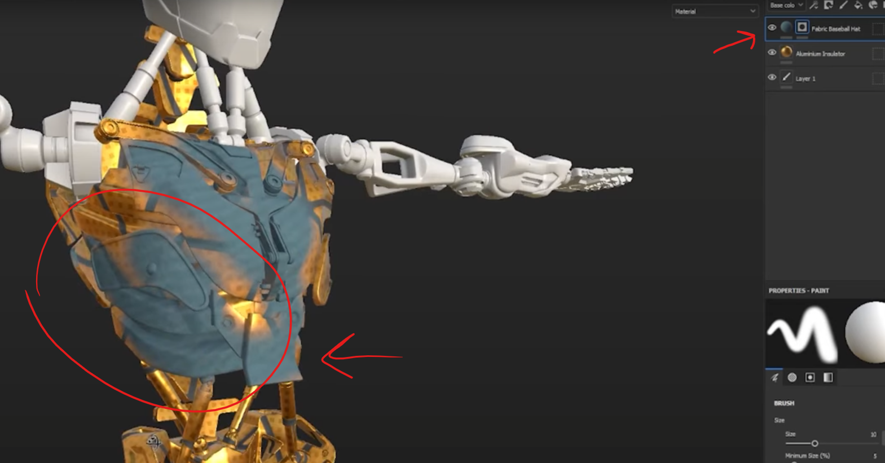
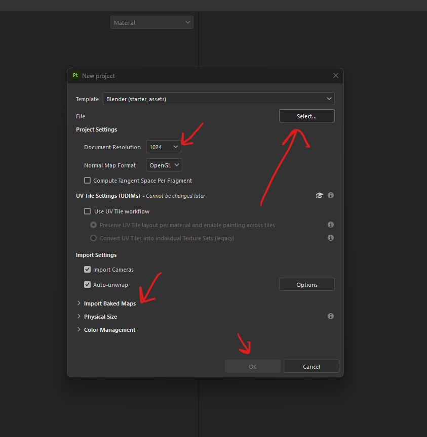
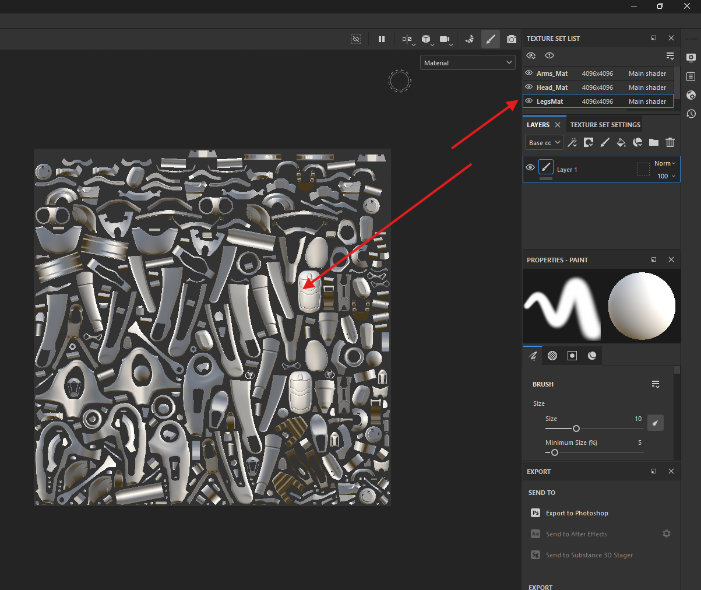

# Substance Painter

basically like a photo shop, where we put layers onto each other and mask it
 

# Create

- 
    - select fbx file
    - select texture to 4k
    - if there are texture, select it using import baked maps
    - press okay

# shortcuts

## viewport

- f1, f2, f3

## bake

- press b to cycle through maps

# texture

- 
